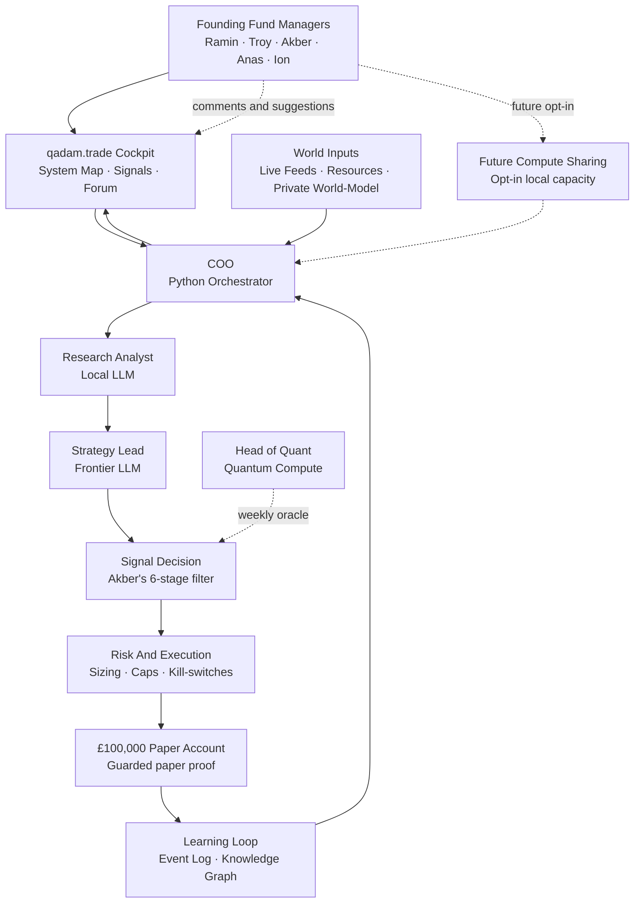

# Qadam For The Founding Fund Managers

## The Short Version

Qadam is a trading intelligence system built around Akber's core philosophy: high-conviction, catalyst-driven opportunities, not random signals, hype, or overtrading.

It watches the world, detects possible catalysts, checks whether markets have mispriced them, runs the idea through risk rules, routes qualified paper trades through guarded approval, and logs every decision so the system can be judged honestly.

The founding Fund Managers are **Ramin, Troy, Akber, Anas, and Ion**. In the first release, these are the only people with login access to oversee Qadam.

Qadam is not trying to be a magic bot. It is trying to prove whether a repeatable process can find real edge.

## What Qadam Is

Qadam is a small macro intelligence fund that runs locally on Ramin's MacBook.

The system is built like a tiny fund team:

- **Python COO:** coordinates the whole system, keeps records, checks health, and routes work.
- **Local Research Analyst:** a local AI model that filters noisy information quickly.
- **Strategy Lead:** a frontier AI model that does deeper research, builds the thesis, and challenges assumptions.
- **Head of Quant:** a quantum/classical modelling layer that runs weekly pattern and ambiguity checks.
- **Founding Fund Managers:** Ramin, Troy, Akber, Anas, and Ion, who oversee the system, review outcomes, hold strategic influence, and help improve Qadam over time.

The first release is local-first. All saved Qadam data lives on Ramin's MacBook by default. Qadam connects to outside APIs to observe the world, but its memory, logs, evidence, comments, and postmortems stay local unless a later cloud-sync decision is made.

## How The System Fits Together

Read this top to bottom. It is designed to stay readable on a phone in portrait. Solid arrows show Qadam's normal operating flow. Dotted arrows show private reasoning lenses, weekly oracle checks, or future optional extensions.

## What Qadam Is Not

Qadam is not:

- A Telegram tip channel.
- A copy-trading app.
- A public trading community.
- A general stock screener.
- A low-latency HFT system.
- A black-box trading bot.
- A financial advisor.
- A system that trades just to stay active.

Qadam's basic rule is simple: if there is no genuine catalyst with evidence, mispricing, and defined risk, the correct action is no trade.

## The Trading Philosophy Inside Qadam

Qadam is built around the idea that the best trades come from the gap between what is already happening in the real world and what markets have not priced yet.

Akber's 6-stage trade filter is the spine:

1. **Low volatility:** is the market quiet before a possible move?
2. **Options distribution:** are options pricing a normal world when the event is actually binary or asymmetric?
3. **Catalyst:** what real-world event could break the distribution?
4. **Technical setup:** is there a sensible entry, invalidation, and structure?
5. **On-balance volume / flow:** is money already positioning?
6. **Gut / judgment:** does the thesis make sense once all evidence is visible?

Qadam does not replace that thinking. It operationalises it. It turns the filter into a repeatable process that can be tested, logged, and improved.

The Fund Managers help judge whether Qadam is applying this framework correctly.

## What Qadam Watches

Qadam uses live and live-adjacent feeds across five intelligence pipelines:

- **Conflict:** wars, unrest, escalation, protests, military risk.
- **Physical / OSINT:** fires, ships, aircraft, GPS jamming, outages, satellites, infrastructure.
- **Macro:** rates, inflation, commodities, trade, central-bank and economic data.
- **Market:** options flow, prediction markets, broker data, crypto derivatives, liquidity signals.
- **Narrative:** news, Telegram, X, Reddit, filings, patents, politician disclosures, GitHub.

The point is not to collect data for its own sake. The point is to catch a catalyst while it is still underpriced.

## The Private Edge Layer

Qadam also has a private world-model layer called **How The World Works**.

This is not used as public evidence. It is a private lens that makes Qadam suspicious of surface narratives and more alert to hidden incentives, power structures, financial flows, media framing, and second-order consequences.

In this worldview, power flows hierarchically: military force enforces the system, financial elites and central banks shape the rules of money, global institutions legitimize those rules, media and culture explain them to the public, and ordinary people eventually internalize the story as normal reality. The current world is seen as a transition from a US-led unipolar order toward a more unstable multipolar struggle, where the US, China, Russia, Iran, and Israel each pursue different survival strategies. US-China relations are not viewed as simple rivalry; Qadam's private lens treats much of the conflict as negotiation theater around a possible grand bargain involving energy access, AI chips, financial markets, stablecoins, Treasury demand, Taiwan, and Iran. China is seen as powerful but dependent on US markets, dollar rails, Western Hemisphere energy, and semiconductor access, while America wants China's savings, manufacturing efficiency, and financial opening to extend the life of the dollar system. At its most esoteric but still testable edge, the corpus treats fear, debt, spectacle, and ritualized crisis as mechanisms that concentrate attention, alter behaviour, move capital, and create tradable stress in markets. Qadam uses this worldview to ask sharper market questions, then forces every tradable implication through live evidence before it can become a signal.

In trader language: it helps Qadam ask better uncomfortable questions.

For example:

- Who benefits if this story is true?
- Who benefits if this story is false?
- What would the market price if it believed the official version?
- What would the market price if the hidden-incentive version is closer to reality?
- What observable signs would confirm or kill the thesis?

Qadam can believe the lens is useful, but it still needs live evidence before a trade can pass.

## How A Signal Is Made

A Qadam signal is not just "buy this."

A proper signal must include:

- The catalyst.
- The affected instrument.
- The expected time window.
- The evidence trail.
- Source quality.
- The market's current implied probability.
- Qadam's estimated probability.
- The pricing gap.
- Entry logic.
- Invalidation.
- Position size.
- Risk cap.
- Exit logic.
- What would prove Qadam wrong.

If any of these are missing, the signal is blocked, downgraded, or left as a watchlist idea.

## What Happens In The Test Account

The first release runs on a **£100,000 paper/test account**.

In test mode, Qadam may trade autonomously after the proper gates are built. That is intentional. The point is to test whether the system can follow its own rules without the Fund Managers emotionally interfering trade by trade.

The Fund Managers can still:

- Review system health.
- Review signals.
- Review postmortems.
- Turn strategies on or off if their role allows it.
- Use or recommend kill-switches depending on governance settings.
- Suggest improvements in the internal comments forum.
- Help decide strategy-level changes after review periods.

But during the clean test run, individual trades should not be manually approved, rejected, resized, or closed. Otherwise the proof sample is contaminated.

## How The Fund Managers Can Use Qadam

The Fund Managers do not need to operate the code.

They use Qadam through the cockpit:

1. **Review the System Map**
   See whether the data feeds, models, broker rail, Event Log, risk system, and world-model layer are healthy.

2. **Review Watchlist Themes**
   See what Qadam is monitoring: prediction markets, crude oil, defence, silver, semiconductors, geopolitical shocks, and major macro narratives.

3. **Review Signal Cards**
   For each proposed trade, inspect the catalyst, evidence, pricing gap, risk, and invalidation.

4. **Challenge The Thesis**
   Ask whether the idea actually matches Akber's 6-stage filter or is just an interesting story.

5. **Review Postmortems**
   After trades close, see what Qadam got right, what it got wrong, and whether the data sources or strategy weights should change.

6. **Suggest Improvements**
   Use the internal comments/forum area to suggest improvements, flag issues, propose new sources, question assumptions, or recommend strategy changes.

7. **Guide Strategy-Level Decisions**
   Help decide which catalyst classes deserve more attention, which instruments are worth trading, and which strategies should be killed or promoted.

The Fund Managers' highest-value role is not clicking approve on individual test trades. It is judging whether Qadam is learning the right lessons.

## The Internal Comments Forum

The cockpit should include a small private comments/forum area for Ramin, Troy, Akber, Anas, and Ion.

This is not a public community. It is an internal governance and improvement layer.

The forum should let the Fund Managers:

- Comment on proposed signals.
- Suggest new data sources.
- Flag broken assumptions.
- Debate catalyst interpretations.
- Suggest improvements to the dashboard.
- Propose changes to strategy rules.
- Record concerns after postmortems.
- Leave notes for future review.

These comments should become part of Qadam's learning record. They should be saved locally, linked to the relevant signal, module, postmortem, or strategy, and visible in future reviews.

The forum should not become a place to manually override every trade. It is for improving the system, not emotionally managing the paper account.

## Future Compute Sharing

In the future, once the Fund Managers understand Qadam better, they may be able to contribute local compute capacity to the system.

This could mean renting or donating spare:

- RAM.
- Local processing power.
- Local model runtime.
- Storage.
- Scheduled machine time.

This is not part of the first release. The first release runs locally on Ramin's MacBook. Compute sharing should only be considered later, after the system is understood, secured, and stable.

If built, compute sharing should be opt-in, permissioned, measurable, and safe. Qadam should never silently use someone else's machine.

## What Makes Qadam Unique

Most trading systems start with charts or indicators. Qadam starts with the world.

Its edge is the combination of:

- **Catalyst-first thinking:** real-world event before chart pattern.
- **Akber's 6-stage filter:** the trading philosophy remains disciplined and explicit.
- **Physical-to-paper logic:** fires, ships, aircraft, sanctions, supply chains, conflict, energy, and infrastructure become market hypotheses.
- **Prediction-market awareness:** markets like Polymarket and Kalshi become probability gauges, not just betting venues.
- **Options mispricing focus:** Qadam looks for when options price a normal distribution around a non-normal event.
- **Private world-model lens:** it treats official narratives as incomplete and looks for hidden incentives.
- **Evidence trail:** every signal must show why it exists.
- **Guarded paper proof:** the system must prove itself on a £100,000 paper account before live capital.
- **Founding Fund Manager oversight:** five trusted humans can inspect, challenge, and improve the system without turning it into a public signal group.
- **Internal comments/forum loop:** suggestions and debate become part of the governance record.
- **Postmortem learning:** every closed trade updates the system.
- **Local-first architecture:** Qadam's saved memory lives on Ramin's machine in the first release.
- **Future compute-sharing option:** the oversight group may later help Qadam scale local compute in a controlled way.
- **No forced trades:** rare high-conviction opportunities are respected as rare.

## The First Release Goal

The first release is not "make money live."

The first release goal is:

- Build the local system.
- Give the five founding Fund Managers login access.
- Connect the data spine.
- Let Qadam paper trade through the guarded £100,000 paper account when qualified setups exist and all gates pass.
- Log every decision.
- Save comments and suggestions locally.
- Review every outcome.
- Reach a clean proof sample.

The mature benchmark is **100 closed proof trades**. The 30-day demo proof run
matters, but Qadam should not force trades just to hit a number. The operating
discipline is three proof trades per week where qualified setups exist. If the
signal-quality floor is not met, no trade is a valid result.

## How To Judge Qadam

Do not judge Qadam by whether one trade wins.

Judge it by:

- Did the thesis make sense before the trade?
- Was the catalyst real?
- Was the market actually mispricing the event?
- Was risk defined before entry?
- Did Qadam follow Akber's 6-stage filter?
- Did it avoid bad trades?
- Did it learn correctly after losses?
- Did Fund Manager comments identify useful improvements?
- Did performance stay positive after costs?
- Did drawdown stay controlled?
- Did the system become smarter over time?

Qadam succeeds if it produces a repeatable, explainable edge. It fails if it becomes a clever story machine that cannot survive paper trading.

## The Trader's Summary

Qadam is not a replacement for expert judgment. It is a machine that tries to make expert judgment testable.

It watches more than a human can watch, remembers more than a human can remember, and logs more honestly than a human usually does. The founding Fund Managers give it strategic oversight, challenge its reasoning, and help improve it over time.

But it still needs the same trading truth at the center:

No edge, no trade.
