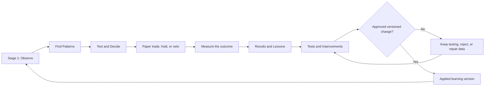

# Qadam Learn & Improve Consolidation Implementation Plan

Date: 2026-07-12

Status: Implemented, validated, and deployed to production

Parent control document: `docs/qadam-operator-ready-edge-engine-implementation-plan.md`

Affected module: `Learn & Improve`

Target navigation contract: `qadam_protected_decision_flow.v4`

## 1. Executive Decision

The four current Learn & Improve destinations represent real and necessary
capabilities, but they should not remain four separate pages. They divide one
learning cycle by backend artifact type rather than by the questions a person
needs answered.

The module should be consolidated into two chronological pages:

| Canonical route | Navigation label | Page headline | Absorbs |
| --- | --- | --- | --- |
| `learn/outcomes` | Results & Lessons | What Qadam Learned | Outcomes & Postmortems plus the human learning content from Learning Briefs |
| `learn/improvements` | Tests & Improvements | How Qadam Improves | Improvement Proposals plus Backtesting & Replay |

### 1.1 Paired Page Purpose Contract

The two pages must introduce themselves as a connected pair with two different
governing questions:

| Page | Always-visible governing question |
| --- | --- |
| `Results & Lessons` | **What happened, and what can Qadam legitimately learn?** |
| `Tests & Improvements` | **Has that lesson earned the right to change Qadam’s behaviour?** |

These questions are primary orientation copy, not tooltip text or technical
documentation. On each page, render the governing question:

1. immediately below the page title and concise subtitle;
2. above the workflow explainer, metrics, ledger, experiment board, or other
   detailed content;
3. in an always-visible scope line that is never collapsed;
4. only once on the page, so it remains distinctive rather than becoming
   another repeated label.

The lifecycle flowchart may remain above the page header. Within the page
itself, the governing question must be the first conceptual statement the user
reads. It should visually connect the pages without making them look identical:
Stage 9 looks backward to establish a justified lesson, while Stage 10 looks
forward to establish whether Qadam is justified in changing.

The old URLs must remain valid as aliases:

| Legacy route | Canonical destination |
| --- | --- |
| `learn/replay` | `learn/improvements` |
| `learn/briefs` | `learn/outcomes` |

The resulting human story is:

1. What happened?
2. What did Qadam expect?
3. What did it learn?
4. What change does that lesson suggest?
5. Did the change survive historical and forward testing?
6. Was a versioned change approved?
7. What will the next Stage 1 Observe cycle do differently?

This is the missing visible bridge between paper outcomes and Qadam's claim to
be a self-improving trading system.

## 2. Review Scope And Evidence

This plan is based on a live review of all four pages, the served production
bundle, the current frontend renderer, the operator-ready V3 projection, and
the current runtime artifacts.

The live dashboard served `dashboard.js?v=20260711-team-human-profile-v2` during
the review. The current four-page implementation is defined in
`landing-page-repo/dashboard.js` and still renders several QSASE-era aggregate
contracts instead of the richer operator-ready V3 records.

The current runtime evidence includes:

| Evidence | Current state | Correct interpretation |
| --- | --- | --- |
| V3 attribution records | 44 | 42 are mirror-only historical outcomes, one is a rejected strategy hypothesis, and one is an operational release block |
| V3 postmortem records | 42 | All 42 are `mirror_only_not_qadam_postmortem`; none can measure Qadam's decision quality |
| Learnable Qadam-origin postmortems | 0 | There is no attributable closed Qadam-origin paper outcome yet |
| Approved learning changes | 0 | No source, strategy, Akber, risk, or policy change has been approved or applied |
| Canonical proposal lifecycle | 42 mirror records excluded; 1 rejected Qadam record; 1 Qadam repair proposal needs data; 0 ready; 0 applied | Only Qadam-origin research or operating events can become proposals, and none has earned adoption |
| Provider backfill | 0 of 450 partitions complete | The provider-backed historical foundation is implemented but not acquired |
| Statistical backtests | 0 hypotheses attempted | No empirical edge claim is currently allowed |
| Forward observations | 0 | Real-time no-order validation has not started because no hypothesis is eligible |
| Historical memory compatibility layer | 6,232 records and 82 complete windows | Structural baseline evidence exists, but 6,150 forward windows are missing and most instruments have no complete outcomes |

These distinctions must be visible. The dashboard must not convert reference
records, rejected records, or compatibility artifacts into active proposals or
learnable Qadam outcomes.

## 3. Current Page Review

### 3.1 Outcomes & Postmortems

Verdict: essential purpose, inadequate current page.

What remains relevant:

- Closed Qadam-origin paper outcomes must be reviewed.
- Holds, vetoes, missed opportunities, shadow outcomes, and system defects must
  also become learning evidence.
- Every lesson needs lineage back to the original source packet, pattern,
  strategy, Akber result, risk decision, route, and paper outcome.

What is wrong now:

- The page shows aggregate counts and three abstract cards, not outcomes or
  postmortems.
- It does not show the original thesis, actual result, P&L, timing, invalidation,
  what helped, what failed, or the next lesson.
- It does not distinguish Qadam-origin outcomes from historical broker mirrors.
- The live page showed 44 attributed outcomes and 44 proposals even though 42
  records are non-attributable mirror-only history.
- The user cannot inspect a specific outcome or follow it into a proposed test.

Decision: retain the purpose inside `Results & Lessons`, but replace the
aggregate-only presentation.

### 3.2 Improvement Proposals

Verdict: essential purpose, currently semantically broken and premature as a
standalone page.

What remains relevant:

- Qadam must propose changes to source trust, data repair, feature definitions,
  pattern routing, strategy weights, Akber thresholds, risk concepts, and
  operational reliability.
- Every change must be testable, versioned, reviewable, and reversible.
- No proposal may silently change trading authority.

What is wrong now:

- The live headline showed 44 proposals while all five proposal categories
  showed zero.
- The compatibility adapter counts every `proposal_only` attribution record as
  a policy proposal, including rejected mirror-only records.
- The page lists system areas that could change, but no concrete change,
  evidence, test plan, expected benefit, risk, owner, or lifecycle state.
- The five-step strip is conceptually sound but disconnected from actual
  records.
- The page sends users back to earlier modules without showing whether anything
  will be different on the next cycle.

Decision: merge proposals with their backtests, shadow evidence, review state,
and applied-version history inside `Tests & Improvements`.

### 3.3 Backtesting & Replay

Verdict: core to Qadam's edge-discovery purpose, but the current page is a data
coverage monitor rather than a learning page.

What remains relevant:

- Historical tests, untouched holdouts, walk-forward tests, negative controls,
  cost adjustments, regime checks, shadow replay, and real-time forward shadow
  are necessary before an improvement gains trust.
- Whole-universe historical coverage must remain visible and honest.

What is wrong now:

- The page leads with 6,232 structural records while only 82 windows are
  complete.
- It displays 1% coverage and calls historical memory operational without first
  explaining that almost the entire trading universe lacks complete outcome
  windows.
- It reports legacy shadow replay counts while operator-ready forward shadow
  has zero decisions and zero outcomes.
- It does not show a tested hypothesis, strategy, expectancy, hit rate,
  drawdown, cost-adjusted return, holdout performance, false-discovery result,
  or rejection reason.
- It does not connect any test to a lesson, proposal, or decision.

Decision: preserve detailed coverage as a collapsed data-readiness disclosure,
then make proposal-linked test evidence the primary content of
`Tests & Improvements`.

### 3.4 Learning Briefs

Verdict: the human summary is relevant; the current page is not a learning
destination.

What remains relevant:

- A non-technical reader needs a short daily or weekly explanation of what
  Qadam learned, what changed, and what is still uncertain.
- Telegram can mirror that explanation after quality and deduplication checks.

What is wrong now:

- The page is mainly Telegram delivery telemetry: drafts, duplicates, sending,
  commands, and authority.
- The current visible note is an operator-status message, not a synthesis of
  outcomes and learning.
- Delivery diagnostics do not deserve a full learning page.
- The note is disconnected from the specific outcomes, tests, and proposals it
  is supposed to summarize.

Decision: place the readable learning digest at the top of `Results & Lessons`.
Move detailed communications diagnostics to a collapsed disclosure and the
System communications mirror.

## 4. Root Causes

### 4.1 Information architecture follows artifacts, not thought

The current navigation separates attribution, proposals, historical coverage,
and Telegram because they come from different JSON artifacts. A reader thinks
in a different order: result, lesson, test, decision, next cycle.

### 4.2 The frontend reads compatibility summaries instead of canonical V3 rows

`qadam_operator_dashboard.py` already exports V3 postmortems, learning records,
shadow state, and communications into the four operator views. The public
renderer largely ignores those records and reads flattened compatibility fields
such as `learning_attribution_v2`, `historical_memory_completion`, and
`telegram_summary_v2`.

### 4.3 Attribution records are miscounted as active proposals

The current `_learning_compatibility()` helper counts every record whose
`champion_challenger.proposal_only` flag is true. That includes rejected and
mirror-only records. The result is the visible contradiction between 44
proposals in the header and zero proposals in every category.

### 4.4 Origin classification is hidden

Historical Alpaca mirror records are useful reference data but cannot establish
whether Qadam's thesis, pattern engine, Akber filter, or execution decision was
correct. They must never appear as Qadam postmortems or active learning
proposals.

### 4.5 Test readiness is confused with test evidence

Data coverage, a test runner existing, a static replay artifact, a completed
backtest, and a validated edge are different states. The current page compresses
them into one Backtesting & Replay view.

### 4.6 There is no durable return edge to Stage 1

The dashboard says learning can affect sources, patterns, strategies, and
thresholds, but it does not show a versioned handoff that the next Observe cycle
will actually consume.

## 5. Target End-To-End Learning Loop



The loop compounds evidence and decision quality, not guaranteed returns.
Qadam should become better at rejecting noise, identifying repeatable edges,
calibrating confidence, selecting strategies, timing entries, and controlling
risk. Profitability remains an empirical result that must be measured.

## 6. Page One: Results & Lessons

Route: `learn/outcomes`

Navigation label: `Results & Lessons`

Eyebrow: `Performance Attribution & Governance`

Headline: `What Qadam Learned`

Always-visible governing question:

> **What happened, and what can Qadam legitimately learn?**

Placement: directly below the title and short page subtitle, and immediately
above the collapsed `How a trade outcome turns into a supported lesson +`
explainer.

Supporting questions answered by the ledger: What did Qadam expect, what
actually happened, what lesson is supported by the evidence, and what should be
tested next?

### 6.1 Required page order

1. **Shared operating-loop overview**
   Show where Learn & Improve sits in Qadam's full operating flow, then show the
   complete eight-stage learning loop and highlight stages 1-2 as this page's
   scope: `Outcome or research event -> Supported lesson`.
2. **Page scope and governing question**
   Show the `Performance Attribution & Governance` eyebrow, `What Qadam
   Learned` title, concise subtitle, and the always-visible question `What
   happened, and what can Qadam legitimately learn?`. Place the collapsed `How
   a trade outcome turns into a supported lesson +` workflow explainer
   immediately after this question.
3. **Current learning answer and latest learning brief**
   Present a two-to-four sentence qualitative summary followed by at most three
   bullets: strongest lesson, biggest uncertainty, and next test.
4. **Grouped learning summary**
   Present the page metrics as three plain-English groups rather than equally
   weighted database-style counters:

   | Visible group label | Content |
   | --- | --- |
   | `What Qadam is learning` | Learning events and lessons awaiting testing |
   | `Lessons proved so far` | Attributable Qadam paper outcomes and proof-eligible lessons |
   | `Past History Kept for Reference` | Historical mirror records excluded from Qadam performance and proof |

   Keep the exact labels above as the visible copy contract. The underlying
   counts remain dynamic, but each number must appear inside its appropriate
   group with a plain-English interpretation.
5. **What happened since the last cycle**
   Show one chronological feed combining paper outcomes, holds, vetoes, missed
   opportunities, backtest outcomes, shadow outcomes, and system defects.
6. **Outcome and postmortem cards**
   Show the expected thesis, actual result, attribution, lesson, confidence,
   and next test for each learnable record.
7. **Reference-only history**
   Put mirror-only records in a collapsed section that clearly says Qadam cannot
   learn decision quality from them.
8. **Learning handoff**
   End with a visible link from each supported lesson to its proposed test on
   `Tests & Improvements`.
9. **Communications detail**
   Keep Telegram draft, dedupe, and delivery state collapsed at the bottom.

### 6.2 Outcome card contract

Every card must answer these plain-English questions:

| Visible field | User question |
| --- | --- |
| Outcome type | What happened? |
| Origin | Was this actually Qadam's decision? |
| Original expectation | What did Qadam think would happen? |
| Actual result | What happened instead? |
| Financial result | Did the paper trade gain or lose, after costs? |
| Evidence contribution | Which sources, models, strategy, Akber stage, and route helped or failed? |
| Lesson | What is Qadam justified in learning? |
| Confidence | How strong and complete is that lesson? |
| Next test | What must be tested before anything changes? |
| Destination | Where does the lesson go next? |

Technical lineage, IDs, missing metrics, proof status, and raw artifact paths
must remain available inside one collapsed `Technical evidence` disclosure.

### 6.3 Honest current empty state

Until a Qadam-origin paper outcome exists, the page should say:

> Qadam has not yet completed a paper trade it can use to judge its own
> decisions. Forty-two historical broker records are visible for context, but
> they are excluded from Qadam's learning and paper proof ledger.

This is more truthful and useful than calling the 42 mirror records postmortems
due.

## 7. Page Two: Tests & Improvements

Route: `learn/improvements`

Navigation label: `Tests & Improvements`

Eyebrow: `Strategy & System Improvement`

Headline: `How Qadam Improves`

Always-visible governing question:

> **Has that lesson earned the right to change Qadam’s behaviour?**

Subtitle:

> Supported lessons are converted into specific, testable improvements. Only
> improvements that survive testing, review and approval can become a new
> strategy or system version.

Placement: show the governing question directly below the title and subtitle.
Follow it with the simplified improvement journey, then the collapsed `How a
supported lesson becomes a strategy or system improvement +` explainer.

Supporting questions answered by the page: What did Qadam learn, what exactly
should change, how will that change be proved or rejected, and what strategy,
system, data, filter, risk, code, or operating version will exist if it is
approved?

### 7.1 Required page order

1. **Shared operating-loop overview**
   Show where Learn & Improve sits in Qadam's full operating flow, then show the
   same eight-stage learning loop used on Results & Lessons. Highlight stages
   3-8 as this page's scope.
2. **Page scope and governing question**
   Show the `Strategy & System Improvement` eyebrow, `How Qadam Improves`
   title, subtitle, and the always-visible question `Has that lesson earned the
   right to change Qadam’s behaviour?`.
3. **Simplified improvement journey**
   Show one light, shallow five-step journey rather than a large permanent
   workflow block:

   `Supported lesson -> Proposed improvement -> Historical and real-time
   testing -> Approve, reject, or keep testing -> New strategy or system
   version`

   Place the collapsed `How a supported lesson becomes a strategy or system
   improvement +` explainer immediately after this journey. The disclosure
   retains the complete governed sequence: proposed improvement, historical
   test, forward observation, review, applied version, and next Observe cycle.
4. **Grouped improvement summary**
   Present three plain-English groups:

   | Visible group label | Content |
   | --- | --- |
   | `What Qadam is testing` | Active proposed improvements and their current phases |
   | `Improvements proved so far` | Improvements ready for approval or approved after testing |
   | `Improvements now in use` | Applied versions and whether current behaviour has changed |

   Historical partitions, statistical paths, instrument completion, and other
   technical coverage do not receive equal first-screen prominence. Keep them
   inside the relevant proposal or technical-evidence disclosure.
5. **Main 30/70 improvement workspace**
   Use a narrow `Can Qadam change yet?` rail beside a wider `Improvements being
   tested` area. Use normal page scrolling; do not create independently
   scrolling panes.
6. **Improvements not taken forward**
   Keep rejected, held, retired, or rolled-back proposals collapsed by default
   and explain why each did not advance.
7. **Improvements now in use**
   Keep the applied-version history collapsed when empty. When populated, show
   version, approval, effective date, before-and-after behaviour, monitoring
   window, and rollback condition.
8. **Testing evidence and technical detail**
   Keep provider partitions, missing windows, leakage checks, statistical
   paths, nonlinear or quantum evidence, and instrument coverage collapsed
   unless a missing item is the principal blocker.
9. **What changes in the next cycle**
   When no approved version exists, state that nothing changes and do not show
   a grid of hypothetical destinations. Once an improvement is applied, show
   only its actual destination, version, effective date, monitoring period, and
   rollback rule.

### 7.2 Can Qadam change yet? rail

The narrow rail must answer the page's main question without requiring any
expansion.

Default current answer:

> **No. Qadam’s current strategy and system version remain unchanged.**

Show the leading proposal using five human-readable stages:

| Stage | Meaning |
| --- | --- |
| Lesson identified | A Stage 9 lesson supports further investigation |
| Improvement defined | Qadam has recorded one specific proposed change |
| Testing | Historical and real-time no-order evidence is being gathered |
| Approval | The evidence and risks are reviewed before implementation |
| Implementation | An approved strategy, system, data, filter, risk, code, or operating version becomes active |

The rail also contains:

- the current stage of the leading improvement;
- the small number of plain-English blockers preventing advancement;
- the next action;
- the behaviour the next Observe cycle will use;
- one concise governance boundary explaining that proposals remain inert until
  separately approved and versioned.

### 7.3 Improvements-being-tested record contract

Every proposed improvement is collapsed by default. The closed row shows only:

| Visible field | Meaning |
| --- | --- |
| Number and title | The proposed improvement in plain English |
| Based on | The linked Stage 9 learning record |
| Improvement type | Strategy, data, Akber or risk, system or code, or operations |
| Current phase | Lesson identified, improvement defined, testing, approval, or implementation |
| Evidence state | The concise reason it can or cannot advance |

Opening the record reveals:

| Expanded field | Question answered |
| --- | --- |
| Lesson behind the improvement | What did Qadam legitimately learn? |
| Proposed improvement | What exactly would Qadam do differently? |
| Part of Qadam affected | Which strategy, data contract, filter, risk rule, code path, or operating process could change? |
| Why it may help | What decision-quality benefit is expected? |
| How Qadam will test it | Which historical and real-time no-order tests will be used? |
| Success criteria | What evidence would prove the improvement useful? |
| Rejection criteria | What result would stop the proposal? |
| Current decision | Continue testing, reject, hold, approve, apply, or roll back |
| Implementation route | What versioned strategy, system, data, policy, engineering, or operating output would be created? |
| Next action | The one action that advances or rejects the proposal |
| Rollback condition | When should Qadam stop or revert the applied change? |

Historical sample detail, holdout and walk-forward tests, costs, drawdown,
false-discovery controls, calibration, Akber ablation, nonlinear or quantum
incremental value, provider partitions, instrument coverage, provenance IDs,
and raw artifact references remain inside one nested `Testing evidence and
technical detail +` disclosure.

### 7.4 Strategy, code, and system destination contract

The page must explicitly distinguish what kind of implementation a successful
proposal could eventually create:

| Improvement type | Eventual governed output |
| --- | --- |
| Strategy improvement | A versioned strategy rule, weighting, threshold, entry, exit, or invalidation change |
| Data improvement | A versioned source, evidence, repair, feature, or data-quality contract |
| Akber or risk improvement | A versioned decision-filter or risk-policy proposal |
| System or code improvement | An engineering change record followed by a separately reviewed, tested, and verified code release |
| Operational improvement | A versioned monitored process, scheduler, reconciliation rule, or system control |

A supported lesson does not directly edit code, mutate a strategy, change
weights, deploy software, approve risk, or alter trading authority. It creates
an inert proposal. Testing and approval determine whether that proposal becomes
a versioned strategy or system specification. Engineering implementation and
deployment remain separately governed actions.

### 7.5 Honest current state

With the current operator-ready evidence, the page should say:

> **No. Qadam’s current strategy and system version remain unchanged.**
>
> One improvement is being considered, but it has not completed historical
> testing, real-time no-order observation, or governed approval. Qadam is
> recording what may need to improve, not claiming that the improvement works.

The grouped summary should read:

- `What Qadam is testing`: 1 proposed improvement;
- `Improvements proved so far`: 0 ready for approval;
- `Improvements now in use`: 0, current behaviour unchanged.

The bottom next-cycle state should read:

> **What changes in the next cycle?**
>
> Nothing yet. No improvement has passed testing and approval, so Qadam will
> continue using its current strategy and system version.

## 8. Canonical Data Contracts

### 8.1 Learning cycle view model

Add:

- `orchestrator/qadam_learning_cycle_view_model.py`
- `data/runtime/qadam_learning_cycle_dashboard.json`
- `data/runtime/qadam_learning_cycle_events.jsonl`
- `scripts/check_qadam_learning_cycle_view_model.py`

The canonical record must include:

```json
{
  "learning_cycle_id": "...",
  "record_id": "...",
  "record_kind": "paper_outcome|hold|veto|missed_opportunity|backtest|shadow|system_defect",
  "origin_class": "qadam_origin|mirror_only|fixture|historical_replay|shadow",
  "learnable": false,
  "lineage": {},
  "expectation": {},
  "actual_outcome": {},
  "component_attribution": {},
  "lesson": {},
  "lesson_confidence": "not_measurable|weak|developing|supported",
  "next_test": {},
  "proof_eligible": false,
  "authority": {}
}
```

### 8.2 Improvement pipeline view model

Add:

- `orchestrator/qadam_improvement_pipeline_view_model.py`
- `data/runtime/qadam_improvement_pipeline_dashboard.json`
- `data/runtime/qadam_improvement_proposals_v3.jsonl`
- `data/runtime/qadam_applied_learning_versions.jsonl`
- `scripts/check_qadam_improvement_pipeline_view_model.py`

The canonical proposal must include:

```json
{
  "proposal_id": "...",
  "lesson_ids": [],
  "change_type": "source_trust|data_repair|feature|pattern_routing|strategy|akber|risk|operations",
  "target_stage": "observe|patterns|decide|trade|system",
  "current_version": "...",
  "proposed_version": "...",
  "change_hypothesis": "...",
  "expected_benefit": "...",
  "failure_risk": "...",
  "historical_test": {},
  "forward_shadow_test": {},
  "nonlinear_quantum_test": {},
  "decision_state": "needs_data|testing|shadowing|ready_for_review|approved|rejected|applied|rolled_back",
  "approval": {},
  "rollback_condition": "...",
  "stage1_handoff": {},
  "authority": {}
}
```

### 8.3 Required source artifacts

| Source | Use in the new module |
| --- | --- |
| `qadam_paper_postmortems_v3.jsonl` | Qadam-origin paper outcomes and origin classification |
| `qadam_learning_attribution_v3.jsonl` | Component attribution and lesson candidates |
| `qadam_backtest_results_summary.json` | Statistical test maturity and empirical-claim boundary |
| `qadam_backtest_rejections.jsonl` | Rejected test records and reasons |
| `qadam_forward_shadow_decisions.jsonl` | Real-time shadow decisions |
| `qadam_forward_shadow_outcomes.jsonl` | Matured forward outcomes |
| `qadam_shadow_calibration.json` | Forward calibration and quality |
| `qadam_shadow_promotion_readiness.json` | Promotion blockers |
| `qadam_provider_backfill_checks.json` | Historical acquisition readiness |
| `qadam_edge_registry.jsonl` | Validated, probationary, degraded, or retired edge state |
| `daily_telegram_learning_brief.json` | Human-readable digest content |
| `qadam_operator_dashboard_view_model.json` | Public-safe route projection |

### 8.4 Count and classification invariants

- `attribution_record_count` must never be presented as
  `active_proposal_count`.
- A rejected record is not an active proposal.
- A mirror-only historical record is not a Qadam postmortem.
- A mirror-only record cannot create a lesson about Qadam's decision quality.
- A proposal is active only when it has a concrete change hypothesis, lesson
  lineage, test plan, and a non-terminal decision state.
- Backtests, historical replay, fixtures, and shadow outcomes receive no paper
  proof ledger credit.
- A completed backtest is not a validated edge unless all holdout, leakage,
  cost, false-discovery, and minimum-evidence gates pass.
- A learning brief summarizes canonical records; it never becomes a separate
  source of truth.
- All displayed counts must reconcile to the same generated snapshot.

## 9. The Controlled Self-Improvement Boundary

Qadam should be autonomous in research but governed in policy.

### 9.1 Safe autonomous research actions

- Record real outcomes and non-trade decisions.
- Calculate attribution and calibration metrics.
- Generate research-only lessons and change hypotheses.
- Schedule historical, ablation, negative-control, nonlinear, and shadow tests.
- Open data-repair and provider-backfill requests.
- Recompute derived research scores from versioned inputs.
- Reject unsupported proposals.
- Detect degradation and propose rollback.

### 9.2 Governed actions

- Change source trust used for quorum.
- Change feature definitions used in production scoring.
- Change strategy weights or admit a new strategy family.
- Change Akber thresholds.
- Change portfolio risk, sizing, drawdown, or execution policy.
- Change PaperOps authority.
- Enable live capital or broker-live routes.

Governed changes require an explicit approved record outside the public
dashboard. The dashboard remains read-only.

## 10. Stage 1 Feedback Contract

Add a proposal-first handoff:

- `data/runtime/qadam_stage1_learning_handoffs.jsonl`
- `orchestrator/qadam_stage1_learning_input.py`
- `scripts/check_qadam_stage1_learning_input.py`

Every handoff must state:

| Field | Purpose |
| --- | --- |
| Applied version | Proves which reviewed change is active |
| Target | Data Sources, Trading Universe, feature set, pattern search, strategy, or filter |
| Effective-from timestamp | Prevents retrospective mutation |
| Evidence references | Links to outcome, lesson, backtest, and shadow records |
| Expected behavior | Defines what should improve |
| Monitoring window | Defines when the change will be evaluated |
| Rollback condition | Defines when to stop or revert |
| Authority record | Proves the change was approved |

The next Stage 1 Observe cycle may consume only `applied` handoffs. Proposed,
testing, shadowing, held, or rejected records remain visible but inert.

Every downstream pattern score, hypothesis, Akber result, Router decision, and
paper outcome must record the applied learning-version IDs it used. This closes
the attribution loop and allows Qadam to measure whether a change actually
helped.

## 11. Backend Implementation Phases

### Phase 0: Amend the protected dashboard contract

Objective: explicitly authorize the navigation reduction before changing the
protected route structure.

Deliverables:

- Update the DP-0 navigation amendment in
  `docs/qadam-operator-ready-edge-engine-implementation-plan.md`.
- Introduce `qadam_protected_decision_flow.v4`.
- Reduce the canonical route count from 15 to 13.
- Preserve `learn/replay` and `learn/briefs` as aliases.
- Update characterization evidence before renderer changes.

Acceptance:

- The contract names exactly two Learn & Improve views.
- Old deep links resolve without falling back to Portfolio.
- Upstream Fund, Observe, Find Patterns, Test & Decide, Trade, Team, and System
  structure remains unchanged.

### Phase 1: Build one canonical learning truth model

Objective: remove V2/V3 semantic drift and reconcile all counts.

Deliverables:

- Implement `qadam_learning_cycle_view_model.py`.
- Classify records by origin and learnability.
- Join postmortems, attribution, proof, performance, holds, vetoes, backtests,
  shadow outcomes, missed opportunities, and defects.
- Generate a human summary from canonical rows.
- Add freshness and snapshot consistency fields.

Acceptance:

- Current fixtures report 42 mirror-only reference records and zero learnable
  Qadam-origin postmortems.
- Current fixtures do not report 44 active policy proposals.
- Current fixtures exclude 42 mirror records, retain one rejected Qadam record
  and one Qadam repair proposal that needs data, and report zero ready or
  applied changes.
- Every count can be derived from the exported rows.

### Phase 2: Build the improvement pipeline model

Objective: join each lesson to its proposal, tests, decision, and Stage 1
destination.

Deliverables:

- Implement `qadam_improvement_pipeline_view_model.py`.
- Add explicit proposal lifecycle states.
- Integrate provider backfill, statistical backtest, forward shadow,
  calibration, nonlinear/quantum value, and edge-registry evidence.
- Separate data readiness from completed test results.
- Export applied version and rollback history.

Acceptance:

- No proposal can be ready for review without lesson lineage and required test
  evidence.
- The current state says no statistical backtest or forward-shadow evidence is
  complete.
- Historical coverage details cannot imply a validated edge.

### Phase 3: Complete the Stage 1 return path

Objective: make approved learning alter the next research cycle in a controlled,
auditable way.

Deliverables:

- Implement `qadam_stage1_learning_input.py`.
- Add immutable version IDs and effective timestamps.
- Allow Stage 1 to consume applied records only.
- Thread learning-version lineage through score, hypothesis, Akber, Router,
  PaperOps, postmortem, and attribution artifacts.
- Add degradation monitoring and rollback proposals.

Acceptance:

- A proposed change has no runtime effect.
- An applied change is visible in the next Stage 1 input pack.
- A later outcome can be attributed to the version that influenced it.
- Authority, risk, PaperOps, proof, and live-capital boundaries remain unchanged.

### Phase 4: Rebuild the operator dashboard projection

Objective: make `qadam_operator_dashboard.py` the only public-safe source for
the two learning pages.

Deliverables:

- Replace the four existing learning views with two canonical views.
- Export `learn/outcomes` from the learning-cycle model.
- Export `learn/improvements` from the improvement-pipeline model.
- Add route aliases to the navigation contract.
- Remove compatibility fields that reinterpret V3 records incorrectly.

Acceptance:

- The public renderer does not read the old V2 learning summary for these pages.
- Live and local counts use the same generated snapshot.
- Missing data is typed and explained rather than converted to zero silently.

## 12. Frontend Implementation Phases

### Phase 5: Build Results & Lessons

Objective: make learning understandable without trading or technical knowledge.

Deliverables:

- Add `renderQsaseResultsAndLessons()`.
- Use `Performance Attribution & Governance` as the page eyebrow.
- Render `What happened, and what can Qadam legitimately learn?` as the
  always-visible scope line directly beneath the page title and subtitle.
- Render `How a trade outcome turns into a supported lesson +` as the collapsed
  workflow explainer label.
- Group the learning metrics under `What Qadam is learning`, `Lessons proved so
  far`, and `Past History Kept for Reference`.
- Add a qualitative latest-learning brief before metrics.
- Add the chronological learning feed.
- Add expandable outcome/postmortem cards.
- Add a collapsed reference-only history section.
- Add direct lesson-to-test links.
- Add collapsed communications diagnostics.

Acceptance:

- The governing question is visible before any expandable or record-level
  content.
- The eyebrow, workflow label, and three metric-group labels match the fixed
  Stage 9 copy contract exactly.
- A first-time reader can answer what happened, what Qadam thought, what it
  learned, and what happens next from the first screen.
- Mirror-only records cannot look like Qadam-origin performance.
- Counts never appear without a plain-English interpretation.

### Phase 6: Build Tests & Improvements

Objective: show, in plain language, how a supported lesson may become a tested
and approved strategy or system improvement without implying that learning can
directly change code or trading behaviour.

Deliverables:

- Add `renderQsaseTestsAndImprovements()`.
- Use `Strategy & System Improvement` as the page eyebrow.
- Render `Has that lesson earned the right to change Qadam’s behaviour?` as the
  always-visible scope line directly beneath the page title and subtitle.
- Render `How a supported lesson becomes a strategy or system improvement +` as
  the collapsed workflow explainer label.
- Add the five-step visible journey from supported lesson to new strategy or
  system version.
- Group the page summary under `What Qadam is testing`, `Improvements proved so
  far`, and `Improvements now in use`.
- Add the 30/70 `Can Qadam change yet?` and `Improvements being tested`
  workspace.
- Keep every proposed-improvement record collapsed by default.
- Show the Stage 9 lesson, proposed change, affected part of Qadam, proof and
  rejection criteria, current decision, implementation route, next action, and
  rollback rule inside the relevant record.
- Label each proposal as a strategy, data, Akber or risk, system or code, or
  operational improvement and show its eventual governed output.
- Keep backtest, forward-shadow, cost, false-discovery, nonlinear or quantum,
  provider, instrument, and provenance detail inside `Testing evidence and
  technical detail +`.
- Add collapsed `Improvements not taken forward` and `Improvements now in use`
  sections.
- Replace the generic Stage 1 destination grid with `What changes in the next
  cycle?`; show no destination until an applied version exists, then show only
  the actual destination and version.

Acceptance:

- The governing question is visible before any expandable or proposal-level
  content.
- The eyebrow, workflow label, five-step journey, and three summary labels match
  the fixed Stage 10 copy contract exactly.
- A first-time reader can trace a supported lesson through proposal, testing,
  decision, and eventual versioned implementation from the first screen.
- The page explicitly distinguishes strategy changes, data-contract changes,
  Akber or risk changes, system or code changes, and operational changes.
- No copy implies that a supported lesson can directly edit code, deploy
  software, mutate a strategy, change weights, approve risk, or alter trading
  authority.
- The page never confuses data coverage, test execution, edge validation, and
  applied change.
- Each proposal has one current state and one next action.
- When nothing is approved, the page clearly says that Qadam's current strategy
  and system version remain unchanged.
- Once a change is applied, the user can see its exact version, destination,
  effective date, monitoring window, and rollback rule.

### Phase 7: Navigation, migration, and responsive UX

Objective: complete the two-page information architecture without broken links.

Deliverables:

- Rename sidebar links.
- Add aliases in `resolveQsaseDashboardRoute()` and the operator route contract.
- Update previous/next journey navigation.
- Preserve active-route and scroll state through 15-second refreshes.
- Add desktop, tablet, and 390px mobile layouts.
- Use progressive disclosure for technical evidence.
- Add plain-English tooltips for postmortem, attribution, holdout, shadow,
  calibration, applied version, and rollback.

Acceptance:

- The sidebar has two Learn & Improve links.
- Legacy links land on the correct canonical page.
- No horizontal overflow or dense metric wall exists on mobile.
- The essential story remains visible with all details collapsed.

## 13. Communications Integration

The daily learning brief must be generated from the same canonical records as
`Results & Lessons`.

The human brief should answer:

1. What did Qadam observe or complete?
2. What lesson is supported?
3. What remains uncertain?
4. What will it test next?
5. Did any approved behavior actually change?

Telegram delivery status, deduplication, quality rejection, and command-disabled
state remain available but are secondary diagnostics. Telegram cannot create a
lesson, proposal, approval, strategy change, trade candidate, order, broker
write, or paper proof ledger credit.

## 14. Testing And Certification

### 14.1 New checks

- `scripts/check_qadam_learning_cycle_view_model.py`
- `scripts/check_qadam_improvement_pipeline_view_model.py`
- `scripts/check_qadam_stage1_learning_input.py`
- `scripts/check_dashboard_learn_improve_consolidation.js`
- `tests/test_qadam_learning_cycle.py`
- `tests/test_qadam_improvement_pipeline.py`
- `tests/test_qadam_stage1_learning_feedback.py`

### 14.2 Required regression updates

- `tests/test_qadam_operator_ready_wave_e.py`
- `scripts/check_dashboard_navigation_ux.js`
- `scripts/check_dashboard_navigable_modules.js`
- `scripts/check_dashboard_qsase_public_frontend.js`
- `scripts/check_dashboard_system_overview.js`
- dashboard acceptance, accessibility, anti-slop, and mobile checks
- protected User Guide and whitepaper checks

### 14.3 Negative safety probes

- A mirror-only outcome cannot become learnable.
- A backtest result cannot receive paper proof ledger credit.
- A shadow outcome cannot create an order.
- A learning brief cannot create a proposal.
- A proposal cannot mutate source trust, strategy, Akber, risk, or authority.
- A non-applied handoff cannot enter Stage 1.
- A dashboard click cannot approve or apply a change.
- A live-capital or broker-live flag fails closed.

### 14.4 UX assertions

- The qualitative answer precedes counts.
- No page shows an unexplained acronym as primary copy.
- Every card answers `what happened`, `what it means`, and `what happens next`.
- Technical IDs and artifact paths are collapsed.
- Repeated safety text appears once per page, not on every card.
- Empty states state the missing evidence and next action.
- Status colors are accompanied by words.
- The learning loop visibly returns to Stage 1 Observe.

## 15. Documentation Updates

Rewrite existing sections rather than adding duplicate explanations:

- Update `docs/qadam-user-guide.md` from four learning views to two.
- Update the protected navigation contract in
  `docs/qadam-operator-ready-edge-engine-implementation-plan.md`.
- Update `docs/qadam-whitepaper.md` so self-improvement is described as
  evidence accumulation, tested proposals, approved versions, and measured
  feedback.
- Update dashboard help markers and route descriptions.
- Keep the public explanation non-technical and paper-only.

## 16. Deployment Sequence

1. Freeze a current characterization snapshot.
2. Implement and validate the two backend view models.
3. Prove count reconciliation against current V3 artifacts.
4. Amend and validate the protected route contract.
5. Implement the two frontend pages and aliases.
6. Run renderer, navigation, accessibility, responsive, anti-slop, and safety
   checks.
7. Refresh the sanitized cockpit status and operator dashboard projection.
8. Run dashboard deployment preflight.
9. Deploy with a new CSS/JS cache key.
10. Verify both canonical routes and both legacy redirects on
    `qadam.trade` and `www.qadam.trade`.
11. Confirm the served JS bundle contains the new labels and route aliases.
12. Confirm live displayed counts match the canonical runtime snapshot.

## 17. Definition Of Complete

This module is complete only when all of the following are true:

- Learn & Improve contains exactly two top-level pages.
- A non-technical reader can follow result, lesson, test, decision, applied
  change, and return to Stage 1 in chronological order.
- Qadam-origin, mirror-only, backtest, shadow, and fixture outcomes are visibly
  distinct.
- The current page does not call 42 mirror-only records Qadam postmortems.
- Active proposal counts reconcile to concrete proposal rows.
- Backtest readiness is not presented as backtest success.
- Every improvement is linked to evidence, test status, approval state, and
  rollback condition.
- Applied learning versions are consumed by the next Stage 1 Observe cycle and
  recorded in downstream lineage.
- Later outcomes can measure whether the applied version helped.
- Telegram summarizes canonical learning but remains non-authoritative.
- The dashboard remains read-only, paper-only, command-disabled, and unable to
  change trading authority.

## 18. Intended User Understanding

After the overhaul, a first-time reader should understand the module as:

> Qadam looks at what happened after every meaningful decision. It compares the
> result with what it expected, records a cautious lesson, and proposes a
> specific improvement. It then tests that improvement on history and in
> forward shadow mode. Only a reviewed, versioned change can feed back into the
> next observation cycle. Qadam keeps measuring whether the change helped and
> can reject or roll it back if it did not.

That is the clearest honest representation of a self-improving trading machine:
not a system that rewrites itself freely, but one that compounds evidence,
tests its own lessons, applies controlled versions, and measures the result.
