# Qadam Pattern Discovery And Quantum Review Implementation Plan

Date: 2026-07-11

Status: Implemented, certified, and deployed to production

Implementation outcome:

- Production deployment: `https://qadam-d66ui1f8v-ramin-hoodehs-projects.vercel.app`
- Production aliases: `https://qadam.trade` and `https://www.qadam.trade`
- Canonical public projections: `data/runtime/qadam_pattern_discovery_dashboard.json`
  and `data/runtime/qadam_quantum_review_dashboard.json`
- Pattern Discovery currently shows five distinct source-to-market relationships,
  five recent qualitative observations, zero completed backtests, and zero
  validated edges.
- Quantum Review currently shows five referrals, 30 defined experiment
  protocols, zero empirical comparisons, and no claimed hardware result.
- The full production preflight, route checks, anti-slop checks, Python tests,
  and live browser verification passed on 2026-07-11.

Affected public routes:

- `https://qadam.trade/dashboard/?module=patterns&view=findings`
- `https://qadam.trade/dashboard/?module=patterns&view=nonlinear`

Public labels after implementation:

- `Pattern Findings` becomes `Pattern Discovery`.
- `Nonlinear Review` becomes `Quantum Review`.

Compatibility decision:

- Keep the existing route identifiers `patterns/findings` and
  `patterns/nonlinear` so saved links and the 18-route dashboard contract do not
  break.
- Change the navigation labels, page titles, view models, explanations, and
  rendering behavior.
- Do not introduce a second competing route for either page.

This plan supersedes the Pattern Findings and nonlinear/quantum portions of
`docs/qadam-pattern-recognition-dashboard-overhaul-implementation-plan.md`.
That older plan remains useful historical context, but it treats market sleeves
as findings and includes Telegram and downstream PaperOps presentation work
that is outside this focused overhaul.

## 1. Objective

Rebuild Qadam's two pattern pages so a first-time public reader can understand:

1. what Qadam has actually observed;
2. what relationship Qadam is testing;
3. whether the relationship has historical evidence;
4. whether a result is linear, nonlinear, quantum-supported, or unmeasured;
5. what stage the record is currently in;
6. what must happen for it to advance;
7. where it will go if it advances;
8. why none of these pages creates trading authority.

The implementation must replace artifact-shaped presentation with an
evidence-shaped experience. It must not invent findings, imply that a raw score
is predictive, describe an experiment protocol as a completed experiment, or
present a market category as a discovered pattern.

## 2. Core Product Decision

The two pages have different jobs.

| Page | Product question | Records it may show |
| --- | --- | --- |
| Pattern Discovery | What possible source-price relationships has Qadam observed, tested, validated, rejected, or seen decay? | Live observations, candidate relationships, relationships under test, validated edges, rejected relationships, decayed edges |
| Quantum Review | Did quantum or nonlinear analysis add useful predictive information beyond the matched classical baseline? | Quantum-eligible pattern referrals, empirical classical-versus-quantum comparisons, blocked comparison protocols, completed comparison verdicts |

The Pattern Discovery page owns the integrated lifecycle. Quantum Review is a
specialist branch inside that lifecycle. Quantum Review returns a verdict to
the originating pattern; it does not create a strategy, trade candidate, risk
approval, execution approval, paper order, or paper proof ledger credit.

## 3. Current Verified Baseline

The following is an observed baseline from 2026-07-11. These values must not be
hardcoded because runtime evidence will change.

| Area | Current public behavior | Current canonical evidence | Required correction |
| --- | --- | --- | --- |
| Pattern headline | Says Qadam has five documented findings | No validated edge exists | Lead with the absence of validated evidence, not the number of market themes |
| Pattern lifecycle | Says five patterns were found today while the readiness ladder says `Found: 0` | Lifecycle artifacts do not support one coherent public count | Build all counts from one typed lifecycle projection |
| Pattern identity | Shows Oil, Silver, Semiconductors, Prediction Markets, and Defence as five findings | These are market sleeves or research themes | Show specific source-to-market relationships; move generic themes out of findings |
| Pattern ranking | Calls Oil the most actionable pattern | No provider-backed validated edge or Router-ready setup exists | Use `Closest to validation` only when evidence supports a relative comparison; otherwise show no spotlight |
| Pattern score | Shows values such as `0.545` without a usable definition | Raw pattern scores are not probabilities and empirical score-tape rows are currently absent | Label score type, calibration state, and evidence basis explicitly |
| Historical proof | Uses generic lead/lag/divergence language | Forward labels, walk-forward folds, and validated edges are currently absent | Show an honest missing-evidence state instead of asserting a relationship |
| Universe counts | Live page says 37 sources and 21 markets | Current operator artifacts define 41 sources and 19 instruments | Read current counts from the canonical operator view model |
| Freshness | Live cards are dated 9 July | Current runtime evidence is newer and still maturing | Show page and record freshness; prevent stale evidence from looking current |
| Quantum headline | Says eight reviews are complete | Current nonlinear audit says the protocol is ready but no empirical experiment has run | Count empirical comparisons separately from defined protocols and fallback records |
| Quantum rows | Repeats `classical fallback`, `downgrade or hold`, and `no public explanation` | Quantum usefulness is not measurable without untouched holdout evidence | Show one honest blocked state and named experiment protocols, not eight fake-complete rows |

## 4. Non-Negotiable UX Principles

- Evidence before interpretation.
- Plain language before internal terminology.
- Current stage before activity counts.
- One relationship identity per card.
- Raw scores are never presented as probabilities.
- A market sleeve is not a pattern.
- A protocol definition is not an experiment result.
- A classical fallback is not quantum hardware execution.
- Quantum usefulness requires comparison with a matched classical baseline.
- Missing evidence is a legitimate primary state, not an error to hide.
- Technical provenance remains available on demand.
- Safety language appears once per page rather than on every record.
- Navigation links explain movement through the system but cannot perform an
  authority-changing action.

## 5. End-To-End Evidence Flow

```mermaid
flowchart LR
    A["Current source and price observation"] --> B["Candidate relationship"]
    B --> C["Point-in-time pattern score"]
    C --> D["Classical historical test"]
    D --> E{"Nonlinear interaction is plausible and testable?"}
    E -- "No" --> F["Integrated classical result"]
    E -- "Yes" --> Q["Quantum Review"]
    Q --> R["Classical-versus-quantum verdict"]
    R --> F
    F --> G{"Validation policy passes?"}
    G -- "No, evidence incomplete" --> H["Under testing"]
    G -- "No, evidence fails" --> I["Rejected or decayed"]
    G -- "Yes" --> J["Validated edge"]
    J --> K["Core Strategy mapping"]
    K --> L["Akber trade-quality review"]
    L --> M["Forward shadow evidence"]
    M --> N["Router and guarded PaperOps"]
```



Important routing rules:

- Not every candidate enters Quantum Review.
- A candidate may bypass Quantum Review when the relationship is adequately
  represented by a simpler classical model and no nonlinear interaction test is
  justified.
- A candidate may enter Quantum Review only after a matched classical baseline
  and sufficient untouched holdout evidence are available.
- Every Quantum Review verdict returns to the originating pattern identity.
- Only an integrated validated edge can advance to Core Strategy mapping.
- Pattern Discovery and Quantum Review remain upstream of Akber, Router, and
  PaperOps.

## 6. Canonical Public Lifecycle

Replace the ambiguous public stages `Found`, `Documented`, `Validated`,
`Trade candidate`, and `Paper-ready` with stages that describe evidence rather
than paperwork.

| Public stage | Machine state examples | Meaning | Permitted next destination |
| --- | --- | --- | --- |
| Live observation | `observation` | A point-in-time source configuration exists; no historical relationship is claimed | Candidate relationship or archived observation |
| Candidate relationship | `candidate_relationship` | Qadam has defined a source signal, target market, direction or open question, horizon, and falsifier | Awaiting evidence or classical test |
| Awaiting historical evidence | `awaiting_provider_history`, `awaiting_forward_labels` | The candidate cannot yet be tested without leakage | Classical test when evidence is complete |
| Under historical test | `classical_test_ready`, `classical_test_running`, `classical_tested` | A frozen classical test is running or has produced a non-final result | Integrated result or Quantum Review eligibility |
| Quantum review | `quantum_review_eligible`, `quantum_review_running` | A justified nonlinear comparison is waiting, running, or being evaluated | Integrated result |
| Validated edge | `validated_edge` | The relationship passed frozen out-of-sample, cost, leakage, and robustness gates | Core Strategy mapping |
| Ready for strategy mapping | `strategy_mapping_ready` | The edge has sufficient evidence to be mapped to a bounded strategy hypothesis | Core Strategies |
| Rejected | `rejected` | The relationship failed evidence, robustness, safety, or falsification gates | Rejected archive |
| Decayed | `decayed` | A previously supported relationship no longer meets its evidence policy | Decayed archive or new research question |

Public lifecycle rules:

- `Live observation` must not be described as a pattern that Qadam has proved.
- `Candidate relationship` must include a target, horizon, falsifier, and
  point-in-time identity.
- `Validated edge` requires positive out-of-sample evidence after costs and
  must pass leakage, multiple-testing, and minimum-independent-occurrence gates.
- `Ready for strategy mapping` is not tradeable now.
- Tradeability belongs to Akber and Router pages, not to the Pattern Discovery
  lifecycle.

## 7. Pattern Identity And Deduplication Contract

A pattern identity must be derived from the relationship being tested, not from
the market sleeve name or display-card position.

Required identity material:

```json
{
  "source_feature_set": ["ais_route_disruption", "acled_conflict_intensity"],
  "source_transform": "joint_threshold_and_rate_of_change",
  "target_instrument": "CL=F",
  "target_outcome": "forward_total_return_after_costs",
  "direction_hypothesis": "positive",
  "horizon": "5_sessions",
  "regime_condition": "low_realized_volatility",
  "point_in_time_policy_version": "...",
  "pattern_definition_version": "..."
}
```

Deduplication rules:

- Group records that share the same source transform, target outcome, direction,
  horizon, and regime condition.
- Do not create separate top-level cards for SIL, SLV, and SI=F when they are
  merely proxy outcomes for the same underlying relationship; show those as
  instrument-level results inside one expanded relationship card.
- Preserve separate cards when instruments have materially different outcome
  definitions, horizons, regimes, or validation results.
- Never deduplicate records solely because they share a strategy family.
- Keep stable pattern IDs across dashboard refreshes.

## 8. Pattern Discovery View-Model Contract

Add a public-safe derived projection:

```text
data/runtime/qadam_pattern_discovery_dashboard.json
```

The projection is not an evidence source and creates no authority. It must be
derived from canonical research artifacts and embedded into:

```text
data/runtime/qadam_operator_dashboard_view_model.json
views["patterns/findings"]
```

Required top-level fields:

```json
{
  "artifact_type": "qadam_pattern_discovery_dashboard",
  "schema_version": "qadam_pattern_discovery_dashboard.v1",
  "generated_at": "...",
  "status": "awaiting_empirical_evidence",
  "headline": "No repeatable historical edge has been validated yet.",
  "plain_english_summary": "...",
  "freshness": {},
  "universe": {},
  "funnel": {},
  "tabs": {},
  "spotlight": null,
  "relationships": [],
  "authority": {},
  "source_artifact_refs": []
}
```

Required relationship fields:

```json
{
  "pattern_id": "...",
  "title": "Maritime disruption may precede crude-oil repricing",
  "stage": "awaiting_historical_evidence",
  "stage_label": "Awaiting historical evidence",
  "relationship_type": "cross_source_lead_lag",
  "source_signal": "...",
  "source_chain": [],
  "target_market": "Crude oil",
  "target_instruments": [],
  "direction": "unmeasured",
  "horizon": "unmeasured",
  "regime": "not established",
  "raw_pattern_score": null,
  "raw_pattern_score_is_probability": false,
  "calibration_state": "not_calibrated",
  "historical_evidence": {},
  "current_live_match": {},
  "classical_result": {},
  "quantum_review": {},
  "integrated_verdict": {},
  "mapped_strategy": null,
  "current_stage": "...",
  "next_destination": "...",
  "advance_when": [],
  "blocked_by": [],
  "falsifiers": [],
  "freshness": {},
  "artifact_refs": [],
  "authority": {}
}
```

Required historical evidence fields when available:

- Eligible point-in-time observations
- Independent occurrence count
- Training-window result
- Validation-window result
- Untouched holdout result
- Forward horizon
- Direction
- Median and mean return after costs
- Hit rate with uncertainty interval
- Maximum drawdown
- Turnover and estimated costs
- Regime breakdown
- Negative-control result
- Multiple-testing adjustment
- Leakage-audit result
- Stability and decay state

If these values are unavailable, the projection must return explicit typed
missing states. It must not substitute a generic evidence score.

## 9. Pattern Discovery Information Architecture

The page should render in this order.

### 9.1 Page Header

Eyebrow:

```text
Find Patterns
```

Title:

```text
Pattern Discovery
```

Purpose statement:

```text
Qadam compares world events, source activity and market prices to test whether
specific signals repeatedly appeared before specific market outcomes.
```

The header must show one current truth statement. With today's evidence, the
correct form is:

```text
No repeatable historical edge has been validated yet. Qadam can score current
source configurations, but provider-backed outcomes and untouched holdout
evidence are still incomplete.
```

### 9.2 Discovery Funnel

Render a compact connected funnel:

```text
Relationships mapped
-> Eligible historical snapshots
-> Scored relationships
-> Backtested relationships
-> Validated edges
-> Active live matches
```

Each stage must show:

- Current count
- Plain-English definition
- Freshness timestamp
- Main blocker when the count is zero
- Link to the relevant downstream or upstream route when useful

Counts must come from one projection. The frontend must not combine counts from
legacy QSASE artifacts and current operator artifacts.

### 9.3 Stage Views

Use four visible filters or tabs:

| View | Contents |
| --- | --- |
| Live observations | Current source configurations that have not earned historical meaning |
| Under testing | Candidate relationships waiting for evidence or currently in classical/quantum testing |
| Validated edges | Relationships that passed frozen empirical validation |
| Rejected or decayed | Failed, falsified, overfit, stale, or decayed relationships |

Default-selection rules:

- Select `Validated edges` when at least one current validated edge exists.
- Otherwise select `Under testing` when testable relationships exist.
- Otherwise select `Live observations`.
- Never default to a visually empty `Validated edges` tab while hiding active
  evidence work elsewhere.

### 9.4 Spotlight

Do not render `Most actionable pattern` on this page.

Permitted labels:

- `Strongest validated edge`, only when a validated edge exists.
- `Closest to validation`, only when comparable empirical progress exists.
- `Most relevant live match`, only when a validated edge currently matches live
  evidence.

If none of those conditions is met, render no spotlight. Show the primary
evidence blocker instead.

### 9.5 Relationship Cards

Collapsed cards should contain only:

- Relationship title
- Evidence stage
- Source signal
- Affected market
- Direction and horizon, or `not measured`
- Current evidence status
- Current live-match state
- Next destination

Expanded cards should contain:

- Plain-English explanation
- Source-to-price timeline
- Historical outcome distribution
- Regime performance
- Instrument-level results
- Classical result
- Quantum Review referral and verdict
- Strategy mapping
- Confirmation requirements
- Falsifiers
- Blocker
- Freshness
- Technical provenance

The expanded content must use `<details>` or an equivalent accessible disclosure
pattern. The default page must not render a seven-column prose table.

### 9.6 Advancement Panel

Every card must show an explicit advancement panel:

```text
Current stage: Awaiting historical evidence
Next destination: Classical historical test
Advances when: Provider-backed forward labels exist and leakage checks pass
If it fails: Rejected relationships
```

When Quantum Review is applicable:

```text
Current stage: Classical test complete
Next destination: Quantum Review
Why: The residual relationship appears regime-dependent and interaction-heavy
Advances when: An untouched holdout and matched classical baseline are available
```

When Quantum Review returns a result:

```text
Quantum verdict: Classical model preferred
Returned to: Pattern Discovery
Next destination: Integrated validation
```

All destination links are read-only navigation. They cannot trigger promotion.

## 10. Pattern Types The Page Must Represent

The page must distinguish pattern types so users understand what Qadam is
testing.

| Pattern type | Plain-English question |
| --- | --- |
| Event-to-price lead/lag | Did a world event repeatedly occur before a market move? |
| Source divergence | Did source pressure rise while the market price failed to reflect it? |
| Cross-source confirmation | Did independent sources strengthen the same relationship? |
| Cross-asset transmission | Did movement in one market consistently precede another? |
| Regime-conditioned relationship | Did the relationship work only during particular volatility, liquidity, macro, or geopolitical states? |
| Path-dependent sequence | Did the order of events matter, rather than only their final values? |
| Nonlinear interaction | Did several weak signals become useful only when combined? |
| Entropy or state transition | Did a change in market complexity or state precede an outcome? |
| Decay or failure | Did a previously useful relationship stop working? |

The technical pattern type may appear in the expanded evidence panel. The card
title must remain qualitative and specific.

## 11. Pattern Ranking Contract

Ranking must prioritize evidence rather than presentation convenience.

Permitted ranking inputs:

- Validation stage
- Untouched holdout quality
- Net expectancy after costs
- Independent occurrence count
- Stability across folds and regimes
- Current live-match quality
- Source freshness
- Evidence completeness
- Distance to the next evidence gate
- Decay and contradiction penalties

Forbidden ranking shortcuts:

- Raw pattern score alone
- Market sleeve order
- Card creation order
- Number of source names
- Quantum involvement by itself
- A generic evidence-quality score with no calibration meaning

When empirical ranking is impossible, preserve deterministic display order but
label the list `Unranked research observations`.

## 12. Pattern Visualizations

Add visual evidence only when backed by canonical data.

### 12.1 Source And Price Timeline

Show source events or source-pressure values aligned with target prices and
forward outcome windows. Include an as-of marker so point-in-time safety is
visible.

### 12.2 Forward Outcome Distribution

Show the distribution of forward returns or probability changes after the
signal. Include the comparison baseline and costs.

### 12.3 Regime Matrix

Show where the relationship strengthened, weakened, reversed, or lacked enough
data across volatility, liquidity, macro, and geopolitical regimes.

### 12.4 Evidence Completeness

Show a compact checklist for source history, price history, forward labels,
classical baseline, untouched holdout, robustness checks, and optional Quantum
Review.

Visualization rules:

- Do not render fabricated series, synthetic sample outcomes, or placeholder
  performance curves in the public runtime.
- Use a clear missing-state panel when chart data is absent.
- Do not use green or red to imply profit or loss when the record is only a
  research observation.
- Every chart requires a title, axes or scale explanation, as-of date, and
  accessible text summary.

## 13. Quantum Review Purpose And Referral Policy

The public page is renamed `Quantum Review` and only explains Qadam's quantum
and nonlinear pattern-recognition stage.

It must not become a general system-health, strategy, Akber, Router, PaperOps,
or mission-control page.

The page answers one question:

```text
Did quantum or nonlinear analysis reveal useful predictive structure that the
matched classical model missed?
```

A pattern is eligible for Quantum Review only when all required conditions are
met:

- A stable pattern identity exists.
- Point-in-time features exist.
- A matched classical baseline is defined.
- Enough training and validation data exist to select a method.
- A genuinely untouched holdout exists for the final comparison.
- A nonlinear mechanism is stated before the holdout is inspected.
- The mechanism involves interactions, path dependence, regimes, entropy,
  combinatorial selection, or another defensible nonlinear reason.
- The comparison can be reproduced.

Quantum Review is not mandatory when a simpler classical model is sufficient.
Complexity must earn its place through incremental holdout value.

## 14. Quantum Method Labels

The public view must distinguish these method states honestly.

| Method state | Public wording |
| --- | --- |
| Real quantum hardware completed | Quantum hardware experiment completed |
| Quantum simulator completed | Quantum circuit simulated; no hardware used |
| Quantum-inspired classical method | Quantum-inspired method run classically |
| Classical nonlinear method | Nonlinear classical comparison |
| Deterministic fallback only | Classical fallback used; no quantum result |
| Protocol defined, no run | Experiment designed; empirical comparison not run |
| Provider unavailable | Quantum provider unavailable; no result claimed |

The page must not use `quantum review completed` unless a recorded comparison
contains empirical metrics and an eligible completion state.

## 15. Quantum Review View-Model Contract

Add a public-safe derived projection:

```text
data/runtime/qadam_quantum_review_dashboard.json
```

Embed it into:

```text
data/runtime/qadam_operator_dashboard_view_model.json
views["patterns/nonlinear"]
```

Required top-level fields:

```json
{
  "artifact_type": "qadam_quantum_review_dashboard",
  "schema_version": "qadam_quantum_review_dashboard.v1",
  "generated_at": "...",
  "status": "waiting_for_untouched_holdout",
  "headline": "Quantum usefulness is not measurable yet.",
  "plain_english_summary": "...",
  "current_method_state": {},
  "funnel": {},
  "empirical_comparison_count": 0,
  "defined_protocol_count": 0,
  "running_count": 0,
  "strengthened_count": 0,
  "classical_preferred_count": 0,
  "weakened_count": 0,
  "inconclusive_count": 0,
  "reviews": [],
  "protocols": [],
  "authority": {},
  "source_artifact_refs": []
}
```

Required review fields:

```json
{
  "review_id": "...",
  "pattern_id": "...",
  "pattern_title": "...",
  "why_referred": "...",
  "interaction_hypothesis": "...",
  "method_family": "...",
  "execution_mode": "hardware|simulator|quantum_inspired|classical_nonlinear|fallback|not_run",
  "hardware_used": false,
  "classical_baseline": {},
  "quantum_or_nonlinear_result": {},
  "incremental_holdout_value": null,
  "complexity_penalty": null,
  "latency_penalty": null,
  "reliability_penalty": null,
  "net_usefulness": null,
  "overfit_audit": {},
  "verdict": "not_measurable",
  "plain_english_verdict": "...",
  "returned_to": "Pattern Discovery",
  "next_destination": "Under testing",
  "blocked_by": [],
  "freshness": {},
  "artifact_refs": [],
  "authority": {}
}
```

## 16. Quantum Review Information Architecture

The page should render in this order.

### 16.1 Page Header

Eyebrow:

```text
Find Patterns
```

Title:

```text
Quantum Review
```

Purpose statement:

```text
Qadam uses this stage only when a candidate may depend on combinations,
sequencing, regimes or nonlinear interactions that a simpler classical model
could miss.
```

Current honest state while evidence remains incomplete:

```text
Quantum testing is waiting for historical outcomes. Qadam has defined the
comparison protocol, but it cannot yet determine whether quantum or nonlinear
methods improve on the classical baseline. No empirical quantum advantage has
been measured.
```

### 16.2 Review Flow

Render one connected progression:

```text
Pattern referred
-> Classical baseline measured
-> Quantum/nonlinear method tested
-> Untouched holdout compared
-> Cost, latency and reliability assessed
-> Verdict returned to Pattern Discovery
```

Every stage must display a count and current blocker.

### 16.3 Summary Metrics

Show only meaningful metrics:

- Empirical comparisons completed
- Waiting for untouched holdout
- Running now
- Quantum/nonlinear strengthened
- Classical model preferred
- Inconclusive

Do not show `completed reviews` when the rows are protocol placeholders,
fallback states, or records with null comparison metrics.

### 16.4 Review Cards

Render one card per originating pattern, not one generic card per backend row.

Collapsed card fields:

- Pattern name
- Why it entered Quantum Review
- Method and execution mode
- Empirical state
- Verdict
- Return destination

Expanded card fields:

- Interaction hypothesis
- Features and target outcome
- Matched classical model
- Quantum or nonlinear method
- Training and validation policy
- Untouched holdout policy
- Baseline metric
- Quantum/nonlinear metric
- Incremental value
- Complexity, latency, and reliability penalties
- Overfit and sensitivity checks
- Hardware, simulator, or fallback truth
- Plain-English conclusion
- Returned stage and next destination
- Technical artifact references

### 16.5 Protocols Awaiting Evidence

Defined but unexecuted experiments belong in one expandable section titled:

```text
Experiment protocols waiting for evidence
```

This section may describe regime/path-dependence, ordinal or permutation
entropy, clustering/state transitions, constrained combinatorial feature
selection, and quantum-kernel or circuit-inspired approaches. Every row must
say `not run` until empirical metrics exist.

### 16.6 Boundary Note

Show once at the end of the page:

```text
Quantum Review can strengthen, weaken or leave a research relationship
unresolved. It cannot create a strategy, approve risk, submit an order or grant
paper proof ledger credit.
```

Do not repeat this text on every card.

## 17. Quantum Verdict And Destination Contract

| Verdict | Required evidence | Public explanation | Returned destination |
| --- | --- | --- | --- |
| Nonlinear strengthened | Positive incremental untouched-holdout value after penalties and robustness checks | The nonlinear method added measured information beyond the classical baseline | Pattern Discovery: integrated validation |
| Classical preferred | Classical model is equal or better after costs, complexity, latency, and reliability | The simpler classical model explained the relationship as well or better | Pattern Discovery: classical-only result |
| Weakened | Nonlinear result reduces confidence or exposes instability | The relationship became less credible after interaction testing | Pattern Discovery: rejected or under testing |
| Inconclusive | Comparison ran but uncertainty remains too high | The review did not produce a reliable difference | Pattern Discovery: under testing |
| Not measurable | No eligible untouched holdout or no empirical comparison | Qadam cannot yet measure whether nonlinear analysis adds value | Pattern Discovery: awaiting evidence |
| Failed safely | Provider, runtime, reproducibility, or safety failure | The review did not complete and no result is claimed | Repair queue and Pattern Discovery: waiting |

No verdict may point directly to Akber, Router, PaperOps, or an order. The
integrated Pattern Discovery record decides whether validation is complete.

## 18. Canonical Data Sources For The Two Projections

Pattern Discovery should read, where present:

- `data/runtime/qadam_pattern_score_v3_records.jsonl`
- `data/runtime/qadam_pattern_score_v3_rejections.jsonl`
- `data/runtime/qadam_pattern_score_tape_manifest.json`
- `data/runtime/qadam_pattern_score_tape_progress.json`
- `data/runtime/qadam_pattern_score_tape_quality.json`
- `data/runtime/qadam_forward_label_manifest.json`
- `data/runtime/qadam_statistical_backtest_checks.json`
- `data/runtime/qadam_edge_registry.jsonl`
- `data/runtime/qadam_edge_registry_summary.json`
- `data/runtime/qadam_strategy_foundry_v3_dashboard_summary.json`
- Current source and trading-universe canonical artifacts

Quantum Review should read, where present:

- `data/runtime/qadam_nonlinear_experiment_registry.jsonl`
- `data/runtime/qadam_quantum_classical_comparison.jsonl`
- `data/runtime/qadam_quantum_usefulness_summary.json`
- `data/runtime/qadam_nonlinear_overfit_audit.json`
- `data/runtime/qadam_nonlinear_quantum_value_checks.json`
- Current provider, simulator, hardware, and fallback truth artifacts

Projection rules:

- Evidence artifacts remain authoritative.
- Dashboard projections may summarize but may not upgrade state.
- Missing source artifacts produce typed missing states.
- Stale source artifacts produce stale presentation and block strong claims.
- Legacy `qsase_pattern_intelligence` and `qsase_pattern_lab` may be retained for
  compatibility but must not override current operator-ready evidence.
- The frontend must not merge conflicting states from old and new artifacts.

## 19. Builder Architecture

Create a focused module:

```text
orchestrator/qadam_pattern_dashboard_views.py
```

Responsibilities:

- Read canonical artifacts safely.
- Normalize timestamps and freshness.
- Build stable relationship identities.
- Group proxy instruments correctly.
- Reconcile lifecycle counts.
- Build Pattern Discovery tabs, funnel, cards, and advancement fields.
- Reconcile experiment protocols versus empirical comparisons.
- Build Quantum Review flow, cards, verdicts, and destinations.
- Apply plain-English wording from typed states.
- Preserve raw artifact references for expanded evidence.
- Write both derived dashboard artifacts atomically.
- Return projections to `orchestrator/qadam_operator_dashboard.py`.

`orchestrator/qadam_operator_dashboard.py` should:

- Embed the two projections into the existing views.
- Preserve the seven-module, 18-route navigation contract.
- Change only the public labels for the two views.
- Stop constructing pattern findings directly from ad hoc score rows.
- Stop reducing Quantum Review to `{quantum_state, quantum_contribution}`.
- Fail closed when either projection is stale, missing, or internally
  inconsistent.

## 20. Frontend Implementation

Update `landing-page-repo/dashboard.js` to:

- Rename navigation labels to `Pattern Discovery` and `Quantum Review`.
- Preserve query routes `view=findings` and `view=nonlinear`.
- Replace `renderQsasePatternLab` consumption for this route with the new
  Pattern Discovery projection.
- Replace `renderQsaseNonlinearReview` with a dedicated Quantum Review renderer.
- Remove the current seven-column pattern-flow table.
- Remove `Most actionable pattern` when no validated edge exists.
- Remove generic quantum fallback rows.
- Add stage filters, cards, advancement panels, and technical disclosures.
- Add read-only deep links between the originating pattern and Quantum Review.
- Add chart containers only when canonical chart data exists.
- Show typed empty, blocked, stale, and error states.
- Keep one page-level safety note.
- Update document titles for both routes.

Update `landing-page-repo/auth.css` to:

- Add a connected evidence-funnel treatment.
- Add compact, scannable relationship cards.
- Add accessible tab/filter states.
- Add stage badges that do not imply P&L.
- Add readable source-price timeline and evidence chart layouts.
- Add a two-column desktop comparison layout for classical versus quantum
  results.
- Collapse expanded evidence cleanly at tablet and mobile breakpoints.
- Keep line length within a readable measure.
- Avoid seven equal-width prose columns.
- Respect reduced-motion preferences.
- Preserve visible keyboard focus.

## 21. Plain-Language Copy Rules

Required translations:

| Internal state | Public wording |
| --- | --- |
| `blocked_no_untouched_holdout` | Waiting for outcomes that were not used to design the model |
| `not_measurable_without_untouched_holdout` | Qadam cannot yet measure whether the nonlinear method adds value |
| `deterministic_classical_shadow` | Classical fallback used; no quantum result |
| `score_ready_for_tape` | Current observation recorded; historical performance not yet known |
| `blocked_missing_critical_features` | Required market context is missing |
| `validated_edge` | Passed the frozen historical validation policy |
| `quantum_kernel_or_circuit_inspired` | Quantum-inspired method; hardware use shown separately |

Forbidden public phrases without additional evidence:

- `Pattern found` when only a market theme or source configuration exists
- `Quantum review completed` when metrics are null
- `Quantum advantage` without positive net untouched-holdout value
- `Confidence 54.5%` when the value is a raw uncalibrated score
- `Most actionable` when no tradeability evidence exists
- `Observed lead/lag relationship` without eligible historical examples
- `All systems ready` while required evidence is stale or absent

## 22. Empty, Waiting, Stale, And Error States

### 22.1 Pattern Discovery Empty State

```text
No candidate relationships are available yet.

Qadam will show a relationship only after it has a defined source signal,
affected market, horizon, falsifier and point-in-time identity.
```

### 22.2 Pattern Discovery Waiting State

```text
No repeatable historical edge has been validated yet.

Current source configurations can be recorded, but provider-backed outcomes,
forward labels or untouched holdout evidence are incomplete.
```

### 22.3 Quantum Review Waiting State

```text
Quantum usefulness is not measurable yet.

The comparison protocol is defined, but no eligible untouched holdout exists.
No empirical quantum result is claimed.
```

### 22.4 Stale State

```text
This evidence is older than the decision freshness policy.

Qadam is showing the last known research state, but it cannot describe it as a
current live match.
```

### 22.5 Failed State

```text
The review did not complete.

No result was inferred from the failure. See the technical detail for the
provider or runtime blocker.
```

The UI must never fall back to old positive-sounding text when a new projection
is missing.

## 23. Anti-Slop And Truth Checks

Add hard failures for:

- Market sleeves rendered as patterns without a relationship definition.
- Contradictory lifecycle counts.
- Duplicate pattern cards with the same identity.
- Multiple cards repeating the same explanation or blocker beyond an allowed
  similarity threshold.
- Raw scores rendered without `not a probability` and calibration state.
- `Most actionable` rendered when validated-edge count is zero.
- `Completed review` rendered for protocols, fallbacks, or null metrics.
- Quantum hardware implied when `hardware_used=false`.
- Quantum usefulness implied when incremental holdout value is null.
- A pattern card missing current stage, next destination, advancement condition,
  or failure destination.
- A quantum card missing originating pattern identity or return destination.
- Generic `No public explanation was exported` copy.
- Stale page data presented as current.
- Counts sourced from multiple incompatible artifact generations.
- Technical IDs or snake-case states exposed as primary copy.
- Repeated trade-authority disclaimers on each row.

## 24. Accessibility And Responsive Requirements

- Every tab or filter must be keyboard operable and have an accessible selected
  state.
- Every expandable card must expose its open/closed state.
- Charts require text alternatives that include the result and evidence state.
- Status must never rely on color alone.
- Heading order must remain logical.
- At widths below 1020 pixels, cards must become a short vertical summary with
  optional expansion rather than seven stacked prose sections.
- At mobile widths, the initial viewport should show the page purpose, current
  evidence state, and funnel before the first long record.
- Buttons that navigate must be links; read-only pages must not use controls
  that imply approval or promotion.
- Focus must move predictably after route changes.
- Reduced-motion users must not receive animated evidence transitions.

## 25. Validation Scripts

Add:

```text
scripts/check_qadam_pattern_discovery_dashboard.py
scripts/check_qadam_quantum_review_dashboard.py
scripts/check_dashboard_pattern_discovery_quantum_review.js
```

Update:

```text
scripts/check_qadam_operator_dashboard.py
scripts/check_dashboard_navigable_modules.js
scripts/check_dashboard_d11b_new_navigation_contract.js
scripts/check_dashboard_qsase_public_frontend.js
scripts/check_dashboard_cc9_slop_repetition.js
scripts/check_dashboard_navigation_ux.js
tests/test_qadam_operator_ready_wave_e.py
```

Python checks must validate:

- Artifact schemas and required fields
- Stable relationship identities
- Grouping and deduplication
- Lifecycle count reconciliation
- Typed missing states
- Score semantics
- Validation-policy truth
- Protocol-versus-comparison truth
- Hardware, simulator, and fallback truth
- Verdict destinations
- Freshness consistency
- Authority flags

Frontend checks must validate:

- New public labels
- Existing route compatibility
- Correct document titles
- Presence of purpose and current-state copy
- Funnel and stage filters
- Advancement panels
- Quantum comparison flow
- No seven-column prose layout
- No generic fallback rows
- No prohibited claims
- One page-level boundary note
- Responsive and accessibility hooks

## 26. Documentation Updates

Rewrite existing descriptions rather than adding duplicate product sections.

Update:

- `docs/qadam-user-guide.md`
- `docs/qadam-whitepaper.md`, or the current canonical whitepaper path
- `landing-page-repo/guide/index.html`
- Any navigation map or route contract that names the two views

Documentation must explain:

- Pattern Discovery records observations, candidate relationships, tests,
  validated edges, and failures.
- Quantum Review is optional and compares justified nonlinear methods with a
  matched classical baseline.
- Quantum Review returns evidence to Pattern Discovery.
- Validated patterns advance to Core Strategy mapping, not directly to trading.
- Akber, shadow testing, Router, and PaperOps remain downstream.
- No dashboard page changes authority.

## 27. Implementation Phases

### Phase 0: Characterization And Truth Freeze

Work:

- Capture current live screenshots and DOM summaries for both routes.
- Record current route labels, document titles, bundle version, and timestamps.
- Add characterization tests for the existing 19-route contract.
- Record the current canonical evidence state without hardcoding it into UI.
- Identify every legacy artifact currently contributing to the two pages.
- Define which artifact wins when legacy and operator-ready states conflict.

Acceptance:

- The implementation team can explain where every visible count and sentence
  currently comes from.
- Tests preserve route compatibility while allowing label and renderer changes.
- No unrelated dashboard module changes.

### Phase 1: Canonical Semantics And Schemas

Work:

- Define the public lifecycle states.
- Define pattern identity and grouping rules.
- Define advancement and return destinations.
- Define Pattern Discovery and Quantum Review schemas.
- Define empirical-completion criteria for quantum comparisons.
- Define stale, blocked, empty, and error states.

Acceptance:

- A raw score cannot satisfy validated-edge fields.
- A protocol cannot satisfy empirical-review counts.
- Every state has one plain-English meaning and one allowed destination set.

### Phase 2: Projection Builders

Work:

- Add `orchestrator/qadam_pattern_dashboard_views.py`.
- Build and atomically write both derived artifacts.
- Reconcile timestamps and count generations.
- Group instrument proxies into stable relationship records.
- Add typed missing evidence.
- Build advancement panels from state transitions.
- Embed projections into the operator dashboard view model.

Acceptance:

- Current evidence produces an honest waiting state.
- Five market sleeves are not rendered as five discovered patterns.
- Current quantum protocols are not counted as completed comparisons.
- Builder checks pass with live-like, empty, stale, inconsistent, and future
  validated fixtures.

### Phase 3: Pattern Discovery Frontend

Work:

- Rename the public label and title.
- Render the current truth statement and funnel.
- Add stage views.
- Add compact relationship cards and disclosures.
- Add advancement panels and destination links.
- Add honest empty and waiting states.
- Remove the current priority callout and seven-column prose table.

Acceptance:

- A first-time user can identify the page purpose, current evidence stage, main
  blocker, and next destination within ten seconds.
- No current observation is visually presented as a validated edge.

### Phase 4: Evidence Visualizations

Work:

- Add source-price timelines.
- Add forward-outcome distributions.
- Add regime matrices.
- Add evidence-completeness displays.
- Add textual chart summaries.
- Suppress charts when canonical data is missing.

Acceptance:

- Every visual can be traced to canonical evidence.
- Missing data produces a clear empty state rather than a fabricated chart.

### Phase 5: Quantum Review Projection And Frontend

Work:

- Rename the navigation label and document title to `Quantum Review`.
- Render the quantum-specific purpose statement.
- Render the referral-to-return flow.
- Separate protocols, running experiments, empirical comparisons, and verdicts.
- Render one comparison card per originating pattern.
- Add method-truth labels.
- Add classical-versus-quantum comparison detail.
- Add the single boundary note.
- Remove generic fallback rows and broad mission-control language.

Acceptance:

- With current evidence, the page says quantum usefulness is not measurable.
- `Completed comparisons` is zero unless empirical comparison metrics exist.
- A user can explain what quantum analysis was supposed to test and where the
  result returns.

### Phase 6: Cross-Route Lineage And Navigation

Work:

- Add read-only deep links from eligible patterns to their Quantum Review.
- Add return links from Quantum Review to the originating Pattern Discovery
  card.
- Add links from validated edges to Core Strategy mapping.
- Preserve the existing route query contract.
- Persist selected stage filters and expanded pattern IDs where safe.

Acceptance:

- Every quantum card has an originating pattern.
- Every completed quantum verdict returns to one integrated pattern record.
- No navigation control implies manual promotion authority.

### Phase 7: Anti-Slop, Accessibility, And Responsive QA

Work:

- Implement repetition and semantic-truth checks.
- Test keyboard, disclosure, focus, and status semantics.
- Test desktop, tablet, and mobile layouts.
- Test long source names, long blockers, missing metrics, and many patterns.
- Remove duplicated safety and internal-language copy.

Acceptance:

- Automated anti-slop checks reject the current generic fallback-row pattern.
- No seven-column pattern prose appears at any breakpoint.
- The first mobile viewport communicates purpose and current state.

### Phase 8: Regression, Documentation, And Preflight

Work:

- Run all new checks.
- Update existing navigation and frontend checks.
- Update the User Guide and whitepaper descriptions in place.
- Refresh the dashboard status mirror.
- Run deployment preflight.
- Confirm unrelated protected sections are unchanged.

Acceptance:

- The 18-route dashboard contract passes.
- Portfolio, holdings, timeline, sources, trading universe, strategy, trade,
  learning, and system routes remain behaviorally unchanged.
- All paper-only and read-only authority checks pass.

### Phase 9: Production Deployment And Live Verification

Work:

- Update dashboard asset-version references.
- Deploy through the existing Vercel production script.
- Verify both production aliases.
- Inspect the served HTML, JavaScript bundle, and visible route content.
- Verify live freshness and canonical counts.
- Capture final desktop and mobile screenshots.
- Confirm the old labels and generic rows are absent.

Acceptance:

- `Pattern Discovery` is visible at the existing findings route.
- `Quantum Review` is visible at the existing nonlinear route.
- Live content matches the current canonical runtime projection.
- No old cached bundle is being served.
- No dashboard interaction creates authority or broker activity.

## 28. Suggested Verification Commands

The exact command set should be confirmed against the implemented scripts, but
the target verification sequence is:

```text
.venv/bin/python scripts/check_qadam_pattern_score_v3.py
.venv/bin/python scripts/check_qadam_pattern_score_tape.py
.venv/bin/python scripts/check_qadam_forward_labels.py
.venv/bin/python scripts/check_qadam_statistical_backtest.py
.venv/bin/python scripts/check_qadam_nonlinear_quantum_value.py
.venv/bin/python scripts/check_qadam_edge_registry.py
.venv/bin/python scripts/check_qadam_pattern_discovery_dashboard.py
.venv/bin/python scripts/check_qadam_quantum_review_dashboard.py
.venv/bin/python scripts/check_qadam_operator_dashboard.py
node --check landing-page-repo/dashboard.js
node scripts/check_dashboard_pattern_discovery_quantum_review.js
node scripts/check_dashboard_navigable_modules.js
node scripts/check_dashboard_qsase_public_frontend.js
node scripts/check_dashboard_cc9_slop_repetition.js
node scripts/check_dashboard_navigation_ux.js
bash landing-page-repo/scripts/preflight_dashboard_deployment.sh
```

The deployment must use the repository's existing production deployment script
and must be followed by live bundle inspection. Passing local checks alone is
not deployment proof.

## 29. Rollback Strategy

- Preserve route identifiers so a renderer rollback does not break links.
- Keep the prior production bundle available through normal deployment history.
- Do not fall back from the new projection to misleading legacy narratives.
- If the new projection fails, show the typed fail-closed page state.
- Roll back the frontend bundle only if the new renderer itself is defective.
- Never roll back canonical evidence or safety artifacts merely to make the page
  look populated.

## 30. Out Of Scope

- Completing the historical provider backfill
- Producing a validated trading edge
- Adding or enabling quantum hardware access
- Changing quantum experiment-selection policy
- Changing Akber thresholds
- Changing Router or PaperOps behavior
- Changing broker permissions
- Enabling live capital
- Creating Telegram notifications
- Redesigning other dashboard routes
- Altering the protected dashboard module order

The pages must accurately reflect these systems but must not alter them.

## 31. Safety And Authority Boundaries

Both derived artifacts and both public pages must assert:

```json
{
  "read_only": true,
  "public_safe": true,
  "command_disabled": true,
  "paper_only": true,
  "trade_candidate_creation_allowed": false,
  "risk_approval_allowed": false,
  "execution_approval_allowed": false,
  "paper_order_allowed": false,
  "broker_write_allowed": false,
  "proof_credit_allowed": false,
  "telegram_command_path_enabled": false,
  "live_capital_enabled": false
}
```

No page label, destination link, validation badge, quantum verdict, or chart may
override these fields.

## 32. Final Acceptance Criteria

The overhaul is complete only when all of the following are true:

- The findings route is publicly labelled `Pattern Discovery`.
- The nonlinear route is publicly labelled `Quantum Review`.
- Existing deep links continue to work.
- Market sleeves are not represented as discovered patterns.
- Every relationship has a stable identity and specific source-to-market test.
- Every relationship displays current stage, next destination, advancement
  condition, failure destination, blocker, and freshness.
- The page distinguishes observations, candidate relationships, tests,
  validated edges, rejected relationships, and decayed edges.
- Raw scores are labelled as non-probabilistic unless separately calibrated.
- Historical evidence metrics are shown only when they exist.
- No spotlight implies actionability without validated evidence.
- Quantum Review contains only quantum/nonlinear pattern-recognition content.
- Quantum protocols are separated from empirical comparisons.
- Hardware, simulator, quantum-inspired, classical nonlinear, fallback, and
  not-run states are visibly distinct.
- Quantum usefulness is measured only against a matched classical baseline on
  untouched holdout evidence.
- Every quantum verdict returns to its originating pattern.
- Validated patterns point to Core Strategy mapping rather than directly to
  Akber, Router, PaperOps, or execution.
- Generic repeated mission-control copy is absent.
- Both pages are usable on desktop, tablet, mobile, keyboard, and screen reader.
- All new and existing dashboard checks pass.
- Live bundle inspection proves the production routes render the new experience.
- Paper-only, read-only, command-disabled, broker-disabled, proof-disabled, and
  live-capital-disabled boundaries remain intact.

## 33. Definition Of Done In Plain English

A first-time reader should be able to open Pattern Discovery and say:

```text
Qadam is testing this specific relationship. This is the evidence it has, this
is the evidence it is missing, this is the current stage, and this is where the
relationship goes next.
```

The same reader should be able to open Quantum Review and say:

```text
Qadam sent this relationship here because several signals may interact in a
nonlinear way. It compared that approach with a simpler classical model, it is
honest about whether quantum hardware was used, and the result returns to the
pattern rather than creating a trade.
```
