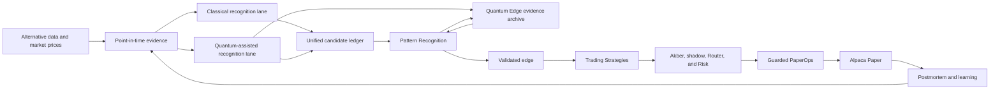

# Qadam Quantum Edge Hybrid Loop Implementation Plan

Date: 2026-07-12

Status: Waves A-H are implemented. Stages 1-9 are verified at the infrastructure
and contract-fixture layer; Stages 10-14 provide the truthful public
research-to-strategy and guarded recurring-loop experience. Stage 15 certifies
the bounded crude-oil testing mechanism while reporting the current scientific
result as unproven and not measurable.
Wave B's empirical evidence gate remains blocked because provider backfill has
zero completed partitions, zero provider rows, and zero eligible point-in-time
windows. Wave C therefore proves reproducible classical and local-quantum
discovery mechanics only, not a historical edge. Wave D has prepared the exact
guarded hardware experiment and durable provider lifecycle. Provider access is
now configured and the readiness probe has recovered, satisfying one of six
market-proof prerequisites. That access is not an IBM experiment: no hardware
job or provider execution call has been authorized, submitted, or run, and no
hardware result exists. Wave E now merges equivalent discovery records and
independently evaluates matched lanes, but its current verdict is
`not_measurable` because no empirical untouched holdout exists. No quantum
market edge has been proven.

Authority: This is the active implementation appendix for adding a genuine
hybrid classical-quantum pattern-recognition loop to Qadam. The canonical
day-to-day control document remains `docs/qadam-master-implementation-plan.md`.
If the documents conflict, the master plan wins until both are reconciled in
the same implementation wave.

## 1. Relationship To Existing Plans

This appendix extends, rather than silently rewrites, the current system:

- `docs/qadam-operator-ready-edge-engine-implementation-plan.md` owns the
  broader provider-backed history, point-in-time evidence, statistical edge,
  Akber, Router, Risk, PaperOps, and unattended-operation path.
- `docs/qadam-pattern-discovery-quantum-review-implementation-plan.md` records
  the already-deployed Pattern Discovery and Quantum Review baseline. It is a
  historical implementation reference after this appendix begins.
- `docs/qadam-qsase-implementation-plan.md` remains the broader self-aware
  strategy-engine roadmap.
- `docs/qadam-quantum-edge-three-layer-ux-implementation-plan.md` is the
  presentation-layer contract for the final Quantum Edge page: one canonical
  public projection, one renderer, and the three questions `The answer`, `The
  evidence`, and `The consequence`. This Hybrid Loop appendix remains the
  evidence-production, evaluation, and governance contract underneath it.
- This appendix controls the new parallel quantum discovery lane, the unified
  Pattern Recognition experience, the Quantum Edge proof archive, and their
  lineage into Trading Strategies.

The implementation must reuse existing evidence, statistical-validation,
dashboard, strategy, and PaperOps contracts where they are sound. It must not
create a competing second pattern lifecycle or execution route.

## 2. Objective

Qadam will process the same frozen point-in-time evidence through two parallel
research lanes:

1. a classical lane using conventional statistical and machine-learning
   methods;
2. a quantum-assisted lane using quantum feature maps, kernels, local
   simulation, and bounded IBM Quantum execution through Q-CTRL Fire Opal.

Both lanes feed one candidate ledger and one Pattern Recognition lifecycle.
Quantum Edge becomes the public museum of proof that measures whether quantum
computation discovered or strengthened anything beyond Qadam's strongest
matched classical method. Only validated patterns can be converted into
governed playbooks in Trading Strategies.

## 3. Correct End-To-End Flow



Pattern Recognition owns the integrated research lifecycle. Quantum Edge is a
specialist evidence branch and archive. Trading Strategies owns validated
playbooks. None of these surfaces creates broker authority.

## 4. Non-Negotiable Product Decisions

- Quantum may originate a research-only candidate relationship.
- Quantum cannot validate itself.
- Quantum cannot create or approve a strategy, risk decision, position size,
  execution decision, paper order, broker write, or proof credit.
- Classical and quantum lanes must receive the same frozen point-in-time
  evidence manifest.
- Outcome labels must remain unavailable during feature construction and
  candidate discovery.
- A simulator, quantum-inspired method, or classical fallback must never be
  presented as IBM hardware execution.
- A hardware job or interesting measurement is not a quantum edge.
- Quantum usefulness requires a matched classical baseline and untouched
  chronological evidence.
- Failed, inconclusive, and classically dominated experiments remain in the
  Quantum Edge archive.
- No cadence, portfolio target, dashboard action, or Telegram message can force
  an experiment, candidate promotion, strategy, or trade.

## 5. Public Page Responsibilities

| Page | Primary question | May contain | Must not do |
| --- | --- | --- | --- |
| Pattern Recognition | What relationships has Qadam recognised, and how? | Classical, quantum-assisted, and joint observations, candidates, tests, validations, rejections, and decays | Present an unvalidated pattern as a strategy or trade |
| Quantum Edge | Did quantum computation add useful information beyond the matched classical method? | Provider truth, experiments, comparisons, proof ladder, negative results, receipts, verdicts, and downstream influence | Treat protocol definition, simulation, or hardware activity as proof of edge |
| Trading Strategies | Which validated relationships have become governed trading playbooks? | Strategy thesis, market, catalyst, confirmation, invalidation, exits, risk assumptions, Akber stage, and concise discovery lineage | Act as the main classical-versus-quantum pattern gallery |

## 6. Discovery And Validation Vocabulary

Every candidate must carry two separate fields:

```text
discovery_origin:
  classical_discovery
  quantum_assisted_discovery
  joint_discovery

validation_contribution:
  not_tested
  quantum_strengthened
  joint_corroboration
  classical_preferred
  weakened
  inconclusive
  not_measurable
  failed_safely
```

Discovery origin records who noticed the relationship. Validation contribution
records what later comparison established. These fields must not be collapsed.

## 7. Two Definitions Of Success

### 7.1 Engineering Success

Qadam can originate a quantum-assisted candidate, execute its frozen circuits
locally and on an explicitly authorized IBM backend through Fire Opal, preserve
the complete chain of proof, compare the result with classical methods, and
route the verdict safely through Pattern Recognition.

Engineering success may conclude `classical_preferred` or `not_measurable`.

### 7.2 Scientific Quantum-Edge Success

At least one quantum contribution reproducibly adds useful predictive or
decision information beyond its matched classical baseline on untouched
evidence after transaction costs, multiple-testing, complexity, latency,
provider reliability, and sensitivity penalties.

Qadam must not claim scientific quantum-edge success until this stronger test
passes.

## Stage 1 - Governance And Vocabulary

Implementation status: Complete on 2026-07-12.

### Objective

Change the current quantum contract without weakening downstream safety.

### Build

- Replace `quantum cannot originate a signal` with `quantum may originate a
  research-only candidate relationship`.
- Add `quantum_research_candidate_allowed` while keeping strategy creation,
  risk, sizing, execution, paper-order, broker-write, live-capital, and
  proof-credit permissions false.
- Change public planning vocabulary from Pattern Discovery to Pattern
  Recognition and from Quantum Review to Quantum Edge.
- Preserve the existing `patterns/findings` and `patterns/nonlinear` route
  identifiers unless a separately tested migration supersedes them.
- Update the master plan, user guide, schema notes, and negative authority tests
  together.

### Exit Gate

A quantum-originated record can enter only the candidate research lifecycle,
and every attempted authority escalation fails closed.

## Stage 2 - Provider And Device Truth

Implementation status: Complete on 2026-07-12. The initial readiness snapshot
recorded `ibm_token_instance_access_mismatch`; the current readiness probe has
since recovered and reports provider access configured. The exit gate treats
that recovery as access readiness only, never as a hardware run or provider
execution result.

### Objective

Replace stale or ambiguous provider posture with explicit Fire Opal and IBM
Quantum truth.

### Build

- Verify Q-CTRL authentication and organization selection.
- Verify Fire Opal product entitlement independently of SDK importability.
- Verify IBM token and instance visibility without exposing values.
- Complete asynchronous device discovery and durable result polling.
- Distinguish:

```text
credentials_configured
authenticated
product_entitled
backend_discovered
circuit_validation_available
hardware_execution_authorized
hardware_experiment_completed
```

- Keep ordinary checks read-only and hardware submission disabled.
- Persist sanitized blockers, status hashes, timestamps, and next actions.

### Exit Gate

Qadam either identifies an eligible backend or reports a precise provider,
entitlement, network, or account blocker without implying hardware availability.

## Stage 3 - Point-In-Time Evidence Foundation

Implementation status: Contract complete on 2026-07-12. The empirical exit
gate remains blocked by `provider_backfill_has_no_completed_partitions`,
`provider_backfill_has_no_rows`, `provider_history_not_certified_complete`, and
`no_eligible_point_in_time_windows`. Missing evidence was not fabricated.

### Objective

Provide real historical evidence that both lanes can use without lookahead.

### Build

- Reuse and complete the operator-ready provider-backfill and point-in-time
  evidence contracts.
- Preserve event time, publication time, ingestion time, provider, source,
  vintage, market timestamp, missingness, and immutable content hashes.
- Use revised datasets only as they were knowable at each historical cutoff.
- Keep source observations, features, future labels, generated views, and
  proof-eligible evidence in separate domains.
- Build chronological train, validation, and untouched holdout partitions with
  purging and embargo where outcome windows overlap.
- Never replace unavailable provider history with invented evidence.

### Exit Gate

Eligible historical windows reproduce from source artifacts without future
information entering feature construction.

## Stage 4 - Shared Experiment Manifest

Implementation status: Contract complete on 2026-07-12. Deterministic fixture
construction, train-only normalization, and equal classical/quantum manifest
hashes pass. Production manifest creation remains blocked by the Stage 3
empirical evidence blockers.

### Objective

Guarantee that classical and quantum lanes compare like with like.

### Build

Define a versioned `QuantumDiscoveryWindow` and frozen manifest containing:

```text
as_of timestamp
market sleeve and target instrument
6-10 normalized features
missingness mask
source artifact references and hashes
feature-schema version
encoding version
chronological split identity
dataset and manifest hashes
random seed
```

- Keep labels and future outcomes absent from discovery manifests.
- Fit normalization on training data only.
- Make construction deterministic and idempotent.
- Reject unsupported dimensions, excessive missingness, stale inputs, malformed
  values, and lineage gaps.

### Exit Gate

The same evidence and schema always produce the same manifest, and both lanes
consume that exact manifest hash.

## Stage 5 - Classical Discovery Lane

Implementation status: complete for deterministic contract fixtures. Empirical
evaluation remains gated by provider-backed point-in-time history.

### Objective

Create strong reference methods so quantum is not measured against a weak
baseline.

### Build

- Implement linear and logistic relationships where appropriate.
- Implement RBF-kernel similarity.
- Implement change-point and state-transition detection.
- Implement anomaly detection and spectral or kernel clustering.
- Implement tree-based interaction, regime, and path-dependence tests.
- Preserve point-in-time scores before labels are attached.
- Freeze metrics, costs, threshold selection, and multiple-testing policy before
  final holdout evaluation.

### Exit Gate

Every quantum experiment has a named, reproducible, and appropriately tuned
matched classical baseline.

## Stage 6 - Local Quantum Discovery Lane

Implementation status: complete for ideal and finite-shot local simulation on
deterministic contract fixtures. This is not IBM hardware execution and does
not establish quantum advantage.

### Objective

Allow quantum computation to originate research candidates before provider
hardware is used.

### Build

- Add compatible pinned `qiskit-aer` and `qiskit-machine-learning`
  dependencies.
- Introduce a shared `QuantumDiscoveryBackend` result contract.
- Encode numerical features into shallow rotation and entanglement circuits.
- Use approximately 4-8 qubits for initial bounded experiments.
- Calculate quantum-derived fidelity or similarity kernels.
- Use landmark or Nystrom approximation to constrain pairwise circuit growth.
- Support ideal and finite-shot local simulation.
- Feed kernels into clustering, anomaly, nearest-regime, or supervised methods
  where appropriate.
- Keep classical fallback visibly non-quantum.

### Exit Gate

Local simulation detects known synthetic nonlinear interactions, rejects null
datasets, and emits reproducible research-only candidates with full lineage.

## Stage 7 - Fire Opal And IBM Backend

Implementation status: guarded adapter and frozen smoke manifest complete.
The real-hardware exit remains pending an eligible discovered backend and a
separate exact operator authorization.

### Objective

Run the same frozen experiment on IBM hardware through Q-CTRL Fire Opal without
creating an uncontrolled provider or trading path.

### Build

- Implement a guarded Fire Opal IBM discovery backend.
- Convert Qiskit circuits into valid OpenQASM and validate them before
  submission.
- Require an exact frozen manifest and separate explicit authorization.
- Support durable asynchronous submission, polling, timeout, and recovery.
- Convert sanitized measurements into the local kernel result schema.
- Persist circuit hashes, backend hashes, shots, depth, runtime, action hashes,
  and sanitized receipts.
- Enforce maximum qubits, depth, circuits, shots, retries, wall-clock time, and
  provider budget.
- Never expose secrets or store raw credential-bearing responses.

### Exit Gate

One frozen experiment can run locally and, after explicit authorization, on an
eligible IBM backend through Fire Opal with comparable result contracts.

## Stage 8 - Hybrid Candidate Merger

Implementation status: Complete at infrastructure and contract-fixture layer
on 2026-07-12.

### Objective

Create one coherent lifecycle rather than separate classical and quantum silos.

### Build

- Derive stable identities from source transform, target, direction or question,
  horizon, regime, and schema version.
- Merge equivalent classical and quantum findings into one joint candidate.
- Preserve independent evidence records beneath the merged identity.
- Record discovery origin separately from validation contribution.
- Include source chain, market, interpretation, confirmation, falsifier,
  evidence, blocker, and next action.
- Prevent proxy instruments from becoming duplicate top-level relationships
  unless outcome definitions materially differ.
- Write durable candidate, merge, rejection, and provenance ledgers.

### Exit Gate

Every candidate has one stable identity, an honest origin, and no automatic
promotion merely because both lanes observed it.

## Stage 9 - Independent Quantum Value Evaluation

Implementation status: Evaluation contract complete on 2026-07-12; empirical
quantum value remains `not_measurable` until provider-backed untouched holdout
evidence exists.

### Objective

Measure quantum value without allowing the discovery model to judge itself.

### Build

- Establish a matched classical baseline before every comparison.
- Use training and validation evidence for method selection.
- Keep final chronological holdout evidence untouched until thresholds freeze.
- Measure incremental predictive or decision value after transaction costs.
- Apply multiple-testing and false-discovery controls.
- Record shot, noise, provider, latency, cost, and reproducibility sensitivity.
- Reuse or extend current nonlinear experiment, comparison, usefulness, and
  overfit-audit artifacts.
- Emit only:

```text
quantum_strengthened
joint_corroboration
classical_preferred
weakened
inconclusive
not_measurable
failed_safely
```

### Exit Gate

Quantum usefulness is claimed only when incremental value survives untouched
evidence and frozen operational penalties.

## Stage 10 - Pattern Recognition

### Objective

Turn Pattern Discovery into the unified record of what Qadam has recognised
through classical, quantum-assisted, or joint computation.

### Build

- Change the visible label to `Pattern Recognition` while preserving
  `patterns/findings`.
- Add `All`, `Classical`, `Quantum`, and `Joint` filters.
- Show relationship, sources, market, interpretation, confirmation, falsifier,
  evidence state, lifecycle stage, blocker, and next action on every card.
- Show discovery origin and validation contribution separately.
- Use neutral white cards with green evidence accents for classical records.
- Use a restrained violet rail and pale lavender evidence area for quantum
  records.
- Use separate green and violet markers for joint records.
- Use `IBM Quantum via Q-CTRL Fire Opal` only with a valid hardware receipt.
- Label simulation, quantum-inspired, and classical fallback states distinctly.
- Link quantum-involved cards to Quantum Edge.
- Show an honest empty state when no quantum-originated candidates exist.

### Exit Gate

A user can distinguish classical, quantum-assisted, and joint recognition
without mistaking an unvalidated pattern for a strategy or trade.

Implementation status: Complete and deployed on 2026-07-12. The preserved
route exposes `All`, `Classical`, `Quantum`, and `Joint` lanes; today's honest
counts are 6 total, 5 classical, 0 quantum-only, and 1 joint engineering
control.

## Stage 11 - Quantum Edge

### Objective

Replace Quantum Review with a public museum of proof for Qadam's quantum thesis.

### Build

- Change the visible label to `Quantum Edge` while preserving
  `patterns/nonlinear`.
- Accept quantum-originated candidates and classical candidates referred for
  justified nonlinear quantum analysis.
- Display a current proof state:

```text
quantum_edge_not_yet_proven
provisional_quantum_evidence
validated_quantum_contribution
quantum_contribution_decayed
```

- Display the proof ladder:

```text
Provider configured
IBM hardware executed
Result reproduced
Classical baseline beaten
Untouched-data advantage survived
Paper decision improved
```

- Build strongest evidence, experiment gallery, classical comparison, circuit
  and dataset provenance, hardware authenticity, negative results, strategy
  influence, and paper-outcome lineage.
- Keep technical detail expandable rather than dominant.
- Preserve failed, inconclusive, neutral, and classically preferred results.
- Return every verdict to its originating Pattern Recognition identity.
- Never describe a protocol, simulator run, submitted job, or hardware receipt
  alone as a quantum edge.

### Exit Gate

The page explains what was tested, what hardware was used, whether quantum beat
its baseline, and what changed in Qadam as a result.

Implementation status: Complete and deployed on 2026-07-12. The six-step proof
ladder, matched-classical comparison, experiment gallery, provenance, hardware
authenticity, negative evidence, strategy influence, and paper-outcome lineage
are visible. The current proof state remains `quantum_edge_not_yet_proven`.

## Stage 12 - Trading Strategies

### Objective

Keep the strategy page focused on validated, governed playbooks rather than
turning it into another pattern gallery.

### Build

- Keep the visible name `Trading Strategies`.
- Admit only validated edges that pass strategy-mapping policy.
- Do not split the page into large green classical and purple quantum galleries.
- Show concise lineage:

```text
underlying_pattern_id
discovery_origin
validation_contribution
Pattern Recognition link
Quantum Edge link when applicable
```

- Keep primary fields focused on market, instruments, thesis, catalyst,
  confirmation, entry, invalidation, exits, risk assumptions, Akber stage, and
  present blocker.
- Prevent provisional patterns and hardware activity from appearing as approved
  strategies.

### Exit Gate

Every strategy maps to a validated pattern, and its discovery lineage is
inspectable without overwhelming the playbook.

Implementation status: Complete and deployed on 2026-07-12. No strategy is
currently admitted because no underlying pattern is independently validated;
the five defined playbooks remain in a collapsed research queue.

## Stage 13 - Strategy, Risk, Paper Trading, And Learning

### Objective

Integrate validated evidence into Qadam's guarded paper workflow.

### Build

Route only integrated validated edges through:

```text
Trading Strategy
-> Akber filter
-> forward shadow validation
-> Router
-> Risk
-> guarded PaperOps
-> Alpaca Paper
```

- Allow quantum contribution to affect research priority or documented strategy
  evidence only after validation.
- Prevent quantum components from sizing, overriding holds, approving execution,
  or calling Alpaca.
- Attribute postmortems separately to classical evidence, quantum contribution,
  strategy logic, Akber and risk, execution quality, and market movement.
- Feed learning into governed feature, experiment, and strategy proposals.

### Exit Gate

Tests prove there is no direct path from quantum code, Pattern Recognition, or
Quantum Edge to broker code.

Implementation status: Complete on 2026-07-12. The current real cycle admits no
edge and creates no strategy, risk review, PaperOps handoff, order, or broker
write. A validated engineering fixture proves the seven-stage review route in
tests without granting any upstream research component broker authority.

## Stage 14 - Automation And Public Visibility

### Objective

Run the hybrid loop repeatedly without forcing hardware, promotion, or trades.

### Build

- Run source refresh, feature construction, classical discovery, and local
  quantum simulation on a daily evidence-driven cadence.
- Prepare bounded Fire Opal experiments weekly or after explicit eligibility.
- Require separate authorization for the exact hardware manifest.
- Evaluate comparisons only after outcomes mature naturally.
- Make jobs resumable, idempotent, budgeted, and safe after interruption.
- Expose truthful dashboard and Telegram states:

```text
candidate noticed
experiment prepared
experiment executed
result reproduced
evidence strengthened
edge validated
strategy influenced
paper outcome observed
```

- Never let cadence force a provider execution call, promotion, strategy, or
  paper trade.

### Exit Gate

Unattended cycles remain fresh, recoverable, within budgets, and accurately
represented on public surfaces.

Implementation status: Complete on 2026-07-12. The coordinator is
content-addressed, checkpointed, resumable after interruption, idempotent on
rerun, bounded to zero hardware jobs and provider execution calls, and public
through a read-only Quantum Edge lifecycle and two-paragraph Telegram preview.
Deployment evidence is recorded in the Wave G implementation record below.

## Stage 15 - Crude-Oil Pilot, Certification, And Deployment

### Objective

Prove the engineering path on one bounded market before expansion.

### Build

Use a frozen crude-oil experiment with point-in-time features such as:

- conflict-event acceleration;
- tanker and chokepoint disruption;
- port congestion;
- inventory surprise;
- weather and fire disruption;
- futures-curve structure;
- realized volatility;
- muted or divergent price response.

Run:

1. matched classical baselines;
2. ideal quantum simulation;
3. finite-shot or noisy simulation;
4. one explicitly authorized IBM/Fire Opal experiment;
5. untouched chronological holdout evaluation;
6. placebo, time-shift, permutation, and multiple-testing controls.

- Certify reproducibility, provider recovery, receipt lineage, secret safety,
  authority isolation, dashboard truth, and strategy provenance.
- Accept `classical_preferred` or `not_measurable` as honest engineering
  outcomes.
- Update the master plan, User Guide, and Whitepaper with verified results.
- Run full preflight, commit, push, deploy, and verify served production assets.
- Expand to silver, defence, semiconductors, and prediction markets only after
  the crude-oil pipeline is reproducible.

### Exit Gate

Qadam has an operational mechanism for testing quantum edge honestly, and the
public product states whether it is unproven, provisional, validated,
classically dominated, or decayed.

Implementation status: Complete for all currently non-blocked work on
2026-07-12. The mechanism certification passes 11/11 engineering checks. The
market-proof certification passes 1/6 prerequisites because provider access is
configured and recovered. Provider history, an eligible untouched holdout, an
IBM hardware result, the matched market comparison, and the robustness control
suite do not yet exist. IBM hardware has not been run, no quantum market edge
has been proven, the current public state is `unproven`, and the scientific
verdict is `not_measurable`.

## Wave Plan

The 15 stages are grouped into eight implementation waves. Each wave is tested,
documented, committed, and pushed independently. A later wave must not paper
over a failed earlier exit gate.

| Wave | Stages | Scope | Primary output | Status | Deploy |
| --- | --- | --- | --- | --- | --- |
| Wave A | 1-2 | Governance, vocabulary, provider and device truth | Authority contract and refreshable readiness | Complete; provider access configured and recovered; no hardware run | No |
| Wave B | 3-4 | Point-in-time evidence and shared manifests | Leakage-safe evidence and frozen inputs | Contract complete; empirical provider history blocked | No |
| Wave C | 5-6 | Classical and local quantum discovery | Baselines and local quantum candidates | Infrastructure complete; contract fixture only | No |
| Wave D | 7 | Fire Opal and IBM backend | Guarded adapter and prepared smoke manifest | Infrastructure complete; hardware run not authorized | No hardware submission by default |
| Wave E | 8-9 | Hybrid merge and independent evaluation | Unified candidates and honest verdicts | Infrastructure complete; empirical verdict not measurable | No |
| Wave F | 10-12 | Pattern Recognition, Quantum Edge, Trading Strategies | Corrected research-to-strategy UX | Complete; proof state remains not yet proven | Deployed 2026-07-12 |
| Wave G | 13-14 | Paper integration, learning, automation, visibility | Safe recurring hybrid loop | Complete; safe idle with zero validated edges | Deployed 2026-07-12 |
| Wave H | 15 | Crude-oil pilot, certification, docs, release | Reproducible end-to-end evidence | Complete for non-blocked work; result unproven | Deployed 2026-07-12 (`73763da`) |

## Wave Dependencies

```text
Wave A
  -> Wave B
    -> Wave C
      -> Wave D
        -> Wave E
          -> Wave F
            -> Wave G
              -> Wave H
```

Wave D backend work may finish while real provider access remains blocked, but
Wave H cannot claim hardware execution without an authorized receipt. Wave F
may deploy an honest `Quantum edge not yet proven` state.

## Wave A Implementation Record

Completed and deployed: 2026-07-12

Implemented:

- `orchestrator/qadam_quantum_edge_governance.py` defines the only positive
  Wave A capability, `quantum_research_candidate_allowed=True`, while keeping
  self-validation, validated-edge creation, strategy, trade-candidate, risk,
  sizing, execution, order, broker, proof-credit, dashboard-command,
  Telegram-command, and live-capital authority false.
- `orchestrator/quantum.py` now emits schema-v3 Fire Opal and IBM provider truth
  for credentials, combined authentication, product entitlement, backend
  discovery, circuit-validation availability, hardware authorization, and
  completed hardware experiments.
- Fire Opal asynchronous device discovery can resume from a private ignored
  mode-0600 sidecar. Only an action hash may enter the public artifact.
- IBM Runtime preflight now verifies the configured instance and lists backend
  names only as hashes when access succeeds.
- Completed or failed read-only probe truth survives ordinary readiness and
  cockpit refreshes, so a confirmed provider blocker cannot regress to
  `explicit_device_probe_not_run` without a new probe.
- The explicit read-only probe originally recorded
  `ibm_token_instance_access_mismatch`. The current readiness artifact now
  reports provider access configured and recovered. This contributes one
  market-proof prerequisite, but it does not authorize or prove an IBM hardware
  run; there is no hardware job or provider execution result.

Verified boundaries:

- no quantum circuit or hardware job submitted;
- no hardware execution authorized;
- no scheduler enabled;
- no research candidate promoted into an edge or strategy;
- no risk, order, broker, proof-credit, or live-capital authority enabled;
- no secret value or raw provider response persisted publicly.

Verification:

- 14 focused governance, provider-truth, and nonlinear-lab tests pass;
- Q-CTRL readiness, local simulator, quantum oracle, oracle routing, PaperOps
  consultation, and cockpit checks pass;
- the repository-wide suite reports 149 passing and 11 failing tests in
  unchanged PaperOps/QSASE modules whose current fixture/runtime counts sit
  outside Wave A; none touches the Wave A authority or provider paths.

Wave A exit decision: complete with a precise external provider blocker. The
matching IBM API key and CRN must be supplied before Wave D or Wave H can run a
real hardware experiment. Waves B and C may proceed independently because they
use point-in-time evidence and local computation.

## Wave B Implementation Record

Completed at contract layer: 2026-07-12

Implemented:

- `orchestrator/qadam_quantum_discovery_evidence.py` adds immutable
  point-in-time feature records with event, publication, ingestion,
  availability, vintage, market, and cutoff timestamps; content and record
  hashes; typed missingness; separate evidence domains; and zero downstream
  authority.
- Chronological train, validation, and untouched-holdout splits now apply
  outcome-window purging and holdout embargoes while retaining every excluded
  record under an explicit partition.
- `orchestrator/qadam_quantum_discovery_manifest.py` defines the versioned
  `QuantumDiscoveryWindow`, supports 6-10 features, fits normalization on the
  training partition only, preserves source references and hashes, emits an
  explicit missingness mask, and rejects stale, future, malformed, unsupported,
  or lineage-incomplete inputs.
- Classical and quantum-assisted consumers receive the same deterministic
  manifest hash. Future labels are absent and separate.
- Contract fixtures are labeled `contract_fixture_only=True`; they cannot be
  presented as empirical evidence, a quantum result, a validated edge, a
  strategy, or a trade.

Current runtime truth:

- 41 source and 19 instrument plans span 450 provider partitions;
- 0 partitions are complete, 0 provider rows exist, and provider history is not
  certified complete;
- 6,232 historical windows are classified, 0 are currently eligible discovery
  inputs, 465 typed evidence gaps remain, and 0 leakage violations are recorded;
- source-provider validation and explicit price backfill remain the next data
  operations; neither Wave B checker performs a network call.

Verification:

- 13 focused Wave B tests pass;
- 27 combined Wave A, Wave B, and nonlinear-lab tests pass;
- provider-backfill, point-in-time alignment, Wave A governance, and Fire
  Opal/IBM readiness checks pass their contracts and preserve their precise
  blockers;
- Ruff, Python compilation, deterministic rebuild, lane-hash equality,
  future-label denial, stale-input denial, excessive-missingness denial, and
  authority-escalation probes pass;
- the repository-wide suite reports 162 passing and the same 11 failures in
  unchanged PaperOps/QSASE modules recorded in Wave A; no Wave B test fails.

Wave B exit decision: the implementation contract is complete, but the
empirical Stage 3 exit gate is not passed. Wave C may implement and test the
classical and local-quantum algorithms against explicitly labeled contract
fixtures, but it must not claim an empirical candidate or quantum edge until
provider-backed point-in-time rows satisfy this gate.

## Wave C Implementation Record

Completed at infrastructure and contract-fixture layer: 2026-07-12

Implemented:

- `orchestrator/qadam_discovery_backend.py` defines the shared, label-blind
  `DiscoveryInputBatch`, classical result, local quantum result, research
  candidate, validation, authority, lineage, and matched-policy contracts.
- Both lanes consume the exact same frozen Wave B manifest hash, split
  identity, feature order, encoding, normalization, missingness mask, source
  lineage, and random seed. Future outcomes and labels are absent.
- `orchestrator/qadam_classical_discovery.py` implements eight named reference
  methods: linear correlation, contemporaneous logistic relationship,
  RBF-kernel similarity, change-point mean shift, lagged state transition,
  multivariate anomaly, RBF spectral structure, and depth-two tree
  interaction.
- The classical policy freezes RBF gamma, logistic settings, candidate
  thresholds, transaction costs, train/validation threshold scope, untouched
  holdout scope, Benjamini-Hochberg FDR policy, and random seed before later
  empirical evaluation.
- `orchestrator/qadam_local_quantum_discovery.py` implements the shared
  `QuantumDiscoveryBackend` contract with a shallow Qiskit rotation and
  entanglement feature map, ideal statevector fidelity, finite-shot Aer
  fidelity, bounded landmark/Nystrom approximation, and explicit circuit
  evaluation budgets.
- Every local quantum result is linked to an actual classical result ID and
  classical policy hash from the same input manifest. Missing, mismatched, or
  incomplete baselines are rejected.
- Compatible local dependencies are pinned as Qiskit 2.4.1, Qiskit Aer 0.17.2,
  and Qiskit Machine Learning 0.9.0. Dependency absence produces a truthful
  classical-fallback record, never a quantum-execution claim.
- The contract fixture contains a known nonlinear interaction between
  `source_density` and `source_agreement`. The classical interaction method and
  the independent local quantum kernel both recover that pair. The fixture is
  marked non-empirical and cannot persist a candidate.

Verified boundaries:

- the local quantum run uses 6 qubits, 8 landmarks, and 100 bounded circuit
  evaluations for the fixture;
- ideal simulation is deterministic, and finite-shot simulation is
  reproducible under its frozen seed;
- null inputs, invalid shot counts, circuit-budget overruns, input tampering,
  and classical-baseline mismatches are rejected;
- local Qiskit/Aer execution is recorded as simulation, never IBM hardware;
- no hardware job or provider execution call, validated edge, strategy, trade
  candidate, risk approval, sizing instruction, execution approval, order,
  broker write, proof credit, dashboard command, Telegram command, or
  live-capital authority is created.

Verification:

- 11 focused Wave C tests pass;
- 38 combined Wave A, Wave B, Wave C, and nonlinear-lab tests pass;
- both Wave C contract checkers pass, recover the expected interaction, and
  report zero edge or order authority;
- the existing local simulator and quantum oracle checks now use
  `qiskit_aer_local` successfully while retaining zero hardware submission and
  zero execution authority;
- Ruff and Python compilation pass for every Wave C implementation, checker,
  and test file;
- the repository-wide suite reports 173 passing and the same 11 failures in
  pre-existing PaperOps/QSASE fixture expectations. No Wave C test fails.

Wave C exit decision: Stages 5 and 6 pass their infrastructure and synthetic
control requirements. They do not pass an empirical edge gate. Provider-backed
historical backfill and untouched holdout evaluation remain future work, as
explicitly requested. Wave D may build the guarded provider adapter. Provider
access has since been configured and recovered, but IBM hardware execution
remains unauthorized and has not been run.

## Wave D Implementation Record

Completed at guarded-adapter and prepared-manifest layer: 2026-07-12

Implemented:

- `orchestrator/qadam_local_quantum_discovery.py` now exposes the exact Wave C
  feature-map builder, deterministic landmark selection, fidelity-pair order,
  Nystrom reconstruction, and kernel analysis as shared local/hardware
  primitives. Wave D does not substitute a different hardware problem.
- `orchestrator/qadam_fire_opal_ibm_discovery.py` composes each frozen feature
  pair as an overlap circuit, adds terminal measurement, exports OpenQASM 2,
  parses it back locally, and enforces Fire Opal-compatible qubit, measurement,
  depth, count, shot, byte, runtime, retry, poll, and provider-cost budgets.
- The prepared fixture smoke manifest contains 100 unique fidelity circuits,
  6 qubits, maximum depth 19, 256 shots per circuit, and 25,600 total shots. It
  is tied to the same Wave B manifest hash, classical result and policy, local
  quantum result and policy, source feature-circuit hashes, landmark set, and
  evaluation pairs used by Wave C.
- The hardware budget is frozen at no more than 8 qubits, depth 64, 128
  circuits, 32,768 total shots, one submission attempt, three poll failures,
  120 polls, 7,200 seconds, and an explicit USD 10 authorization ceiling.
- A single-use authorization must match the prepared manifest hash, discovered
  backend-name hash, circuit and shot counts, estimated and maximum provider
  cost, validity window, and a raw operator nonce whose hash alone enters the
  authorization record. There is no submit CLI or scheduler.
- `FireOpalSdkIbmGateway` is lazy and performs no work on construction. Only an
  authorized submission function may authenticate Q-CTRL, build in-memory IBM
  credentials, call Fire Opal validation, and then call asynchronous execution.
- Public and mode-0600 private state are separated. QASM, backend name, action
  ID, credentials, and raw provider responses remain private; public state
  retains only circuit, backend, action, provider-job, validation, receipt, and
  failure hashes plus bounded counters.
- Submission is idempotent and fail-closed. State is durably marked
  `submission_in_progress` before the provider execution call. A
  crash-ambiguous attempt cannot retry automatically and requires explicit
  reconciliation.
- Polling is one-shot and resumable. It enforces poll and wall-clock budgets,
  preserves timed-out actions for later explicit recovery, and never submits a
  replacement job.
- Sanitized Fire Opal bitstring distributions rebuild the same Nystrom kernel
  schema and nonlinear analysis used locally. A resulting relationship remains
  research-only and cannot validate itself, create a strategy or trade, approve
  risk or execution, create an order, grant proof credit, or enable live
  capital.
- The tested provider dependency set is pinned to Fire Opal 11.1.0, Qiskit
  2.4.1, and Qiskit IBM Runtime 0.47.0.

Current prepared truth:

- prepared manifest hash:
  `57b7137c71ee255a6c4a04b2812258cccfc76beef2332c09cdce55a9c4eb1661`;
- shared Wave B manifest hash:
  `5548406d3edcf302d7c5f66e253fdb62fce855b4d588166abc9dd2b1dc357653`;
- local QASM validation passed for all 100 circuits;
- hardware/provider execution call count is 0, hardware authorization is false,
  hardware job submitted is false, and hardware experiment completed is false;
- the prepared private bundle is mode 0600 and the public state contains no
  QASM or raw provider identity;
- current provider readiness is configured and recovered. That readiness is
  access only: the prepared manifest has not been authorized or submitted, IBM
  hardware has not been run, and no provider execution result exists.

Verification:

- 12 focused Wave D tests pass, including manifest and authorization tampering,
  budget overruns, blocked readiness, validation rejection, fake-provider
  idempotency, private-to-public crash recovery, ambiguous submission, timeout,
  poll-failure recovery, malformed result denial, receipt sanitization, and
  provider-silent construction;
- 50 combined Wave A-D and nonlinear-lab tests pass;
- the Wave D checker prepares the exact manifest with zero hardware jobs,
  provider execution calls, or hardware authority;
- the Fire Opal/IBM readiness check passes its schema with provider access
  configured and recovered while preserving all zero-execution and
  zero-authority fields;
- local simulator and quantum oracle checks continue to pass on
  `qiskit_aer_local` with zero hardware, execution, and paper-order authority;
- Ruff, Python compilation, and `pip check` pass;
- the repository-wide suite reports 185 passing and the same 11 failures in
  pre-existing PaperOps/QSASE fixture expectations. No Wave D test fails.

Wave D exit decision: the guarded adapter, exact experiment preparation,
durability, sanitization, and fake-provider execution contract are complete.
The real-hardware portion of the Stage 7 exit gate is not passed. Provider
access is ready, but an actual run still requires a separate prompt that names
this prepared manifest hash, backend, limits, provider-cost approval, and
one-time authorization nonce. No such authorization or provider execution call
has occurred. Wave E may build merger and evaluation contracts without claiming
a hardware contribution.

## Wave E Implementation Record

Completed at hybrid-lifecycle and independent-evaluation contract layer:
2026-07-12

Implemented:

- `orchestrator/qadam_hybrid_candidate_merger.py` defines a stable candidate
  identity from source transform, feature relationship, economic target,
  outcome definition, direction or question, horizon, regime, and schema. A
  proxy ticker is evidence beneath that identity rather than a reason to create
  a duplicate top-level relationship.
- Classical, local-quantum, and valid hardware-receipt evidence enter through
  separate hashed evidence records. Equivalent records merge into one
  candidate while retaining source result, source candidate, manifest,
  method, observed instrument, execution mode, simulation, hardware, and
  fixture provenance.
- Discovery origin and validation contribution remain separate. A joint
  classical and quantum observation records `joint_discovery` and
  `not_tested`; merging cannot validate the candidate or promote it.
- Every candidate carries the source chain, market target, relationship,
  interpretation, confirmation, falsifier, blocker, and next action. Unmatched
  or ambiguous evidence enters a rejection ledger rather than being silently
  attached.
- Durable candidate, merge, rejection, and provenance JSONL artifacts use
  atomic replacement and contain no QASM, provider action ID, backend identity,
  credential, secret, token, or raw provider response.
- `orchestrator/qadam_independent_quantum_value.py` is a separate evaluator. It
  requires a named matched classical baseline, frozen method policies, a
  chronological split, an untouched holdout manifest, thresholds frozen before
  unsealing, and no holdout use during method selection.
- The evaluator applies the same decision threshold to both lanes, computes
  cost-adjusted matched returns, runs a deterministic paired sign-flip test,
  applies Benjamini-Hochberg false-discovery correction, and subtracts frozen
  complexity, latency, provider-cost, noise, and reproducibility penalties.
- Provider mode, hardware receipt, shots, noise sensitivity, lane latency,
  provider cost, and repeated-run scores remain explicit. An IBM/Fire Opal
  hardware claim without a completed receipt fails safely.
- Only the seven planned verdicts are accepted. Synthetic controls expose a
  separate `control_verdict` for testing the mathematics, while their public
  validation contribution remains `not_measurable`. A fixture cannot be
  relabeled as empirical evidence.
- Evaluation records do not mutate candidates and cannot create a validated
  edge, strategy hypothesis, trade candidate, risk or execution approval,
  paper order, proof credit, hardware submission, scheduler, broker write,
  dashboard command, Telegram command, or live-capital authority.

Current Wave E truth:

- shared Wave B manifest hash:
  `5548406d3edcf302d7c5f66e253fdb62fce855b4d588166abc9dd2b1dc357653`;
- hybrid candidate ID:
  `hybrid-candidate:a8743e753b380958f5bde199`;
- one classical record and one local ideal-simulator record merge into one
  `joint_discovery` candidate with two independent provenance records;
- the candidate is explicitly `contract_fixture_only`, cannot persist as an
  empirical finding, and retains `validation_contribution=not_tested`;
- the independent result is `not_measurable` with blocker
  `empirical_untouched_holdout_missing`;
- quantum edge claimed is false, hardware/provider execution call attempted is
  false, hardware submission attempted is false, candidate promotion count is
  0, and paper order count is 0.

Verification:

- 13 focused Wave E tests pass, covering stable identity, proxy collapse,
  outcome separation, joint merge, provenance, deduplication, rejection,
  zero promotion, no-holdout truth, positive synthetic control, classical
  preference, joint corroboration, null control, FDR, holdout misuse,
  operational cost penalties, hardware and authority tampering, public-safe
  durability, and result tampering;
- 63 combined Wave A-E and nonlinear-lab tests pass;
- every Wave A-E checker passes. The Wave E checker rebuilds one joint fixture
  candidate and the honest `not_measurable` verdict with zero provider,
  hardware-submission, promotion, or order activity;
- the positive synthetic control reaches `quantum_strengthened` only in its
  test-only control field; the real validation field stays `not_measurable`;
- Ruff, Python compilation, diff hygiene, and `pip check` pass;
- the entire dirty working-tree suite reports 203 passing and 12 failing. The
  11 established PaperOps/QSASE fixture failures remain, and one additional
  untracked dashboard-navigation test expects 14 routes while that unrelated
  in-progress dashboard work currently exposes 12. No Wave E test fails.

Wave E exit decision: Stage 8 passes. Stage 9 passes as an independent,
fail-closed evaluation mechanism, but its scientific quantum-value exit gate
does not pass until provider-backed historical evidence produces an untouched
chronological holdout. `not_measurable` is the only honest current verdict.
Wave F may proceed if Pattern Recognition and Quantum Edge preserve this state
as `Quantum edge not yet proven`. No deployment was performed in Wave E.

## Wave F Implementation Record

Completed and deployed: 2026-07-12

Implemented:

- `orchestrator/qadam_wave_f_public_view.py` builds one public-safe projection
  for Pattern Recognition, Quantum Edge, and Trading Strategies. It preserves
  the existing route identifiers, separates discovery origin from validation
  contribution, rejects unearned hardware and quantum-edge labels, and grants
  no dashboard, broker, order, proof, strategy-promotion, hardware-submission,
  Telegram-command, or live-capital authority.
- `scripts/check_qadam_wave_f_public_view.py` rebuilds and validates matching
  runtime and static-site artifacts from the canonical Wave A-E records.
- `landing-page-repo/quantum-edge-wave-f.js` renders the three Wave F views from
  the read-only projection. The MutationObserver-safe renderer relabels every
  route reference without changing route identity and does not contain an
  order or broker endpoint.
- `landing-page-repo/quantum-edge-wave-f.css` provides scoped, responsive
  classical, quantum, and joint visual states. Quantum-only evidence uses the
  violet treatment; the rest of the dashboard remains within the existing
  non-homepage design system.
- `scripts/check_dashboard_quantum_edge_wave_f.js` verifies routes, filters,
  proof ladder, hardware labels, strategy admission, zero authority, static
  asset wiring, responsive contracts, and the single read-only status fetch.
- `tests/test_qadam_wave_f_public_view.py` covers the live projection, origin
  separation, simulator truth, proof ladder, strategy admission, tampering,
  forbidden public keys, zero authority, and matching artifact exports.
- The non-homepage deployment regression contract now recognises the Wave F
  `auth.js` cache key; the previous stale assertion correctly blocked the first
  deployment attempt before upload.

Current Wave F truth:

- six research relationships are visible: five classical, zero quantum-only,
  and one joint classical/local-simulator engineering control;
- the joint record remains `contract_fixture_only` and `not_measurable`;
- the Quantum Edge market-proof prerequisites are 1/6 complete because
  provider access is configured and recovered;
- provider access is not execution: IBM hardware has not been run, and hardware
  submissions, provider execution calls, completed hardware experiments, and
  verified receipts remain zero or false;
- zero strategies are admitted and five playbooks remain research-only;
- no paper decision or paper outcome is attributed to quantum evidence.

Verification:

- 8 focused Wave F tests pass;
- 71 combined Wave A-F and nonlinear-lab tests pass;
- all Wave A-F contract checkers pass with zero hardware jobs, provider
  execution calls, strategy promotions, paper orders, broker writes, proof
  credit, or live-capital authority from Wave F;
- Ruff, Python compilation, Node syntax, `pip check`, the Wave F dashboard
  acceptance contract, and the 16-check non-homepage regression suite pass;
- the exact staged site bundle was tested independently of the dirty worktree;
- desktop and mobile browser checks pass without console warnings or horizontal
  overflow, including the empty Quantum lane and collapsed research queue;
- the full production preflight passed before deployment;
- static-site commit `2a54536` was pushed to `origin/main` and deployed to
  `https://qadam-bu1jo2p9j-ramin-hoodehs-projects.vercel.app`, then aliased to
  `https://qadam.trade` and `https://www.qadam.trade`;
- served production HTML, JavaScript, CSS, and public JSON expose content hash
  `e579f96dd40bed00d6aef3645d560432565b7d9102934a2817ac36b95115af5b`.

Wave F exit decision: Stages 10-12 pass. The public UX now distinguishes what
was found, how it was found, whether it survived independent comparison, and
whether it is admitted into strategy. This does not pass the scientific quantum
edge gate: IBM hardware execution and untouched empirical validation remain
future work for Waves G-H.

## Wave G Implementation Record

Completed: 2026-07-12

Implemented:

- `orchestrator/qadam_wave_g_hybrid_loop.py` admits only independently
  validated, non-fixture edges with frozen training and untouched-holdout
  lineage. Quantum contribution can become documented strategy evidence only
  after independent validation; it cannot size, approve, override, submit, or
  call a broker.
- The guarded route is explicit and ordered: Trading Strategy, Akber filter,
  matured forward shadow validation, Router, Risk, guarded PaperOps, and Alpaca
  Paper. Wave G ends at a review-only handoff to the existing PaperOps runner;
  `orchestrator.paperops_alpaca_paper_post` remains the only broker-write
  boundary.
- The existing tracked shadow builder now evaluates the matching Akber record
  rather than incorrectly looking for an Akber decision on the strategy
  hypothesis itself.
- Risk reviews can hold but never create a position size or risk approval.
  PaperOps handoffs are explicitly not orders and must be independently
  rechecked by `scripts/run_paperops_autonomous_pass.py`.
- Mature paper outcomes receive six separate attribution fields: classical
  evidence, quantum contribution, strategy logic, Akber and risk, execution
  quality, and market movement. Learning produces governed feature,
  experiment, and strategy proposals that cannot apply themselves.
- The daily coordinator rebuilds a canonical source snapshot, observes the
  point-in-time feature contract, reuses content-addressed classical and local
  quantum controls, enforces candidate and circuit budgets, and checkpoints
  every stage. An interrupted cycle resumes without duplicate events, while an
  identical rerun returns the same content-addressed artifact.
- Hardware preparation is capped at one manifest and remains separate from
  submission. Wave G has no authorization input and records zero hardware jobs
  or provider execution calls for its cycle. Comparisons remain waiting until
  outcomes mature naturally.
- `landing-page-repo/quantum-edge-wave-g.js` and `.css` add a compact Quantum
  Edge lifecycle, safe-cycle facts, guarded route, and human Telegram preview.
  The page exposes the eight approved public states without adding any command,
  send, order, or broker surface.

Current Wave G truth:

- six pattern records were reviewed and all six remain research-only;
- zero validated edges, strategies, risk reviews, PaperOps review handoffs,
  postmortems, learning proposals, paper orders, or broker writes were created;
- the bounded hardware experiment is prepared but not submitted;
- the local simulator reproduced the engineering control within a 250-circuit
  evaluation budget, using 200 content-addressed circuit evaluations;
- the public lifecycle truth is `candidate noticed`, `experiment prepared`,
  and `result reproduced`; hardware execution, strengthened evidence,
  validation, strategy influence, and paper outcomes remain not reached;
- hardware jobs and provider execution calls made by Wave G remain zero.

Verification:

- 8 focused Wave G tests pass, covering admission, the complete guarded route,
  risk holds, separate attribution, governed proposals, interruption recovery,
  idempotency, budgets, authority tampering, and the static broker boundary;
- 52 combined Wave C-G tests pass;
- both Wave F and Wave G frontend acceptance contracts pass;
- Python compilation, Ruff, Node syntax, `pip check`, and diff checks pass;
- desktop and mobile browser checks show a responsive lifecycle and operations
  view without document-level horizontal overflow;
- the exact staged frontend index and the clean deployment worktree both pass
  the Wave F and Wave G frontend acceptance contracts;
- static-site commit `0986b2b` was pushed to `origin/main` and deployed to
  `https://qadam-bm94g07g5-ramin-hoodehs-projects.vercel.app`, then aliased to
  `https://qadam.trade` and `https://www.qadam.trade`;
- served production HTML, JavaScript, CSS, and public JSON expose content hash
  `84b7fc75ae65973b2dc174e036384b9b1625a112439a048983deb0a0d27e8410`;
- production browser verification confirms one Wave G lifecycle, all eight
  public states, zero document-level horizontal overflow at desktop and mobile
  widths, and no Wave G runtime errors.

Wave G exit decision: Stages 13-14 pass. The recurring hybrid loop is safe and
truthful but scientifically idle: no empirical edge exists to route, and the
prepared IBM experiment still requires separate exact-manifest authorization.

## Wave H Implementation Record

Completed for all non-blocked work: 2026-07-12

Implemented:

- `orchestrator/qadam_wave_h_crude_oil_certification.py` freezes one bounded
  crude-oil pilot covering BNO and USO, eight point-in-time feature families,
  chronological training and untouched holdout rules, matched classical and
  quantum methods, transaction costs, and four robustness controls.
- The certifier reruns the matched eight-method classical control, ideal local
  fidelity-kernel control, and 256-shot local control on the same content-
  addressed engineering fixture. It keeps every result labelled
  `contract_fixture_only` and cannot create a validated edge or strategy.
- The Fire Opal engineering smoke manifest remains prepared, locally QASM-
  validated, and budgeted at 6 qubits, 100 circuits, 256 shots per circuit,
  25,600 total shots, and a maximum provider budget of USD 10. It was not
  authorized, submitted, or executed.
- The public certification contract exposes five states: `unproven`,
  `provisional`, `validated`, `classically_dominated`, and `decayed`.
- `landing-page-repo/quantum-edge-wave-h.js` and `.css` add the crude-oil pilot
  manifest, proof-state key, experiment ledger, engineering-versus-scientific
  certification, and next actions to Quantum Edge without adding commands,
  provider controls, order controls, or broker access.

Current Wave H truth:

- the testing mechanism passes 11/11 engineering checks;
- the market result passes 1/6 market-proof prerequisites because provider
  access is configured and recovered; it remains `unproven` with a
  `not_measurable` verdict;
- a local planning snapshot classified 6,232 non-eligible windows, while a clean
  checkout has no committed classified-window summary; both report zero windows
  eligible for forward scoring, zero provider-history rows, and zero complete
  provider partitions;
- IBM provider access is configured and the readiness probe has recovered, but
  IBM hardware has not been run and no hardware result exists;
- zero IBM jobs, provider execution calls, validated edges, strategies, risk
  reviews, PaperOps review handoffs, paper orders, or broker writes were
  created;
- expansion to silver, defence, semiconductors, and prediction markets remains
  blocked until the crude-oil empirical and hardware path is reproducible.

Verification:

- 11 focused Wave H tests and 88 combined Wave A-H tests pass, including proof-state classification, manifest
  determinism, authority tampering, fixture-promotion rejection, secret-like
  material rejection, downstream-promotion rejection, and matching exports;
- the Wave H dashboard acceptance contract passes alongside the Wave F and G
  contracts;
- Python compilation, Ruff, Node syntax, accessibility, deployment discipline,
  and exact-bundle checks pass;
- frontend commit `73763da` is deployed at
  `https://qadam-f0bittcnh-ramin-hoodehs-projects.vercel.app` and aliased to
  `qadam.trade` and `www.qadam.trade`;
- the served Wave H JavaScript hash matches the committed asset, the served
  public artifact reports content hash
  `06de809d4bf072c152f8730b6b74d3c5ca870d86237b35d19a20f480382282bc`,
  and desktop/mobile DOM checks show one panel with no horizontal overflow.

Wave H exit decision: Stage 15's operational-mechanism gate passes. Its
scientific quantum-edge gate does not pass. This is a completed honest
certification with one access-readiness prerequisite satisfied and an unproven
result, not a claim of IBM execution or market advantage. No quantum market edge
has been proven.

## Wave Execution Rules

For every wave:

1. inspect the current checkout and canonical artifacts before edits;
2. preserve unrelated dirty and untracked work;
3. update this appendix without marking later stages complete;
4. add focused, integration, authority, and regression tests;
5. run the strongest non-destructive verification available;
6. stage only wave-owned files;
7. create one scoped commit and push it;
8. deploy only when the wave table permits it;
9. report exact completed work, freshness, tests, and blockers;
10. never edit or expose secrets during implementation.

## Paste-Ready Wave Prompts

### Wave A

```text
Proceed with Wave A of docs/qadam-quantum-edge-hybrid-loop-implementation-plan.md: Stages 1-2, Governance And Provider Truth. Implement only this wave, preserve all paper-only boundaries, allow read-only device discovery but no hardware job, run the required tests, update the plan status, commit and push the scoped changes, and do not deploy.
```

### Wave B

```text
Proceed with Wave B of docs/qadam-quantum-edge-hybrid-loop-implementation-plan.md: Stages 3-4, Point-In-Time Evidence And Shared Experiment Manifests. Use real provider-backed evidence only, prove there is no lookahead leakage, complete all non-blocked work, run the required tests, update the plan status, commit and push, and do not deploy.
```

### Wave C

```text
Proceed with Wave C of docs/qadam-quantum-edge-hybrid-loop-implementation-plan.md: Stages 5-6, Classical And Local Quantum Discovery. Build strong matched baselines and the local quantum-kernel lane using identical frozen manifests, keep fallback labels truthful, run synthetic and null controls, update the plan status, commit and push, and do not call providers or deploy.
```

### Wave D

```text
Proceed with Wave D of docs/qadam-quantum-edge-hybrid-loop-implementation-plan.md: Stage 7, Fire Opal And IBM Backend. Implement and test the guarded provider adapter, validation, durable polling, sanitized receipts, idempotency, and budgets. Prepare but do not submit a hardware smoke manifest. Update the plan status, commit and push, and do not deploy.
```

A real hardware job requires a separate prompt naming the prepared manifest hash
and its approved limits.

### Wave E

```text
Proceed with Wave E of docs/qadam-quantum-edge-hybrid-loop-implementation-plan.md: Stages 8-9, Hybrid Candidate Merger And Independent Quantum Value Evaluation. Unify equivalent findings, preserve origin and validation separately, compare against matched baselines on untouched evidence, run statistical and authority tests, update the plan status, commit and push, and do not deploy.
```

### Wave F

```text
Proceed with Wave F of docs/qadam-quantum-edge-hybrid-loop-implementation-plan.md: Stages 10-12, Pattern Recognition, Quantum Edge, And Trading Strategies. Put the strong classical-versus-quantum distinction on Pattern Recognition, make Quantum Edge the truthful museum of proof, keep Trading Strategies focused on validated playbooks with concise lineage, preserve route identifiers, run complete UX and authority preflight, commit and push, deploy the pages together to qadam.trade, and verify the served production bundle.
```

### Wave G

```text
Proceed with Wave G of docs/qadam-quantum-edge-hybrid-loop-implementation-plan.md: Stages 13-14, Guarded Paper Integration, Learning, Automation, And Public Visibility. Preserve Akber, Risk, PaperOps, and Alpaca Paper boundaries, make automation resumable and budgeted, keep hardware jobs explicitly authorized, run failure and authority tests, update the plan status, commit and push, and deploy only if public artifacts changed.
```

### Wave H

```text
Proceed with Wave H of docs/qadam-quantum-edge-hybrid-loop-implementation-plan.md: Stage 15, Crude-Oil Pilot, Certification, And Final Deployment. Run every non-blocked classical, simulator, statistical, lineage, authority, and deployment check. Submit IBM hardware only if the exact manifest was separately authorized. Accept classical_preferred or not_measurable honestly, update plans and user documents with verified results, commit and push, deploy production, and verify the served qadam.trade bundle.
```

## Hardware Authorization Checkpoint

Wave D stops after preparing a bounded manifest. Before submission, show:

- manifest hash;
- backend or selection rule;
- qubit count;
- circuit count;
- shots per circuit;
- retry policy;
- expected usage;
- timeout and cancellation policy.

Only the exact approved manifest may be submitted. Any material change creates a
new manifest and requires new authorization.

## Verification Matrix

| Area | Required proof |
| --- | --- |
| Data | Point-in-time reconstruction, no future labels, vintage correctness, missingness preserved |
| Classical | Strong matched baseline, frozen selection policy, reproducible scores |
| Quantum local | Deterministic manifest, synthetic positive control, null rejection, shot sensitivity |
| Provider | Entitlement truth, validated QASM, bounded execution, sanitized receipt, recoverable failure |
| Statistics | Chronological holdout, costs, multiple-testing control, placebo and permutation tests |
| Lineage | Source -> manifest -> circuit -> result -> candidate -> verdict -> strategy |
| Authority | No quantum-to-risk, quantum-to-order, dashboard-to-order, or Telegram-to-order path |
| UX | Classical, quantum, joint, simulator, hardware, fallback, and unproven states stay distinct |
| Operations | Idempotency, retries, stale detection, budgets, interruption recovery |
| Deployment | Local tests, preflight, committed bundle, served HTML and JavaScript verification |

## Final Definition Of Done

The implementation is complete when Qadam can:

1. construct one leakage-safe evidence manifest;
2. process it through strong classical and quantum-assisted discovery lanes;
3. originate and merge traceable research candidates;
4. execute bounded circuits locally and, when authorized, through Fire Opal on
   IBM Quantum;
5. compare incremental value against a matched classical baseline on untouched
   evidence;
6. display candidates correctly in Pattern Recognition;
7. preserve positive and negative proof exhibits in Quantum Edge;
8. admit only validated patterns into Trading Strategies;
9. preserve Akber, Risk, PaperOps, and Alpaca Paper as the guarded execution
   route;
10. attribute outcomes and feed learning back through promotion gates;
11. remain honest when quantum evidence is absent, inconclusive, or inferior;
12. verify the same truth in artifacts, tests, documents, Telegram, and the
    served production dashboard.
