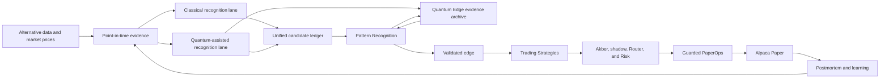

# Qadam Quantum Edge Hybrid Loop Implementation Plan

Date: 2026-07-12

Status: Waves A-C are implemented at the infrastructure and contract-fixture
layer. Stages 1-6 are verified within that boundary; Waves D-H remain pending.
Wave B's empirical evidence gate remains blocked because provider backfill has
zero completed partitions, zero provider rows, and zero eligible point-in-time
windows. Wave C therefore proves reproducible classical and local-quantum
discovery mechanics only, not a historical edge. IBM backend discovery also
remains blocked because the configured API key cannot access the configured
CRN. No hardware job was authorized or submitted.

Authority: This is the active implementation appendix for adding a genuine
hybrid classical-quantum pattern-recognition loop to Qadam. The canonical
day-to-day control document remains `docs/qadam-master-implementation-plan.md`.
If the documents conflict, the master plan wins until both are reconciled in
the same implementation wave.

## 1. Relationship To Existing Plans

This appendix extends, rather than silently rewrites, the current system:

- `docs/qadam-operator-ready-edge-engine-implementation-plan.md` owns the
  broader provider-backed history, point-in-time evidence, statistical edge,
  Akber, Router, Risk, PaperOps, and unattended-operation path.
- `docs/qadam-pattern-discovery-quantum-review-implementation-plan.md` records
  the already-deployed Pattern Discovery and Quantum Review baseline. It is a
  historical implementation reference after this appendix begins.
- `docs/qadam-qsase-implementation-plan.md` remains the broader self-aware
  strategy-engine roadmap.
- This appendix controls the new parallel quantum discovery lane, the unified
  Pattern Recognition experience, the Quantum Edge proof archive, and their
  lineage into Trading Strategies.

The implementation must reuse existing evidence, statistical-validation,
dashboard, strategy, and PaperOps contracts where they are sound. It must not
create a competing second pattern lifecycle or execution route.

## 2. Objective

Qadam will process the same frozen point-in-time evidence through two parallel
research lanes:

1. a classical lane using conventional statistical and machine-learning
   methods;
2. a quantum-assisted lane using quantum feature maps, kernels, local
   simulation, and bounded IBM Quantum execution through Q-CTRL Fire Opal.

Both lanes feed one candidate ledger and one Pattern Recognition lifecycle.
Quantum Edge becomes the public museum of proof that measures whether quantum
computation discovered or strengthened anything beyond Qadam's strongest
matched classical method. Only validated patterns can be converted into
governed playbooks in Trading Strategies.

## 3. Correct End-To-End Flow



Pattern Recognition owns the integrated research lifecycle. Quantum Edge is a
specialist evidence branch and archive. Trading Strategies owns validated
playbooks. None of these surfaces creates broker authority.

## 4. Non-Negotiable Product Decisions

- Quantum may originate a research-only candidate relationship.
- Quantum cannot validate itself.
- Quantum cannot create or approve a strategy, risk decision, position size,
  execution decision, paper order, broker write, or proof credit.
- Classical and quantum lanes must receive the same frozen point-in-time
  evidence manifest.
- Outcome labels must remain unavailable during feature construction and
  candidate discovery.
- A simulator, quantum-inspired method, or classical fallback must never be
  presented as IBM hardware execution.
- A hardware job or interesting measurement is not a quantum edge.
- Quantum usefulness requires a matched classical baseline and untouched
  chronological evidence.
- Failed, inconclusive, and classically dominated experiments remain in the
  Quantum Edge archive.
- No cadence, portfolio target, dashboard action, or Telegram message can force
  an experiment, candidate promotion, strategy, or trade.

## 5. Public Page Responsibilities

| Page | Primary question | May contain | Must not do |
| --- | --- | --- | --- |
| Pattern Recognition | What relationships has Qadam recognised, and how? | Classical, quantum-assisted, and joint observations, candidates, tests, validations, rejections, and decays | Present an unvalidated pattern as a strategy or trade |
| Quantum Edge | Did quantum computation add useful information beyond the matched classical method? | Provider truth, experiments, comparisons, proof ladder, negative results, receipts, verdicts, and downstream influence | Treat protocol definition, simulation, or hardware activity as proof of edge |
| Trading Strategies | Which validated relationships have become governed trading playbooks? | Strategy thesis, market, catalyst, confirmation, invalidation, exits, risk assumptions, Akber stage, and concise discovery lineage | Act as the main classical-versus-quantum pattern gallery |

## 6. Discovery And Validation Vocabulary

Every candidate must carry two separate fields:

```text
discovery_origin:
  classical_discovery
  quantum_assisted_discovery
  joint_discovery

validation_contribution:
  not_tested
  quantum_strengthened
  joint_corroboration
  classical_preferred
  weakened
  inconclusive
  not_measurable
  failed_safely
```

Discovery origin records who noticed the relationship. Validation contribution
records what later comparison established. These fields must not be collapsed.

## 7. Two Definitions Of Success

### 7.1 Engineering Success

Qadam can originate a quantum-assisted candidate, execute its frozen circuits
locally and on an explicitly authorized IBM backend through Fire Opal, preserve
the complete chain of proof, compare the result with classical methods, and
route the verdict safely through Pattern Recognition.

Engineering success may conclude `classical_preferred` or `not_measurable`.

### 7.2 Scientific Quantum-Edge Success

At least one quantum contribution reproducibly adds useful predictive or
decision information beyond its matched classical baseline on untouched
evidence after transaction costs, multiple-testing, complexity, latency,
provider reliability, and sensitivity penalties.

Qadam must not claim scientific quantum-edge success until this stronger test
passes.

## Stage 1 - Governance And Vocabulary

Implementation status: Complete on 2026-07-12.

### Objective

Change the current quantum contract without weakening downstream safety.

### Build

- Replace `quantum cannot originate a signal` with `quantum may originate a
  research-only candidate relationship`.
- Add `quantum_research_candidate_allowed` while keeping strategy creation,
  risk, sizing, execution, paper-order, broker-write, live-capital, and
  proof-credit permissions false.
- Change public planning vocabulary from Pattern Discovery to Pattern
  Recognition and from Quantum Review to Quantum Edge.
- Preserve the existing `patterns/findings` and `patterns/nonlinear` route
  identifiers unless a separately tested migration supersedes them.
- Update the master plan, user guide, schema notes, and negative authority tests
  together.

### Exit Gate

A quantum-originated record can enter only the candidate research lifecycle,
and every attempted authority escalation fails closed.

## Stage 2 - Provider And Device Truth

Implementation status: Complete on 2026-07-12 with the external blocker
`ibm_token_instance_access_mismatch`. The exit gate permits either an eligible
backend or a precise provider blocker; it does not treat the blocker as backend
readiness.

### Objective

Replace stale or ambiguous provider posture with explicit Fire Opal and IBM
Quantum truth.

### Build

- Verify Q-CTRL authentication and organization selection.
- Verify Fire Opal product entitlement independently of SDK importability.
- Verify IBM token and instance visibility without exposing values.
- Complete asynchronous device discovery and durable result polling.
- Distinguish:

```text
credentials_configured
authenticated
product_entitled
backend_discovered
circuit_validation_available
hardware_execution_authorized
hardware_experiment_completed
```

- Keep ordinary checks read-only and hardware submission disabled.
- Persist sanitized blockers, status hashes, timestamps, and next actions.

### Exit Gate

Qadam either identifies an eligible backend or reports a precise provider,
entitlement, network, or account blocker without implying hardware availability.

## Stage 3 - Point-In-Time Evidence Foundation

Implementation status: Contract complete on 2026-07-12. The empirical exit
gate remains blocked by `provider_backfill_has_no_completed_partitions`,
`provider_backfill_has_no_rows`, `provider_history_not_certified_complete`, and
`no_eligible_point_in_time_windows`. Missing evidence was not fabricated.

### Objective

Provide real historical evidence that both lanes can use without lookahead.

### Build

- Reuse and complete the operator-ready provider-backfill and point-in-time
  evidence contracts.
- Preserve event time, publication time, ingestion time, provider, source,
  vintage, market timestamp, missingness, and immutable content hashes.
- Use revised datasets only as they were knowable at each historical cutoff.
- Keep source observations, features, future labels, generated views, and
  proof-eligible evidence in separate domains.
- Build chronological train, validation, and untouched holdout partitions with
  purging and embargo where outcome windows overlap.
- Never replace unavailable provider history with invented evidence.

### Exit Gate

Eligible historical windows reproduce from source artifacts without future
information entering feature construction.

## Stage 4 - Shared Experiment Manifest

Implementation status: Contract complete on 2026-07-12. Deterministic fixture
construction, train-only normalization, and equal classical/quantum manifest
hashes pass. Production manifest creation remains blocked by the Stage 3
empirical evidence blockers.

### Objective

Guarantee that classical and quantum lanes compare like with like.

### Build

Define a versioned `QuantumDiscoveryWindow` and frozen manifest containing:

```text
as_of timestamp
market sleeve and target instrument
6-10 normalized features
missingness mask
source artifact references and hashes
feature-schema version
encoding version
chronological split identity
dataset and manifest hashes
random seed
```

- Keep labels and future outcomes absent from discovery manifests.
- Fit normalization on training data only.
- Make construction deterministic and idempotent.
- Reject unsupported dimensions, excessive missingness, stale inputs, malformed
  values, and lineage gaps.

### Exit Gate

The same evidence and schema always produce the same manifest, and both lanes
consume that exact manifest hash.

## Stage 5 - Classical Discovery Lane

Implementation status: complete for deterministic contract fixtures. Empirical
evaluation remains gated by provider-backed point-in-time history.

### Objective

Create strong reference methods so quantum is not measured against a weak
baseline.

### Build

- Implement linear and logistic relationships where appropriate.
- Implement RBF-kernel similarity.
- Implement change-point and state-transition detection.
- Implement anomaly detection and spectral or kernel clustering.
- Implement tree-based interaction, regime, and path-dependence tests.
- Preserve point-in-time scores before labels are attached.
- Freeze metrics, costs, threshold selection, and multiple-testing policy before
  final holdout evaluation.

### Exit Gate

Every quantum experiment has a named, reproducible, and appropriately tuned
matched classical baseline.

## Stage 6 - Local Quantum Discovery Lane

Implementation status: complete for ideal and finite-shot local simulation on
deterministic contract fixtures. This is not IBM hardware execution and does
not establish quantum advantage.

### Objective

Allow quantum computation to originate research candidates before provider
hardware is used.

### Build

- Add compatible pinned `qiskit-aer` and `qiskit-machine-learning`
  dependencies.
- Introduce a shared `QuantumDiscoveryBackend` result contract.
- Encode numerical features into shallow rotation and entanglement circuits.
- Use approximately 4-8 qubits for initial bounded experiments.
- Calculate quantum-derived fidelity or similarity kernels.
- Use landmark or Nystrom approximation to constrain pairwise circuit growth.
- Support ideal and finite-shot local simulation.
- Feed kernels into clustering, anomaly, nearest-regime, or supervised methods
  where appropriate.
- Keep classical fallback visibly non-quantum.

### Exit Gate

Local simulation detects known synthetic nonlinear interactions, rejects null
datasets, and emits reproducible research-only candidates with full lineage.

## Stage 7 - Fire Opal And IBM Backend

### Objective

Run the same frozen experiment on IBM hardware through Q-CTRL Fire Opal without
creating an uncontrolled provider or trading path.

### Build

- Implement a guarded Fire Opal IBM discovery backend.
- Convert Qiskit circuits into valid OpenQASM and validate them before
  submission.
- Require an exact frozen manifest and separate explicit authorization.
- Support durable asynchronous submission, polling, timeout, and recovery.
- Convert sanitized measurements into the local kernel result schema.
- Persist circuit hashes, backend hashes, shots, depth, runtime, action hashes,
  and sanitized receipts.
- Enforce maximum qubits, depth, circuits, shots, retries, wall-clock time, and
  provider budget.
- Never expose secrets or store raw credential-bearing responses.

### Exit Gate

One frozen experiment can run locally and, after explicit authorization, on an
eligible IBM backend through Fire Opal with comparable result contracts.

## Stage 8 - Hybrid Candidate Merger

### Objective

Create one coherent lifecycle rather than separate classical and quantum silos.

### Build

- Derive stable identities from source transform, target, direction or question,
  horizon, regime, and schema version.
- Merge equivalent classical and quantum findings into one joint candidate.
- Preserve independent evidence records beneath the merged identity.
- Record discovery origin separately from validation contribution.
- Include source chain, market, interpretation, confirmation, falsifier,
  evidence, blocker, and next action.
- Prevent proxy instruments from becoming duplicate top-level relationships
  unless outcome definitions materially differ.
- Write durable candidate, merge, rejection, and provenance ledgers.

### Exit Gate

Every candidate has one stable identity, an honest origin, and no automatic
promotion merely because both lanes observed it.

## Stage 9 - Independent Quantum Value Evaluation

### Objective

Measure quantum value without allowing the discovery model to judge itself.

### Build

- Establish a matched classical baseline before every comparison.
- Use training and validation evidence for method selection.
- Keep final chronological holdout evidence untouched until thresholds freeze.
- Measure incremental predictive or decision value after transaction costs.
- Apply multiple-testing and false-discovery controls.
- Record shot, noise, provider, latency, cost, and reproducibility sensitivity.
- Reuse or extend current nonlinear experiment, comparison, usefulness, and
  overfit-audit artifacts.
- Emit only:

```text
quantum_strengthened
joint_corroboration
classical_preferred
weakened
inconclusive
not_measurable
failed_safely
```

### Exit Gate

Quantum usefulness is claimed only when incremental value survives untouched
evidence and frozen operational penalties.

## Stage 10 - Pattern Recognition

### Objective

Turn Pattern Discovery into the unified record of what Qadam has recognised
through classical, quantum-assisted, or joint computation.

### Build

- Change the visible label to `Pattern Recognition` while preserving
  `patterns/findings`.
- Add `All`, `Classical`, `Quantum`, and `Joint` filters.
- Show relationship, sources, market, interpretation, confirmation, falsifier,
  evidence state, lifecycle stage, blocker, and next action on every card.
- Show discovery origin and validation contribution separately.
- Use neutral white cards with green evidence accents for classical records.
- Use a restrained violet rail and pale lavender evidence area for quantum
  records.
- Use separate green and violet markers for joint records.
- Use `IBM Quantum via Q-CTRL Fire Opal` only with a valid hardware receipt.
- Label simulation, quantum-inspired, and classical fallback states distinctly.
- Link quantum-involved cards to Quantum Edge.
- Show an honest empty state when no quantum-originated candidates exist.

### Exit Gate

A user can distinguish classical, quantum-assisted, and joint recognition
without mistaking an unvalidated pattern for a strategy or trade.

## Stage 11 - Quantum Edge

### Objective

Replace Quantum Review with a public museum of proof for Qadam's quantum thesis.

### Build

- Change the visible label to `Quantum Edge` while preserving
  `patterns/nonlinear`.
- Accept quantum-originated candidates and classical candidates referred for
  justified nonlinear quantum analysis.
- Display a current proof state:

```text
quantum_edge_not_yet_proven
provisional_quantum_evidence
validated_quantum_contribution
quantum_contribution_decayed
```

- Display the proof ladder:

```text
Provider configured
IBM hardware executed
Result reproduced
Classical baseline beaten
Untouched-data advantage survived
Paper decision improved
```

- Build strongest evidence, experiment gallery, classical comparison, circuit
  and dataset provenance, hardware authenticity, negative results, strategy
  influence, and paper-outcome lineage.
- Keep technical detail expandable rather than dominant.
- Preserve failed, inconclusive, neutral, and classically preferred results.
- Return every verdict to its originating Pattern Recognition identity.
- Never describe a protocol, simulator run, submitted job, or hardware receipt
  alone as a quantum edge.

### Exit Gate

The page explains what was tested, what hardware was used, whether quantum beat
its baseline, and what changed in Qadam as a result.

## Stage 12 - Trading Strategies

### Objective

Keep the strategy page focused on validated, governed playbooks rather than
turning it into another pattern gallery.

### Build

- Keep the visible name `Trading Strategies`.
- Admit only validated edges that pass strategy-mapping policy.
- Do not split the page into large green classical and purple quantum galleries.
- Show concise lineage:

```text
underlying_pattern_id
discovery_origin
validation_contribution
Pattern Recognition link
Quantum Edge link when applicable
```

- Keep primary fields focused on market, instruments, thesis, catalyst,
  confirmation, entry, invalidation, exits, risk assumptions, Akber stage, and
  present blocker.
- Prevent provisional patterns and hardware activity from appearing as approved
  strategies.

### Exit Gate

Every strategy maps to a validated pattern, and its discovery lineage is
inspectable without overwhelming the playbook.

## Stage 13 - Strategy, Risk, Paper Trading, And Learning

### Objective

Integrate validated evidence into Qadam's guarded paper workflow.

### Build

Route only integrated validated edges through:

```text
Trading Strategy
-> Akber filter
-> forward shadow validation
-> Router
-> Risk
-> guarded PaperOps
-> Alpaca Paper
```

- Allow quantum contribution to affect research priority or documented strategy
  evidence only after validation.
- Prevent quantum components from sizing, overriding holds, approving execution,
  or calling Alpaca.
- Attribute postmortems separately to classical evidence, quantum contribution,
  strategy logic, Akber and risk, execution quality, and market movement.
- Feed learning into governed feature, experiment, and strategy proposals.

### Exit Gate

Tests prove there is no direct path from quantum code, Pattern Recognition, or
Quantum Edge to broker code.

## Stage 14 - Automation And Public Visibility

### Objective

Run the hybrid loop repeatedly without forcing hardware, promotion, or trades.

### Build

- Run source refresh, feature construction, classical discovery, and local
  quantum simulation on a daily evidence-driven cadence.
- Prepare bounded Fire Opal experiments weekly or after explicit eligibility.
- Require separate authorization for the exact hardware manifest.
- Evaluate comparisons only after outcomes mature naturally.
- Make jobs resumable, idempotent, budgeted, and safe after interruption.
- Expose truthful dashboard and Telegram states:

```text
candidate noticed
experiment prepared
experiment executed
result reproduced
evidence strengthened
edge validated
strategy influenced
paper outcome observed
```

- Never let cadence force a provider call, promotion, strategy, or paper trade.

### Exit Gate

Unattended cycles remain fresh, recoverable, within budgets, and accurately
represented on public surfaces.

## Stage 15 - Crude-Oil Pilot, Certification, And Deployment

### Objective

Prove the engineering path on one bounded market before expansion.

### Build

Use a frozen crude-oil experiment with point-in-time features such as:

- conflict-event acceleration;
- tanker and chokepoint disruption;
- port congestion;
- inventory surprise;
- weather and fire disruption;
- futures-curve structure;
- realized volatility;
- muted or divergent price response.

Run:

1. matched classical baselines;
2. ideal quantum simulation;
3. finite-shot or noisy simulation;
4. one explicitly authorized IBM/Fire Opal experiment;
5. untouched chronological holdout evaluation;
6. placebo, time-shift, permutation, and multiple-testing controls.

- Certify reproducibility, provider recovery, receipt lineage, secret safety,
  authority isolation, dashboard truth, and strategy provenance.
- Accept `classical_preferred` or `not_measurable` as honest engineering
  outcomes.
- Update the master plan, User Guide, and Whitepaper with verified results.
- Run full preflight, commit, push, deploy, and verify served production assets.
- Expand to silver, defence, semiconductors, and prediction markets only after
  the crude-oil pipeline is reproducible.

### Exit Gate

Qadam has an operational mechanism for testing quantum edge honestly, and the
public product states whether it is unproven, provisional, validated,
classically dominated, or decayed.

## Wave Plan

The 15 stages are grouped into eight implementation waves. Each wave is tested,
documented, committed, and pushed independently. A later wave must not paper
over a failed earlier exit gate.

| Wave | Stages | Scope | Primary output | Status | Deploy |
| --- | --- | --- | --- | --- | --- |
| Wave A | 1-2 | Governance, vocabulary, provider and device truth | Authority contract and refreshable readiness | Complete; IBM token/CRN mismatch recorded | No |
| Wave B | 3-4 | Point-in-time evidence and shared manifests | Leakage-safe evidence and frozen inputs | Contract complete; empirical provider history blocked | No |
| Wave C | 5-6 | Classical and local quantum discovery | Baselines and local quantum candidates | Infrastructure complete; contract fixture only | No |
| Wave D | 7 | Fire Opal and IBM backend | Guarded adapter and prepared smoke manifest | Not started | No hardware submission by default |
| Wave E | 8-9 | Hybrid merge and independent evaluation | Unified candidates and honest verdicts | Not started | No |
| Wave F | 10-12 | Pattern Recognition, Quantum Edge, Trading Strategies | Corrected research-to-strategy UX | Not started | Yes, after preflight |
| Wave G | 13-14 | Paper integration, learning, automation, visibility | Safe recurring hybrid loop | Not started | Only if public artifacts change |
| Wave H | 15 | Crude-oil pilot, certification, docs, release | Reproducible end-to-end evidence | Not started | Yes |

## Wave Dependencies

```text
Wave A
  -> Wave B
    -> Wave C
      -> Wave D
        -> Wave E
          -> Wave F
            -> Wave G
              -> Wave H
```

Wave D backend work may finish while real provider access remains blocked, but
Wave H cannot claim hardware execution without an authorized receipt. Wave F
may deploy an honest `Quantum edge not yet proven` state.

## Wave A Implementation Record

Completed: 2026-07-12

Implemented:

- `orchestrator/qadam_quantum_edge_governance.py` defines the only positive
  Wave A capability, `quantum_research_candidate_allowed=True`, while keeping
  self-validation, validated-edge creation, strategy, trade-candidate, risk,
  sizing, execution, order, broker, proof-credit, dashboard-command,
  Telegram-command, and live-capital authority false.
- `orchestrator/quantum.py` now emits schema-v3 Fire Opal and IBM provider truth
  for credentials, combined authentication, product entitlement, backend
  discovery, circuit-validation availability, hardware authorization, and
  completed hardware experiments.
- Fire Opal asynchronous device discovery can resume from a private ignored
  mode-0600 sidecar. Only an action hash may enter the public artifact.
- IBM Runtime preflight now verifies the configured instance and lists backend
  names only as hashes when access succeeds.
- Completed or failed read-only probe truth survives ordinary readiness and
  cockpit refreshes, so a confirmed provider blocker cannot regress to
  `explicit_device_probe_not_run` without a new probe.
- The explicit read-only probe recorded
  `ibm_token_instance_access_mismatch`: the IBM API key is valid enough to
  reach account discovery, but it cannot access the configured CRN. Fire Opal
  product entitlement remains verified.

Verified boundaries:

- no quantum circuit or hardware job submitted;
- no hardware execution authorized;
- no scheduler enabled;
- no research candidate promoted into an edge or strategy;
- no risk, order, broker, proof-credit, or live-capital authority enabled;
- no secret value or raw provider response persisted publicly.

Verification:

- 14 focused governance, provider-truth, and nonlinear-lab tests pass;
- Q-CTRL readiness, local simulator, quantum oracle, oracle routing, PaperOps
  consultation, and cockpit checks pass;
- the repository-wide suite reports 149 passing and 11 failing tests in
  unchanged PaperOps/QSASE modules whose current fixture/runtime counts sit
  outside Wave A; none touches the Wave A authority or provider paths.

Wave A exit decision: complete with a precise external provider blocker. The
matching IBM API key and CRN must be supplied before Wave D or Wave H can run a
real hardware experiment. Waves B and C may proceed independently because they
use point-in-time evidence and local computation.

## Wave B Implementation Record

Completed at contract layer: 2026-07-12

Implemented:

- `orchestrator/qadam_quantum_discovery_evidence.py` adds immutable
  point-in-time feature records with event, publication, ingestion,
  availability, vintage, market, and cutoff timestamps; content and record
  hashes; typed missingness; separate evidence domains; and zero downstream
  authority.
- Chronological train, validation, and untouched-holdout splits now apply
  outcome-window purging and holdout embargoes while retaining every excluded
  record under an explicit partition.
- `orchestrator/qadam_quantum_discovery_manifest.py` defines the versioned
  `QuantumDiscoveryWindow`, supports 6-10 features, fits normalization on the
  training partition only, preserves source references and hashes, emits an
  explicit missingness mask, and rejects stale, future, malformed, unsupported,
  or lineage-incomplete inputs.
- Classical and quantum-assisted consumers receive the same deterministic
  manifest hash. Future labels are absent and separate.
- Contract fixtures are labeled `contract_fixture_only=True`; they cannot be
  presented as empirical evidence, a quantum result, a validated edge, a
  strategy, or a trade.

Current runtime truth:

- 41 source and 19 instrument plans span 450 provider partitions;
- 0 partitions are complete, 0 provider rows exist, and provider history is not
  certified complete;
- 6,232 historical windows are classified, 0 are currently eligible discovery
  inputs, 465 typed evidence gaps remain, and 0 leakage violations are recorded;
- source-provider validation and explicit price backfill remain the next data
  operations; neither Wave B checker performs a network call.

Verification:

- 13 focused Wave B tests pass;
- 27 combined Wave A, Wave B, and nonlinear-lab tests pass;
- provider-backfill, point-in-time alignment, Wave A governance, and Fire
  Opal/IBM readiness checks pass their contracts and preserve their precise
  blockers;
- Ruff, Python compilation, deterministic rebuild, lane-hash equality,
  future-label denial, stale-input denial, excessive-missingness denial, and
  authority-escalation probes pass;
- the repository-wide suite reports 162 passing and the same 11 failures in
  unchanged PaperOps/QSASE modules recorded in Wave A; no Wave B test fails.

Wave B exit decision: the implementation contract is complete, but the
empirical Stage 3 exit gate is not passed. Wave C may implement and test the
classical and local-quantum algorithms against explicitly labeled contract
fixtures, but it must not claim an empirical candidate or quantum edge until
provider-backed point-in-time rows satisfy this gate.

## Wave C Implementation Record

Completed at infrastructure and contract-fixture layer: 2026-07-12

Implemented:

- `orchestrator/qadam_discovery_backend.py` defines the shared, label-blind
  `DiscoveryInputBatch`, classical result, local quantum result, research
  candidate, validation, authority, lineage, and matched-policy contracts.
- Both lanes consume the exact same frozen Wave B manifest hash, split
  identity, feature order, encoding, normalization, missingness mask, source
  lineage, and random seed. Future outcomes and labels are absent.
- `orchestrator/qadam_classical_discovery.py` implements eight named reference
  methods: linear correlation, contemporaneous logistic relationship,
  RBF-kernel similarity, change-point mean shift, lagged state transition,
  multivariate anomaly, RBF spectral structure, and depth-two tree
  interaction.
- The classical policy freezes RBF gamma, logistic settings, candidate
  thresholds, transaction costs, train/validation threshold scope, untouched
  holdout scope, Benjamini-Hochberg FDR policy, and random seed before later
  empirical evaluation.
- `orchestrator/qadam_local_quantum_discovery.py` implements the shared
  `QuantumDiscoveryBackend` contract with a shallow Qiskit rotation and
  entanglement feature map, ideal statevector fidelity, finite-shot Aer
  fidelity, bounded landmark/Nystrom approximation, and explicit circuit
  evaluation budgets.
- Every local quantum result is linked to an actual classical result ID and
  classical policy hash from the same input manifest. Missing, mismatched, or
  incomplete baselines are rejected.
- Compatible local dependencies are pinned as Qiskit 2.4.1, Qiskit Aer 0.17.2,
  and Qiskit Machine Learning 0.9.0. Dependency absence produces a truthful
  classical-fallback record, never a quantum-execution claim.
- The contract fixture contains a known nonlinear interaction between
  `source_density` and `source_agreement`. The classical interaction method and
  the independent local quantum kernel both recover that pair. The fixture is
  marked non-empirical and cannot persist a candidate.

Verified boundaries:

- the local quantum run uses 6 qubits, 8 landmarks, and 100 bounded circuit
  evaluations for the fixture;
- ideal simulation is deterministic, and finite-shot simulation is
  reproducible under its frozen seed;
- null inputs, invalid shot counts, circuit-budget overruns, input tampering,
  and classical-baseline mismatches are rejected;
- local Qiskit/Aer execution is recorded as simulation, never IBM hardware;
- no provider call, hardware job, validated edge, strategy, trade candidate,
  risk approval, sizing instruction, execution approval, order, broker write,
  proof credit, dashboard command, Telegram command, or live-capital authority
  is created.

Verification:

- 11 focused Wave C tests pass;
- 38 combined Wave A, Wave B, Wave C, and nonlinear-lab tests pass;
- both Wave C contract checkers pass, recover the expected interaction, and
  report zero edge or order authority;
- the existing local simulator and quantum oracle checks now use
  `qiskit_aer_local` successfully while retaining zero hardware submission and
  zero execution authority;
- Ruff and Python compilation pass for every Wave C implementation, checker,
  and test file;
- the repository-wide suite reports 173 passing and the same 11 failures in
  pre-existing PaperOps/QSASE fixture expectations. No Wave C test fails.

Wave C exit decision: Stages 5 and 6 pass their infrastructure and synthetic
control requirements. They do not pass an empirical edge gate. Provider-backed
historical backfill and untouched holdout evaluation remain future work, as
explicitly requested. Wave D may build the guarded provider adapter, but IBM
hardware execution remains unauthorized and blocked by the recorded API
key/CRN access mismatch.

## Wave Execution Rules

For every wave:

1. inspect the current checkout and canonical artifacts before edits;
2. preserve unrelated dirty and untracked work;
3. update this appendix without marking later stages complete;
4. add focused, integration, authority, and regression tests;
5. run the strongest non-destructive verification available;
6. stage only wave-owned files;
7. create one scoped commit and push it;
8. deploy only when the wave table permits it;
9. report exact completed work, freshness, tests, and blockers;
10. never edit or expose secrets during implementation.

## Paste-Ready Wave Prompts

### Wave A

```text
Proceed with Wave A of docs/qadam-quantum-edge-hybrid-loop-implementation-plan.md: Stages 1-2, Governance And Provider Truth. Implement only this wave, preserve all paper-only boundaries, allow read-only device discovery but no hardware job, run the required tests, update the plan status, commit and push the scoped changes, and do not deploy.
```

### Wave B

```text
Proceed with Wave B of docs/qadam-quantum-edge-hybrid-loop-implementation-plan.md: Stages 3-4, Point-In-Time Evidence And Shared Experiment Manifests. Use real provider-backed evidence only, prove there is no lookahead leakage, complete all non-blocked work, run the required tests, update the plan status, commit and push, and do not deploy.
```

### Wave C

```text
Proceed with Wave C of docs/qadam-quantum-edge-hybrid-loop-implementation-plan.md: Stages 5-6, Classical And Local Quantum Discovery. Build strong matched baselines and the local quantum-kernel lane using identical frozen manifests, keep fallback labels truthful, run synthetic and null controls, update the plan status, commit and push, and do not call providers or deploy.
```

### Wave D

```text
Proceed with Wave D of docs/qadam-quantum-edge-hybrid-loop-implementation-plan.md: Stage 7, Fire Opal And IBM Backend. Implement and test the guarded provider adapter, validation, durable polling, sanitized receipts, idempotency, and budgets. Prepare but do not submit a hardware smoke manifest. Update the plan status, commit and push, and do not deploy.
```

A real hardware job requires a separate prompt naming the prepared manifest hash
and its approved limits.

### Wave E

```text
Proceed with Wave E of docs/qadam-quantum-edge-hybrid-loop-implementation-plan.md: Stages 8-9, Hybrid Candidate Merger And Independent Quantum Value Evaluation. Unify equivalent findings, preserve origin and validation separately, compare against matched baselines on untouched evidence, run statistical and authority tests, update the plan status, commit and push, and do not deploy.
```

### Wave F

```text
Proceed with Wave F of docs/qadam-quantum-edge-hybrid-loop-implementation-plan.md: Stages 10-12, Pattern Recognition, Quantum Edge, And Trading Strategies. Put the strong classical-versus-quantum distinction on Pattern Recognition, make Quantum Edge the truthful museum of proof, keep Trading Strategies focused on validated playbooks with concise lineage, preserve route identifiers, run complete UX and authority preflight, commit and push, deploy the pages together to qadam.trade, and verify the served production bundle.
```

### Wave G

```text
Proceed with Wave G of docs/qadam-quantum-edge-hybrid-loop-implementation-plan.md: Stages 13-14, Guarded Paper Integration, Learning, Automation, And Public Visibility. Preserve Akber, Risk, PaperOps, and Alpaca Paper boundaries, make automation resumable and budgeted, keep hardware jobs explicitly authorized, run failure and authority tests, update the plan status, commit and push, and deploy only if public artifacts changed.
```

### Wave H

```text
Proceed with Wave H of docs/qadam-quantum-edge-hybrid-loop-implementation-plan.md: Stage 15, Crude-Oil Pilot, Certification, And Final Deployment. Run every non-blocked classical, simulator, statistical, lineage, authority, and deployment check. Submit IBM hardware only if the exact manifest was separately authorized. Accept classical_preferred or not_measurable honestly, update plans and user documents with verified results, commit and push, deploy production, and verify the served qadam.trade bundle.
```

## Hardware Authorization Checkpoint

Wave D stops after preparing a bounded manifest. Before submission, show:

- manifest hash;
- backend or selection rule;
- qubit count;
- circuit count;
- shots per circuit;
- retry policy;
- expected usage;
- timeout and cancellation policy.

Only the exact approved manifest may be submitted. Any material change creates a
new manifest and requires new authorization.

## Verification Matrix

| Area | Required proof |
| --- | --- |
| Data | Point-in-time reconstruction, no future labels, vintage correctness, missingness preserved |
| Classical | Strong matched baseline, frozen selection policy, reproducible scores |
| Quantum local | Deterministic manifest, synthetic positive control, null rejection, shot sensitivity |
| Provider | Entitlement truth, validated QASM, bounded execution, sanitized receipt, recoverable failure |
| Statistics | Chronological holdout, costs, multiple-testing control, placebo and permutation tests |
| Lineage | Source -> manifest -> circuit -> result -> candidate -> verdict -> strategy |
| Authority | No quantum-to-risk, quantum-to-order, dashboard-to-order, or Telegram-to-order path |
| UX | Classical, quantum, joint, simulator, hardware, fallback, and unproven states stay distinct |
| Operations | Idempotency, retries, stale detection, budgets, interruption recovery |
| Deployment | Local tests, preflight, committed bundle, served HTML and JavaScript verification |

## Final Definition Of Done

The implementation is complete when Qadam can:

1. construct one leakage-safe evidence manifest;
2. process it through strong classical and quantum-assisted discovery lanes;
3. originate and merge traceable research candidates;
4. execute bounded circuits locally and, when authorized, through Fire Opal on
   IBM Quantum;
5. compare incremental value against a matched classical baseline on untouched
   evidence;
6. display candidates correctly in Pattern Recognition;
7. preserve positive and negative proof exhibits in Quantum Edge;
8. admit only validated patterns into Trading Strategies;
9. preserve Akber, Risk, PaperOps, and Alpaca Paper as the guarded execution
   route;
10. attribute outcomes and feed learning back through promotion gates;
11. remain honest when quantum evidence is absent, inconclusive, or inferior;
12. verify the same truth in artifacts, tests, documents, Telegram, and the
    served production dashboard.
