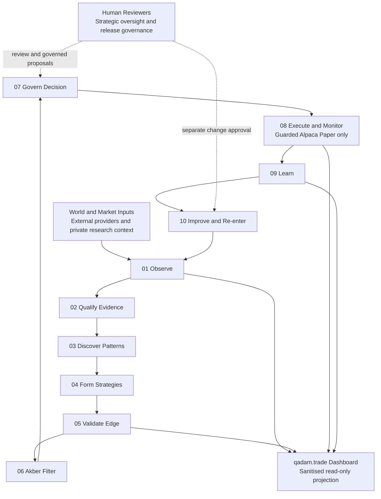

# Qadam Whitepaper

> **Canonical document:** This is the single canonical Qadam whitepaper. Other
> summaries should link here rather than reproduce its narrative.
>
> **Version:** 2.0 
> **Current-state reference date:** 19 July 2026 
> **Scope:** Qadam's intended architecture, implemented research and PaperOps
> controls, and the evidence-backed operating state on the reference date.
> Mutable readiness, evidence, account, and service states must be read from the
> current dashboard projections rather than inferred from this document.

## Three Current Hypotheses

Qadam is currently testing three foundational hypotheses. They are falsifiable
research questions, not proven claims:

1. **Consumer AI execution:** Can advances in consumer-accessible AI execution
   technology enable the discovery of a genuine trading edge?
2. **Quantum pattern recognition:** Can quantum computers recognise a genuine
   trading pattern and form a successful trading strategy from backtested data
   where a matched classical approach cannot?
3. **Akber's investment filter:** Can hedge fund trader Akber's evaluation
   expertise—captured in his six-stage investment filter—be operationalised
   successfully through automated systems?

## The Short Version

Qadam is a macro trading-intelligence system built around Akber's founding
philosophy: look for high-conviction, catalyst-driven opportunities and refuse
random signals, hype, and overtrading.

It is designed like a compact hedge fund team that fits inside a laptop. Its
Python COO coordinates specialist research, strategy, quantitative, risk,
execution, attribution, and improvement functions through one inspectable
10-stage lifecycle. Qadam observes the world, qualifies evidence, discovers
patterns, forms and validates strategy hypotheses, checks whether an idea is
tradeable now, governs the portfolio decision, uses guarded Alpaca Paper for
eligible paper execution, learns only from attributable outcomes, and tests any
proposed improvement before it can re-enter the system.

Qadam's dashboard explains that process. It is a read-only projection, not a
trading terminal: it cannot promote a hypothesis, approve risk, submit or alter
an order, write to a broker, deploy code, change a strategy, or grant
live-capital authority.

Qadam is not trying to be a magic bot. It is trying to determine whether a
repeatable and inspectable process can establish genuine edge while refusing
weak trades.

## How To Read Qadam's Claims

Three layers must remain separate:

1. **Designed:** the governed lifecycle Qadam is intended to complete.
2. **Implemented:** code, adapters, records, safety controls, and public-safe
   projections that exist and can be inspected.
3. **Currently operating and proven:** what fresh runtime evidence permits Qadam
   to do now, and which investment claims have survived the required tests.

An implemented route is not automatically enabled. A successful engineering
check is not a validated market edge. A broker-mirrored record is not proof of
Qadam's decision quality. A research candidate is not an order. The live
dashboard is authoritative for mutable current state; this whitepaper describes
the governing model and provides a dated operating snapshot.

### Current operating snapshot

On the reference date above, Qadam is in **research-only, evidence-maturing
mode**. Guarded PaperOps is **watch-only**: it may reconcile and observe the
Alpaca Paper account, but current evidence does not authorize a new Qadam paper
submission. Qadam has not yet established the complete attributable,
validated-edge-backed setup required for that transition.

This is a governed no-trade state, not a system promise or permanent
restriction. It changes only when fresh evidence passes the relevant gates; the
dashboard must be consulted for the latest state.

## What Qadam Is

Qadam is a small macro intelligence fund architecture that runs primarily on
Ramin's MacBook.

The system is organised like a tiny fund team:

- **Python COO:** coordinates the lifecycle, checks health, refreshes runtime
  artifacts, preserves lineage, routes work, and enforces the paper-only
  boundary.
- **Local Research Analyst:** filters noisy information and turns observations
  into structured research evidence.
- **Strategy Lead:** develops hypotheses, compares alternatives, and challenges
  the causal and economic case.
- **Head of Quant:** runs classical and selected quantum-assisted analysis for
  nonlinear, sequencing, regime, or path-dependent questions.
- **Risk, Router, and PaperOps functions:** keep research eligibility, portfolio
  governance, execution suitability, and broker submission as distinct gates.
- **Human reviewers:** inspect evidence and outcomes, challenge assumptions, and
  decide whether supported proposals deserve separate implementation and
  release approval.

The current operating form is the **Qadam Self-Aware Strategy Engine**, or
QSASE. Self-aware does not mean sentient. It means Qadam maintains a
machine-readable picture of its sources, freshness, models, classical and
quantum research, PaperOps route, risk posture, blockers, and learning history,
then limits its actions to what those records actually support.

## The Canonical 10-Stage Lifecycle

The lifecycle is a set of evidence gates, not a promise that every observation
becomes a trade.

| Stage | Operating question | Governed output |
| --- | --- | --- |
| 1. Observe the World | What changed in the world or market? | Time-stamped source observations. |
| 2. Qualify the Evidence | Is the evidence fresh, trustworthy, relevant, and usable point in time? | Eligible evidence or a documented exclusion. |
| 3. Discover Patterns | Does qualified evidence repeatedly relate to later market behaviour? | Candidate source-to-price relationships, including negative findings. |
| 4. Form Strategy Hypotheses | Can a documented relationship support a falsifiable strategy hypothesis? | A versioned hypothesis with catalyst, instrument, horizon, invalidation, and lineage. |
| 5. Validate the Edge | Does the hypothesis survive historical costs, walk-forward testing, and untouched holdout evidence? | Validated, provisional, rejected, faded, or still-unmeasurable edge evidence. |
| 6. Akber's 6-Stage Filter | Does Akber's multi-stage decision-making filter find the idea practically tradeable now? | Research eligibility: pass, hold, or veto. |
| 7. Govern the Decision | Does the portfolio have permission and capacity to express it? | A governed decision record with risk and sizing constraints, or no trade. |
| 8. Execute and Monitor | Has an eligible paper decision safely entered and progressed through Alpaca Paper? | Broker-reconciled paper-order and position lifecycle evidence. |
| 9. Learn From the Outcome | What happened, what caused it, and what may Qadam legitimately learn? | An attributable postmortem and supported lesson—or an explicit lack of proof. |
| 10. Improve and Re-enter | Has a proposed change earned the right to alter future behaviour? | A separately reviewed, versioned improvement that may return to Stage 1. |

Different observations, hypotheses, orders, and lessons can occupy different
stages at the same time. The lifecycle shown on each dashboard page describes
that page's ownership; it is not a single global progress bar.

The strict boundary is deliberate: a relationship can fail before strategy
formation; a strategy can fail edge validation; a validated edge can be
untradeable today; an Akber pass can fail portfolio governance; and a governed
decision can still fail execution safeguards.

## How The Dashboard Maps To The Fund

The dashboard presents 13 conceptual destinations:

| Destination | Purpose |
| --- | --- |
| Qadam Team | Explains the hedge-fund roles and their authority boundaries. |
| Portfolio | Mirrors current paper-fund composition, performance, and positions. |
| Trading History | Preserves the full paper-order and trade chronology. |
| Data Sources | Shows what Qadam observes and whether source evidence is fresh and eligible. |
| Trading Universe | Shows where Qadam is permitted to search for liquid paper expressions. |
| Pattern Recognition | Shows live observations, patterns under testing, validated edges, and disproved or faded research. |
| Quantum Edge | Audits whether selected quantum-assisted analysis contributed beyond the fairest classical benchmark. |
| Trading Strategies | Shows documented strategy families and their evidence requirements. |
| Decision Room | Separates approaching research, Akber eligibility, and the final governed portfolio decision. |
| Order Monitor | Monitors unresolved paper orders, positions, broker reconciliation, and lifecycle events. |
| Results & Lessons | Asks what happened and what Qadam may legitimately learn from attributable evidence. |
| Tests & Improvements | Asks whether a supported lesson has earned the right to change future behaviour. |
| System Overview | Diagnoses the infrastructure, automations, freshness, lifecycle impact, recovery path, and technical evidence across every stage. |

These pages are explanatory and diagnostic. Even when protected access is used,
the dashboard itself does not mutate runtime state. Operational commands,
broker writes, policy changes, code deployment, and approval authority remain
outside the public web surface and behind their respective controls.

## What Qadam Is Not

Qadam is not:

- A Telegram tip channel.
- A copy-trading app.
- A public trading community.
- A general stock screener.
- A low-latency HFT system.
- A black-box trading bot.
- A financial adviser.
- A system that trades merely to stay active.
- A live-capital trading system in its current operating state.

Qadam's basic rule is simple: if there is no genuine catalyst with qualified
evidence, validated mispricing, defined risk, and permission through every
downstream gate, the correct action is no trade.

## Akber's Trading Philosophy And Its Operational Form

Akber's founding six-part trading lens remains the philosophical spine:

1. **Low volatility:** is the market quiet before a possible move?
2. **Options distribution:** is the market pricing a normal world around an
   event that may be binary or asymmetric?
3. **Catalyst:** what real-world event could break that distribution?
4. **Technical setup:** is there a sensible entry, confirmation, and
   invalidation?
5. **On-balance volume and flow:** is capital already positioning?
6. **Gut and judgment:** does the complete thesis remain coherent once the
   evidence is visible?

Qadam does not replace this judgment. It makes the questions repeatable,
auditable, and falsifiable. The current V3 operational filter groups the same
discipline into six lifecycle stages:

| V3 stage | What it tests | Founding lens carried forward |
| --- | --- | --- |
| Context | Regime, volatility, distribution, market expectations, and the pricing gap. | Low volatility and options distribution. |
| Catalyst | The specific event, causal mechanism, affected market, horizon, and source quality. | Catalyst. |
| Confirmation | Price structure, technical evidence, participation, flow, and whether the market has begun to recognise the thesis. | Technical setup and on-balance volume/flow. |
| Risk | Invalidation, downside, asymmetry, concentration, sizing limits, and portfolio interaction. | The risk discipline inside the technical setup and final judgment. |
| Execution Suitability | Liquidity, spreads, costs, timing, duplicate exposure, route readiness, and paper-only safeguards. | Whether the idea can be expressed sensibly rather than merely believed. |
| Postmortem Learning | Whether the decision and outcome have attributable evidence strong enough to support a lesson. | Judgment made accountable after the event. |

This is not a mechanical one-to-one renaming of the original questions; it is
their governed operationalisation across the full lifecycle.

Most importantly, an **Akber pass grants research eligibility only**. It is not
a trade approval, risk approval, execution approval, PaperOps handoff, broker
instruction, or live-capital authority. Portfolio governance, Router checks,
risk constraints, idempotency, broker reconciliation, and guarded PaperOps
remain independent downstream gates.

## What Qadam Watches

Qadam uses live and live-adjacent evidence across durable source families rather
than promising a fixed provider count:

- **Geopolitical and policy evidence:** conflict, sanctions, unrest,
  chokepoints, elections, regulation, and state action.
- **Physical-world and OSINT evidence:** ships, aircraft, fires, outages,
  infrastructure, satellites, supply chains, and location-based disruption.
- **Macroeconomic evidence:** rates, inflation, commodities, trade, central-bank
  decisions, and economic releases.
- **Market and technical evidence:** point-in-time prices, volatility,
  liquidity, options context, broker paper-account state, and flow context where
  it is available and qualified.
- **Probability and narrative evidence:** prediction markets, news, filings,
  research, and public narrative sources used as evidence or context according
  to their trust posture.

Providers can enter, leave, fail, become stale, or be quarantined. The dashboard
therefore reports the current source inventory and eligibility state. Fresh,
trusted, point-in-time evidence may contribute to quorum; stale,
supplemental, quarantined, or context-only sources cannot independently justify
a trade.

The purpose is not data collection for its own sake. It is to recognise a
potential catalyst early enough to test whether the market has underpriced it.

## The Private World-Model Layer

Qadam maintains a private research lens called **How The World Works**. It asks
who benefits from a narrative, what incentives sit beneath visible events, how
financial and political power may shape the story, and which second-order
consequences could reach markets.

It is a hypothesis-generating lens, not public evidence and not permission to
trade. A private interpretation must still produce observable, time-stamped,
falsifiable claims and pass the same evidence, validation, Akber, risk, and
execution gates as any other idea.

Useful questions include:

- Who benefits if the prevailing explanation is true?
- Who benefits if it is false or incomplete?
- What has the market already priced?
- What observable evidence would confirm or invalidate the alternative thesis?
- Which liquid instrument could express the effect without confusing the story
  with proof?

The lens may help Qadam ask better uncomfortable questions. It cannot exempt an
answer from evidence.

## From Observation To A Governed Paper Decision

A Qadam research idea is not simply "buy this." Before it can approach a paper
decision, the record needs an identifiable catalyst, instrument, horizon,
point-in-time evidence, source eligibility, causal or predictive relationship,
historical validation state, costs, invalidation, risk/reward, liquidity,
portfolio interaction, and lineage through Akber and the Decision Room.

The operational sequence is:

1. Capture evidence without seeing the future outcome.
2. Score or map a possible relationship.
3. Wait for the relevant horizon and label what prices actually did.
4. Backtest the relationship after costs and false-discovery controls.
5. Validate it through walk-forward and untouched holdout testing.
6. Express a surviving edge through a documented strategy and liquid paper
   instrument.
7. Use Akber to test whether the setup is tradeable now.
8. Observe it through real elapsed time when forward shadow evidence is needed.
9. Apply Router, portfolio, risk, and guarded PaperOps controls before any
   Alpaca Paper submission.
10. Attribute the outcome and propose—never silently apply—what should improve.

Missing evidence produces a block, hold, downgrade, or no-trade result. The
system is designed to record those negative decisions because avoiding a weak
trade is part of the proof.

## Quantum Edge: Hybrid Research, Not A Quantum Shortcut

Quantum Edge is a **hybrid classical-quantum research system**. A quantum
computer does not work alone:

1. Python aligns prices, timestamps, source signals, instruments, and regimes.
2. Classical models search for linear, nonlinear, lead-lag, divergence,
   breakout, sequencing, and regime relationships.
3. Selected problems may enter a quantum-assisted lane when complicated
   interactions or path dependence could justify the extra method.
4. The strongest fair classical method and quantum-assisted method receive the
   same frozen evidence.
5. Any quantum-originated result must still survive ordinary historical,
   holdout, cost, forward-observation, strategy, Akber, risk, and paper-trading
   validation.

The Quantum Edge page follows **evidence -> consequence -> verdict**:

- **Experiment & Evidence:** what was simulated, executed, compared, and
  independently verified?
- **Strategy & Paper Impact:** did the result improve a validated strategy or a
  governed paper decision?
- **Quantum Edge Verdict:** has a genuine market-level quantum advantage been
  proven?

As of the reference date, the public-safe Quantum Benchmark Framework concludes
**Unproven — Not measurable yet**. Its projection reports **11/11 engineering
checks** but only **1/6 market-proof checks**. This means the experimental test
rig works; it does not mean a market advantage has been established. Local
simulation has reproduced the engineering experiment, but **no IBM hardware
experiment has been authorized or executed**, no fair untouched market
comparison has beaten the strongest classical benchmark, and no validated
strategy or governed paper outcome has been attributed to quantum evidence.

Those dated counts come from the current public projection and will change only
with new evidence. The live Quantum Edge page is authoritative thereafter.

A quantum-assisted result may strengthen evidence, agree with the classical
result, lose to it, weaken an original pattern, or remain unmeasurable. **Classical
preferred** is a successful scientific outcome: Qadam learns that the simpler
method is sufficient. Sophisticated mathematics, provider access, a successful
simulation, or a prepared hardware manifest must never be confused with
predictive and economic value.

## The Alpaca Paper Boundary

Qadam's paper-evaluation account is a **US$100,000 Alpaca Paper account**. It is
not live capital.

The architecture is designed to allow a guarded paper submission only when a
validated-edge-backed setup has complete lineage and every independent gate
passes: current evidence, Akber eligibility, forward observation where
required, portfolio permission, risk limits, liquidity and cost constraints,
Router readiness, idempotency, duplicate-exposure checks, drawdown controls,
and broker reconciliation.

The implemented PaperOps path can monitor and reconcile paper-broker state. Its
current watch-only posture does not authorize a submission. No user-facing
dashboard action can bypass that posture or create an order.

Historical broker records may be retained as reference context, but unless
they possess verified Qadam pipeline lineage they cannot measure Qadam's
decision quality, validate an edge, earn proof credit, or justify a lesson.

## Results, Lessons, Tests, And Improvements

The learning loop has two separate questions:

- **Results & Lessons:** What happened, and what can Qadam legitimately learn?
- **Tests & Improvements:** Has that lesson earned the right to change Qadam's
  behaviour?

Only an attributable Qadam-origin outcome can support a postmortem about
Qadam's own decisions. A supported lesson still cannot edit code, mutate a
strategy, change a threshold, or deploy itself.

Improvement is proposal-first:

1. Record the attributed outcome and evidence.
2. Draft a specific, versioned improvement proposal.
3. Run a fair historical test on eligible evidence without rewriting the
   original result.
4. Observe it forward over real elapsed time where required.
5. Review its effect, regressions, safety, and authority boundaries.
6. Separately approve and release the version.
7. Let only that approved version re-enter the next observation cycle.

Rejection, no measurable improvement, or evidence that the old method is
better are legitimate outputs. Qadam must not learn by silently changing itself
after a loss.

## Local-First, Precisely

Local-first describes Qadam's control and persistence model; it does not mean
the laptop is disconnected from the world.

- Canonical private research artifacts, credentials, logs, evidence lineage,
  and operational state are kept under local control by default.
- Qadam may query external data, model, broker-paper, notification, classical,
  and quantum providers through bounded adapters.
- External responses are treated according to provenance, trust, freshness,
  and privacy rules.
- Only sanitised, public-safe, read-only projections are published to
  qadam.trade.
- The public dashboard cannot read private credentials or operate the private
  control plane.

Any future cloud persistence or shared compute should be explicit,
permissioned, measurable, and reversible. Qadam must never silently consume
another person's machine or expose private research artifacts.

## Human Oversight

Human oversight is most valuable at the strategic and governance layers:

- challenge a thesis and its falsifiability;
- identify missing or unreliable evidence;
- review attribution and postmortems;
- propose sources, controls, strategies, or product improvements;
- review whether a tested change should be approved and released;
- investigate infrastructure and policy exceptions through appropriate
  operator tooling.

Review does not turn dashboard pages into command surfaces. Individual paper
orders should not be emotionally approved, rejected, resized, or closed through
the explanatory website, and suggestions do not automatically change policy.

## What May Make Qadam Distinctive

Qadam's intended differentiation is the combination of:

- catalyst-first observation of the world rather than indicator-first idea
  generation;
- point-in-time source-to-price evidence with explicit provenance;
- classical and selectively quantum-assisted pattern research with negative
  evidence preserved;
- a documented Strategy Foundry before present-tense tradeability review;
- Akber's practical decision philosophy made auditable;
- separate edge, portfolio, risk, Router, PaperOps, and broker gates;
- controlled paper proof through Alpaca Paper;
- strict attribution before learning;
- proposal-first, versioned improvement rather than silent self-mutation;
- public-safe transparency without public execution authority;
- local control of canonical private research and operating state; and
- respect for rare opportunities through a no-forced-trades rule.

These are architectural properties and hypotheses about how an edge might be
found and governed. They are not themselves proof of a profitable edge. Qadam
earns that claim only through eligible, attributable, out-of-sample and paper
evidence after realistic costs.

## The Current Proof Objective

The present objective is not to make money with live capital. It is to build a
clean, inspectable proof process:

- maintain the local research and operating system;
- qualify the data spine;
- preserve point-in-time evidence and decision lineage;
- reject weak patterns and strategies visibly;
- permit guarded Alpaca Paper activity only when every gate passes;
- attribute closed outcomes honestly;
- test supported improvements without contaminating prior evidence; and
- accumulate a credible proof sample over real calendar time without forcing
  trades.

No trade is a valid outcome whenever the signal-quality or safety floor is not
met. Targets and trial windows must never become quotas that manufacture
activity.

## How To Judge Qadam

Do not judge Qadam by one winning or losing trade. Ask:

- Was the evidence available point in time, fresh, and trustworthy?
- Was the catalyst and causal or predictive claim explicit?
- Did the relationship survive costs and untouched testing?
- Was risk and invalidation defined before the decision?
- Did Akber, portfolio governance, Router, risk, and PaperOps each stay within
  their authority?
- Did Qadam refuse weak or duplicate trades?
- Can a paper result be traced to a Qadam-origin decision?
- Did the postmortem distinguish evidence from storytelling?
- Did any proposed improvement survive independent testing before release?
- Did performance remain credible after costs and drawdown?

Qadam succeeds only if it establishes a repeatable, explainable, and governed
edge. It fails if it becomes a sophisticated story machine that cannot survive
untouched evidence and attributable paper testing.

## The Trader's Summary

Qadam is not a replacement for expert judgment. It is a machine that tries to
make expert judgment testable.

It can watch more than one person, preserve more evidence than memory, and log
decisions more consistently than an informal process. Human reviewers provide
strategic oversight, challenge its reasoning, and govern proposed changes.

But the trading truth remains the same:

**No edge, no trade.**
