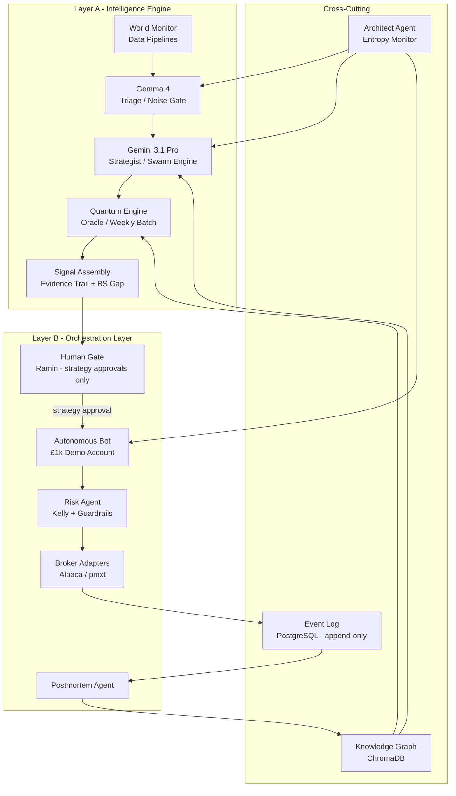
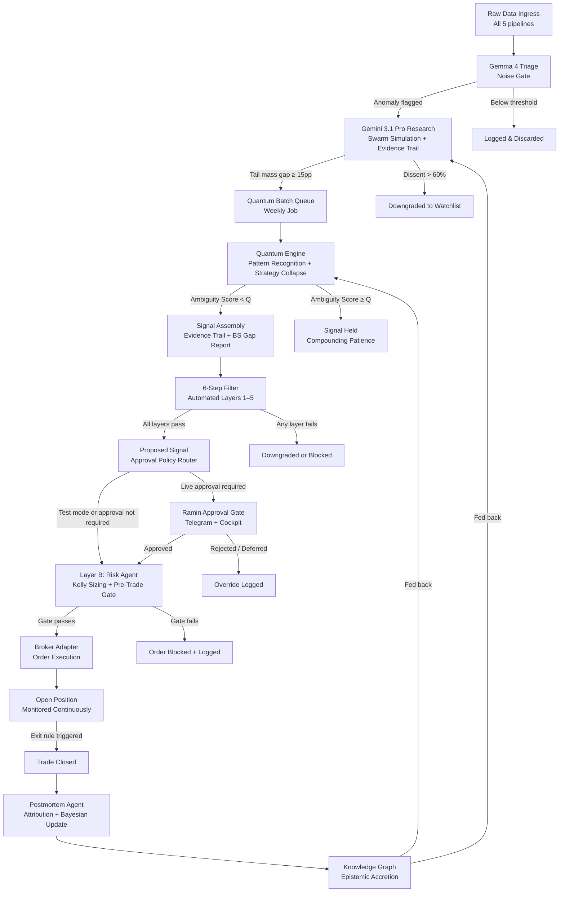

# Qadam Specifications v3

<aside>

**Qadam Specifications v3.0** - The canonical single-document specification. Collapses and supersedes v2.0 through v6.0. Written for Ramin Hoodeh, running on MacBook Air M5. All prior versions are archived in [Qadam Specifications v2](Archive/Qadam%20Specifications%20v2%203566fe2ecf3780568dbdcd2e659a6232.md). - [Glossary](Qadam%20Specifications%20v3/Qadam%20%E2%80%94%20Glossary%2025b45e385f414e4f881653145915edad.md) · [Quantum Circuit Spec](Qadam%20Specifications%20v3/Qadam%20%E2%80%94%20Quantum%20Circuit%20Technical%20Spec%20c862b0f269974911897867623e9a9a9a.md) · [World Monitor Integration Reference](Qadam%20Specifications%20v3/Qadam%20%E2%80%94%20World%20Monitor%20Integration%20Reference%200b2be21964cf40458af5b09eb8b7ca1b.md)

</aside>

# 1. Vision & Executive Summary

## 1.0 Executive Summary

### What Qadam Is

**Qadam** is a boutique macro intelligence hedge fund - built entirely in software, running on a single MacBook Air, and operated by one human.

It is also a **transparent internal intelligence platform**. The autonomous system exists to prove, audit, and continuously improve the quality of the recommendations; the product surface exists to expose that process clearly to Ramin and a close circle. Someone logging into [**qadam.trade**](http://qadam.trade) should be able to see what Qadam is monitoring, what opportunities it is recommending, why those opportunities matter, what evidence supports them, whether the autonomous engine would act, and how similar signals have historically performed.

<aside>
🌓

**Core product identity:** Qadam is an **autonomous intelligence engine with a transparent recommendation interface**.

- **Autonomous underneath:** the engine can observe, reason, size risk, paper/live trade under guardrails, log outcomes, and run postmortems.
- **Advisory on top:** Ramin and a close circle see the analysis, evidence trail, confidence, suggested structure, risk, invalidation, and autonomous-system action path — then make their own trading decisions.
- **Boundary:** Qadam is an internal tool first. Public community features and external user broker-connected autopilot are separate, later, more heavily governed product surfaces — not v1.
</aside>

Think of it as a small, elite trading firm with a four-person investment team. Each person has a distinct role, a distinct cognitive style, and a strict remit. They don't overlap. They don't second-guess each other in real time. They operate in sequence, each one handing a refined output to the next.

<aside>
🏢

**The Qadam Investment Team**

- 🔬 **Research Analyst - Gemma 4** *(running locally on the M5 Processor, 24/7)*
Monitors 450+ simultaneous data streams - satellite thermal feeds, AIS vessel tracking, Telegram OSINT channels, RSS news, Twitter/X - around the clock. Gemma's job is triage: *is this signal worth escalating?* It does not reason; it filters. It passes only anomalies that clear a Trust Score threshold and match the active strategy's criteria. Everything else is discarded or quarantined.
- 🧠 **Strategy Lead - Gemini 3.1 Pro** *(Google Cloud API)*
Receives the escalated anomaly and performs the deep work: geopolitical context, causal chain analysis, and a 100-persona Swarm Simulation where synthetic Hedge Fund Managers, Logistics Experts, Regional Diplomats, and Retail Traders each reason independently about the catalyst. The output is not a recommendation - it is a probability distribution over outcomes, with a documented Evidence Trail and a confidence score. If the distribution shows the market has meaningfully mispriced the tail, the case is elevated to the Head of Quant.
- 📐 **Head of Quant Strategy - IBM Quantum / Q-CTRL** *(weekly cloud oracle)*
Queried at least once per week, mainly for rare high-conviction candidates and strategic pattern discovery. It runs non-linear cross-dataset pattern scans, ambiguity scoring, and options-structure optimisation. Quantum output can upgrade, downgrade, or hold a signal, but it does not originate trades by itself and does not gate every weekly proof trade.
- ⚙️ **COO - Python Orchestrator** *(asyncio + uvloop, M5 CPU)*
The firm's operations backbone. Routes every API call, enforces Trust Score rules at every ingestion point, manages the handoffs between Gemma → Gemini → Quantum, writes every event to the append-only audit log, monitors all 35 data source heartbeats, schedules the weekly Quantum batch, and applies Bayesian weight updates after each postmortem. The COO has no intelligence of its own. It has no opinions. It follows the routing rules in `ORCHESTRATOR.md` and coordinates the rest of the team with machine precision.
</aside>

Above the team sits **Ramin Hoodeh** - the Fund Manager. In the **test account**, Qadam trades autonomously with no human approval so the system can prove whether its rules work without interference. In a **live account**, Ramin controls an approval policy toggle: approval can be on, off, or conditional based on variables such as position size, conviction tier, instrument, venue, drawdown state, or whether the trade exceeds a predefined threshold. His role is strategic control: approve the system, configure the approval policy, hold the kill-switches, and review outcomes — not emotionally manage individual test trades.

The fund runs autonomously on a £1,000 paper account to prove its edge before any live capital is deployed. The operating cadence is **2 autonomous proof trades per week**: enough for Ramin to track the system consistently without forcing overtrading. This cadence is separate from Qadam's rarer high-conviction mode. Weekly proof trades validate the machine; rare high-conviction signals are exceptional catalyst opportunities that should not be manufactured for cadence. Statistical maturity is assessed cumulatively as the sample grows, with 100 closed proof trades treated as the mature benchmark rather than a forced 90-day volume target.

Financial markets are information-processing machines - but they process information reactively. A refinery fire in the Strait of Hormuz, a shipping lane blockade near Suez, a surge in conflict-zone air traffic detected by ADS-B sensors - these are physical events that will move commodity prices, energy equities, and defence stocks. But they only move prices *after* they enter the consensus narrative. Before that transition, the options chain still reflects a near-normal probability distribution, systematically underpricing the tail risk that the physical world has already flagged. That window - between physical reality and market awareness - is where Qadam operates.

### How It Works - A Signal From Start to Finish

At 03:14 on a Tuesday morning, a NASA FIRMS satellite pass detects an anomalous thermal signature near a refinery cluster in a Gulf shipping corridor. By 03:22, Gemma 4 - running locally on the M5 Processor - has matched the thermal anomaly against its active keyword clusters and flagged it. The event's Trust Score clears the 0.6 threshold. It passes to Gemini 3.1 Pro.

Gemini pulls the event's coordinates against live AIS data. Three tankers in the corridor have altered their routing in the past six hours. It queries the Knowledge Graph: *has Qadam seen this pattern before?* There are eleven prior instances of thermal anomaly near this cluster combined with AIS diversion; nine of them preceded crude oil options mispricing that resolved within a week. Gemini runs a 100-persona Swarm Simulation. Logistics Experts, Hedge Fund Managers, Regional Diplomats, and Retail Traders each reason independently. The swarm produces a probability distribution where the upside tail mass exceeds the options chain's implied distribution by 22 percentage points - above the 15pp threshold. Swarm dissent is 31%. Because this is a rare high-conviction candidate, it is marked for Quantum Oracle review.

On Sunday evening, the Quantum Engine runs its weekly oracle query on IBM Quantum hardware. Job 1 checks whether the event belongs to a non-linear cross-dataset pattern: AIS diversion near this corridor, combined with a FIRMS thermal event and unusual USO options flow, has a 0.74 confidence score and eight historical precedents in the Knowledge Graph - elevated to a Quantum-Confirmed Pattern. Job 2 runs the Strategy Collapse: given the current options chain on USO, the 47-strike call spread expiring in 9 days has the largest Black-Scholes Gap, with an expected value of +0.38R at current pricing. The Quantum Ambiguity Score is 0.31 - below the Q threshold. A high-conviction signal is assembled. Standard weekly proof trades do not need to wait for this path unless the strategy explicitly marks them as Quantum-gated.

The 6-Step Filter runs automatically. IV percentile is at the 14th percentile - below the 20th. The Black-Scholes Gap passes at 22pp. The catalyst is specific, dated, and dated within 7 days. A structural entry zone exists above the prior week's high. OBV is confirmatory. All five layers pass. The signal is presented to Ramin at Layer 6.

Ramin sees the signal card in the cockpit: thermal anomaly, AIS diversion, Quantum-Confirmed Pattern, 22pp tail mass diff, 0.38R expected value, 9-day expiry. In test mode, he observes only: because the signal has passed Layers 1–5 and the account is in clean proof mode, the Approval Policy Router records `auto_approved_test` and routes the signal to the Risk Agent without human approval. In live mode, the same signal may either proceed automatically or require Ramin's approval depending on the configured toggle and thresholds; if approval is required, Telegram and the cockpit request a decision and log the outcome. The Risk Agent runs the pre-trade gate: Kelly fraction is 3.2%, capped to the 2% standard hard cap on defined-risk options. The order routes to Alpaca. The position is opened. Seven days later, the catalyst plays out. USO moves through the strike. The position closes at +1.9R. The Postmortem Agent runs all five sub-analyses. The Knowledge Graph adds a twelfth instance. The pattern's High-Correlation Cluster score ticks upward.

This is the loop. It runs continuously. It improves with every resolved catalyst.

### Why It's Effective - Four Structural Edges

**1. Physical signals precede narrative.** Satellite thermal data, AIS vessel tracking, and electronic warfare signatures register events in the physical world hours to days before they appear in news feeds. Qadam's data pipeline is calibrated to act on physical signals - not their consensus-narrative echo. By the time Bloomberg runs the headline, the trade has already been placed.

**2. Probability vs. pricing gap.** Options markets price risk using Black-Scholes, which assumes near-normal distributions. Physical catalysts are binary: a refinery either fires or it doesn't; a shipping lane is either blocked or it isn't. Qadam exploits the systematic mismatch between Black-Scholes' smooth distributions and the bimodal reality that its data pipelines detect. The Quantum Engine's Strategy Collapse job identifies the specific strike and structure where this mismatch is largest.

**3. The system improves over time; it does not decay.** Most algorithmic systems degrade as markets evolve. Qadam is designed to compound its intelligence: every resolved catalyst updates the Knowledge Graph, shifts Bayesian component weights, and recalibrates Trust Scores. The more it operates, the more precisely it knows which data sources to trust, which model to weight most heavily for which catalyst type, and which patterns have recurred with statistical significance. The edge grows with usage.

**4. Human judgment is preserved where it matters; removed where it doesn't.** The operator approves strategy-level decisions - which instruments to trade, which hypotheses to manifest, whether a proposed signal makes sense in context. The operator does not approve individual trades, adjust stops in real time, or intervene in open positions. This separation removes the two most common sources of retail trading failure - emotional interference at the trade level - while preserving genuine human judgment at the strategy level.

### Who Is Building This

Qadam is designed and built by **Ramin Hoodeh**, operating solo from Dubai. The entire system operates locally on a MacBook Air M5 (24GB Unified Memory), with cloud access to Google Gemini 3.1 Pro for deep geopolitical reasoning and IBM Quantum / Q-CTRL for weekly pattern recognition and strategy optimisation. There is no institution, no team, no external capital. The constraint is deliberate: a system that can prove a statistical edge on a £1,000 paper account, built and operated by one person on consumer hardware, is a system whose edge is real and whose architecture is honest. If it works at this scale, promotion to live capital is straightforward. If it doesn't, the failure is visible and diagnosable - not buried in organisational complexity.

---

## 1.1 Operating Philosophy & Product Boundaries

## 1.1.1 What Qadam Is NOT

<aside>
🚫

**Qadam is not any of the following.** These boundaries are not marketing — they are architectural constraints. Violating them changes what the system is.

- **Not a low-latency, speed-based HFT system.** That game belongs to Citadel, Renaissance, and compute-rich institutions. Qadam's edge is pre-consensus catalyst detection, not execution speed.
- **Not a copy-trading app.** Wallet, politician, or insider-flow data are signals and conviction multipliers. Qadam surfaces the reasoning; humans act on it.
- **Not a general stock screener.** The edge is catalyst detection before consensus — not filtering on standard metrics.
- **Not a financial advisor.** Qadam is internal intelligence infrastructure for Ramin and a close circle. Any future expansion toward external users carries separate legal and suitability obligations.
- **Not built on lagging indicators.** Quarterly earnings, government jobs reports, analyst consensus — these are reactive. Qadam uses leading physical signals.
- **Not a black-box bot.** Every signal Qadam produces must be explainable: catalyst source, evidence trail, probability estimate, pricing gap, invalidation condition, and risk. If Qadam cannot explain a trade, it should not make it.
- **Not a frequency machine.** The weekly proof cadence exists to prove the system — not to generate volume. Rare high-conviction opportunities are the actual goal.
</aside>

## 1.1.2 The Rare Edge Doctrine

<aside>
💎

**Rare edge is the point. Frequency is just proof.**

Qadam's philosophical foundation is that genuine edge is rare. Most markets are efficient most of the time. The specific window Qadam targets is narrow: the gap between what the physical world has already signalled and what the options market has not yet priced in.

- Qadam should never trade to fill a calendar. If there is no genuine catalyst with a verified mispricing, the right trade is no trade.
- The 2-proof-trades-per-week cadence is a discipline mechanism — it creates a consistent sample for review, not a quota to hit regardless of quality.
- Rare high-conviction signals (4–6 per year) represent the system at its best.
- Forcing trades degrades the signal record, inflates false-positive rates, and corrupts the Knowledge Graph.
- **Quality of thesis beats quantity of trades. Always.**
</aside>

## 1.1.3 Operating Philosophy — Master Filters

*These are not motivational notes. They are decision rules embedded into every layer of Qadam's product logic, signal-quality scoring, risk review, postmortem attribution, and cockpit design.*

| **Filter** | **Principle** | **Where It Applies in Qadam** |
| --- | --- | --- |
| **Edge beats excitement** | A boring repeatable edge is more valuable than a dramatic story | Signal scoring: thesis must be quantifiably testable, not narratively compelling |
| **Process beats prediction** | Define rules, risk, data, and review loops before acting | Manifested Strategy Document must be approved before any trade; RBI methodology enforced |
| **Behaviour beats optimisation** | A perfect strategy the operator cannot follow is worse than a good one they can execute | Cockpit design: reduce anxiety and cognitive load; configurable approval thresholds; no trade noise |
| **Transparency beats trust** | Prefer systems with visible logic, trade logs, live results, and auditability | Every signal must have a full evidence trail; every trade must be replayable from the Event Log |
| **Robustness beats backtest beauty** | Test across regimes, costs, slippage, and unseen data | No strategy is promoted without out-of-sample testing, regime analysis, and transaction-cost assumptions |
| **AI is leverage, not authority** | Use AI to research, structure, automate, and challenge thinking — not to outsource judgment | LLMs and Quantum produce hypotheses and evidence; deterministic code enforces risk and execution |
| **Avoid guru gravity** | Strip every claim down to evidence, incentives, risk, and repeatability | Red-Flag Checklist (§1.1.4) blocks signals that show guru-style patterns; postmortems require failure analysis |
| **Hedge funds out-simulate retail** | Retail cannot win on brute-force compute or execution speed | Qadam targets pre-consensus physical signals, OSINT, and prediction-market mispricing — not speed or volume |

## 1.1.4 Signal Integrity Standard — Red-Flag Checklist & Minimum Evidence

*Every Qadam signal must be checked against these two standards before it is acted on or shared.*

### Red-Flag Checklist (auto-block or downgrade if present)

A signal must be blocked, downgraded, or flagged for manual review if its thesis relies on or resembles any of the following:

- "Free money" or "guaranteed" framing
- A single-trade proof of concept with no sample history
- No drawdown history or stop logic defined
- No live or paper-forward results
- No costs, slippage, or spread assumptions
- Hidden model output with no explainable evidence trail
- No sample size cited for any statistical claim
- Prediction that depends on an unverified social media claim without cross-source confirmation
- Catalyst that has already entered mainstream narrative — edge is closed

### Minimum Evidence Before a Signal Can Proceed

A signal cannot reach the 6-Step Filter unless it can answer all of the following:

- **Clear rules:** What exactly triggers this trade? What invalidates it?
- **Evidence trail:** What physical or market data supports the catalyst? What are the Trust Scores?
- **Out-of-sample reference:** Has Qadam or anyone seen this pattern before? What happened?
- **Transaction-cost assumptions:** What does slippage, spread, and commission do to expected value?
- **Regime context:** What Markov regime is the market in? Is it supportive?
- **Risk per trade:** What is the defined max loss? Is it within the hard cap?
- **Failure / invalidation condition:** When is the thesis wrong? What does the exit look like?
- **Kill-switch clause:** If this goes immediately against thesis, what is the plan?
- **Position-sizing rule:** Is Kelly-based sizing applied and within the hard cap?
- **Probability estimate:** What does the swarm output say? What does the options chain imply? What is the gap?

## 1.1.5 Build Principles — Hard-Won Guardrails

*Distilled from other retail builders who attempted the same class of system. These are not inspiration — they are constraints Qadam is built around.*

<aside>
🔩

- **Multi-layer, not monolithic.** A single bot is fragile. Qadam's 5-agent pipeline (Scan → Research → Predict → Risk → Postmortem) is independently testable at each layer. If one layer degrades, the others continue.
- **Data first, profit later.** Building a profitable system is a waiting game on data collection. Train and validate on 3+ years of historical data. Different asset classes need different training regimes — don't reuse the same model across instruments.
- **Paper trade until it actually works.** Never deploy live capital behind a paper-trading loss. Run on paper for weeks, audit periodically, go live with very small amounts, then scale gradually. Paper ≠ real, ever.
- **Backtest ≠ live.** Backtests routinely overstate performance. Real-world execution latency, slippage, and conflict-regime volatility can blow drawdowns past anything the backtest showed. The 90-day demo proof is the only honest test.
- **Specialised knowledge is the moat, not the AI.** Akber's 6-step filter and catalyst detection philosophy is what makes Qadam's signals non-generic. The AI is the leverage; the trading thesis is the edge. An edge-less system that is AI-powered is still edge-less.
- **Hedge funds out-simulate retail — so don't compete on that axis.** Citadel runs thousands of simulations per second. Qadam targets pre-consensus physical signals, OSINT, and prediction-market mispricing — not brute-force compute or execution speed.
- **RBI: Read → Backtest → Implement.** Skip any of these and the system loses. No signal type goes live without passing all three steps in sequence.
- **"AI self-funding compute forever" is a fantasy.** Documented retail experiments show that autonomous AI loops lose on paper trading before they ever reach self-funding. The underlying signal must be profitable first; autonomy is the last 5% of the build, not the first.
- **AI is leverage, not authority.** LLMs research, structure, and challenge thinking. Deterministic Python enforces risk and execution. A system where an LLM can unilaterally place trades is not Qadam.
- **Agent-accessible trading CLIs are real now, but they are rails — not strategy.** Polymarket CLI + Claude Code proves agents can browse markets, inspect order books/history, propose orders, and submit commands. Qadam treats this as execution infrastructure, not edge.
- **Read-only first, wrapper second, autonomy last.** The safe sequence is: read-only market scans and reports → guarded shell wrappers with dry-run and hard caps → human approval on every trade → conditional autonomy only after weeks of logged performance.
- **Secrets and limits live in code.** Wallet/API keys must live in environment variables or a secret store. Max order size, market whitelist, total exposure, and dry-run mode must be enforced by wrappers and the Risk Agent, not by prompt instructions.
- **Most published AI trading repos are architecture references, not solutions.** Treat them as patterns to learn from. Build the actual system from first principles using Akber's thesis as the north star.
</aside>

**Qadam** is a self-evolving, catalyst-driven intelligence infrastructure designed to capture market margin by identifying the gap between market-implied probability (as priced into options via Black-Scholes) and ground-truth reality surfaced by alternative data - before that gap reaches consensus.

It is built as **two distinct but connected layers**:

- **Layer A - The Intelligence Engine:** The cognitive and mathematical stack. It ingests alternative data, reasons over it, runs quantum pattern recognition, and surfaces high-conviction signals with a full evidence trail. *i.e. the system that figures out what to trade and why.*
- **Layer B - The Orchestration Layer:** The autonomous execution stack. It receives signals from Layer A, executes trades within hard risk guardrails on a demo broker, and manages the human-in-the-loop approval process. *i.e. the system that actually places the trades and proves the edge.*

These two internal layers power a third surface:

- **Internal Intelligence Platform - [qadam.trade](http://qadam.trade):** The transparent product layer. It exposes Qadam's monitoring, reasoning, recommendations, evidence trails, confidence tiers, risk/invalidation logic, autonomous-system action path, and postmortems to Ramin and a close circle. *i.e. the system they log into to understand what Qadam would do and why, while remaining responsible for their own trades.*

These two layers are specified separately. Layer A is the innovation; Layer B is the proof.

## 1.2 The Core Hypothesis

> Retail markets are reactive, but physical reality is predictive. By monitoring logistics, conflict zones, and thermal anomalies before they reach the Bloomberg Terminal, Qadam captures a non-linear, pre-consensus edge.
> 

The specific mechanism: real-world catalysts (a refinery fire detected via NASA FIRMS, a shipping lane jam detected via AIS, a politician's options filing on EDGAR) move asset prices - but only *after* they enter the consensus narrative. Qadam detects them *before* that transition, quantifies the mispricing in the options chain, and executes while the edge exists.

## 1.3 North Star (per layer)

**Layer A - Intelligence Engine:**

- Surface enough qualified candidates to support **2 autonomous proof trades per week**
- Preserve a separate **rare high-conviction tier** for exceptional catalyst-driven opportunities, expected roughly **4–6 times per year**, not forced weekly
- Every proposed/internal signal must carry a documented Evidence Trail, probability estimate, pricing-gap explanation, risk/invalidation logic, and clear confidence tier
- Query the Quantum Oracle at least **once per week**, mainly for high-conviction candidates, ambiguity checks, and cross-dataset pattern discovery

**Layer B - Orchestration Layer:**

- Run autonomously on a **£1,000 demo account (Alpaca paper)** for **90 consecutive days**
- Execute **2 autonomous proof trades per week** where qualified setups exist; do not force trades when the signal-quality floor is not met
- Track weekly proof results in public/product-facing form: thesis, evidence, action taken, risk, outcome, and postmortem
- Treat **100 closed proof trades** as the mature statistical benchmark for Expectancy significance, accumulated over time rather than forced into a single 90-day sprint
- Maintain **max drawdown ≤ 20%** throughout
- **Zero manual approval or trade-level overrides in test mode** - the point is to test the autonomous system cleanly. Kill-switches and strategy toggles are allowed and logged.

Pass = weekly proof cadence maintained with positive, explainable performance and risk discipline → eligible for live capital promotion review. Fail = back to shadow mode.

## 1.4 Hardware Target

All local inference and orchestration runs on:

- **MacBook Air M5** - 10-core CPU/GPU, 16-core Processor, 24GB Unified Memory, 512GB/s memory bandwidth, 1TB NVMe SSD
- The **Processor** runs Gemma 4 triage (via MLX, 4-bit quantised) - deliberately kept free from GPU competition to sustain 450+ concurrent stream throughput
- The **CPU/asyncio** runs the Python Orchestrator and all API I/O
- **Gemini 3.1 Pro** is accessed via the Google Gemini API (cloud) - deep geopolitical reasoning and swarm simulations run remotely, not on the M5
- The **Quantum Engine** is accessed via cloud API (IBM Quantum / Q-CTRL) on a weekly batch cadence - it is not local

## 1.5 The Recursive Bet - Epistemic Accretion

*Vocabulary:* **Epistemic Accretion** - the compounding of knowledge (alpha) over time, not just capital.

*Plain language:* Unlike static algorithmic systems that degrade as market regimes change, Qadam treats every trade outcome, every failed signal, and every data anomaly as a lesson. The system remembers. It stores every detected catalyst and its market resolution in a permanent Knowledge Graph. Over time, it does not just *reason* - it *recognises patterns it has seen before* and adjusts its probability priors accordingly.

*If X → Y:* If the Knowledge Graph contains ≥ 20 prior instances of catalyst cluster X resolving in direction Y with > 80% frequency, the Risk Agent is authorised to increase position sizing up to the per-trade cap for that cluster.

This is what makes Qadam compound its intelligence, not just its capital.

## 1.6 Instrument Scope & Priority Ranking

*Plain language:* Qadam is a general-purpose catalyst intelligence system, but not all instruments are equally well-served by its specific data pipelines, broker adapters, and feedback cadence. This table documents the seven instrument classes ranked by fit with Qadam's current capabilities, the **2 proof trades per week** cadence goal, and the requirement to see measurable signal resolution within 1–2 weeks.

| **Rank** | **Instrument** | **Vehicle** | **Primary Qadam Data Sources** | **Catalyst Frequency** | **Typical Resolution Window** | **Role in Qadam** |
| --- | --- | --- | --- | --- | --- | --- |
| **1** | **Prediction Markets** | Polymarket / Kalshi contracts (via pmxt / Polyrouter) | ACLED, Oref, GDELT, AIS, FIRMS, RSS feeds, Telegram OSINT | High -multiple live geopolitical and macro contracts at all times | Hours to days -contracts resolve on discrete events | **Primary.** Best cadence fit; binary feedback loop directly calibrates Brier Score; physical pipeline feeds in natively. Run 1–2 contracts/week. |
| **2** | **Crude Oil** | USO / XLE options (weekly expiries) | AIS (Strait of Hormuz, Suez), NASA FIRMS (refinery thermal), Oref, ACLED, GDELT, UnusualWhales | High -AIS and FIRMS generate multiple actionable anomalies per week in active corridor periods | 3–10 days -shipping disruptions and refinery events price in quickly | **Primary.** Highest physical-pipeline catalyst frequency of any single asset. Target ~1 trade/week when corridor activity is elevated. |
| **3** | **Defence Equities** | LMT / RTX / XAR options (weekly expiries) | ACLED, GDELT, Oref, AIS, Wingbits (military flight tracking), UnusualWhales, Polymarket | Medium-high -conflict escalation events are frequent; not all translate to clear options setups | 3–7 days -escalation news cycles are fast-moving | **Primary (secondary to crude oil).** Pairs naturally with prediction markets and crude oil signals; conflict events that move oil also move defence. Target ~1 trade/week during escalation periods. |
| **4** | **Silver** | SLV options | USGS Earthquake API (mining region seismic), AIS (shipping lanes near silver mining regions), UN Comtrade (industrial demand flows), UnusualWhales | Medium -physical catalyst events are meaningful but lumpy; not reliable for weekly cadence | 5–14 days -industrial demand and supply disruption catalysts take longer to price in than energy | **Opportunistic.** Excellent Qadam pipeline fit when a catalyst fires; should not be forced for cadence. Target 0–1 trade/week, high conviction only. |
| **5** | **Semiconductors** | SOXX / NVDA / AMD options | AIS (Taiwan Strait vessel tracking), GitHub API (developer activity inflection points), Patent Applications, UnusualWhales, SEC/STOCK Act (politician trades in semi sector) | Medium -Taiwan Strait AIS events are periodic; earnings and product cycles are calendar-driven | 7–21 days -geopolitical and supply-chain catalysts in semis price in over longer windows | **Opportunistic.** Strong pipeline fit specifically for Taiwan Strait tension signals and institutional flow confirmation. Cross-validate with politician filings for high conviction. |
| **6** | **Agricultural Commodities** | WEAT / CORN / SOYB options | AIS (Black Sea corridor), ACLED (conflict in grain-producing regions), UN Comtrade (trade flow rerouting), USGS (drought-adjacent seismic context), BLS (food CPI) | Low-medium -Black Sea corridor events are relevant but catalyst frequency is too low for consistent weekly cadence | 2–6 weeks -supply disruptions in agricultural commodities take weeks to propagate to price | **Watchlist (demo phase).** Qadam's AIS and geopolitical pipelines are relevant, but the resolution window is too long for the 1–2 week feedback goal. Activate post-demo when longer-window strategies are tested. |
| **7** | **Politician Trade Plays** | Options on tickers flagged in STOCK Act filings, cross-validated with UnusualWhales flow | SEC / STOCK Act Filings (Pipeline E), UnusualWhales (institutional flow confirmation), GDELT (narrative velocity -is the filing already public knowledge?) | Low -filing frequency is lumpy; 45-day disclosure window means data is often stale | Days to weeks -but alpha window shrinks rapidly after public disclosure | **Conviction multiplier, not standalone signal.** Do not generate a signal from a filing alone. Use only when a politician filing on a ticker coincides with an active Qadam physical or microstructure signal on the same instrument. Escalates conviction tier; does not originate one. |

**How to use this table operationally:**

- During the demo phase (Phase 7), the Manifested Strategy Document should constrain the RBI hypothesis generation to Ranks 1–3 as primary instruments and Ranks 4–5 as opportunistic. This supports the **2 proof trades/week** cadence goal without forcing low-quality setups.
- Rank 6 (Agricultural) moves to active consideration only after the demo run, when longer-window strategy backtesting is feasible.
- Rank 7 (Politician trades) is implemented in `pipeline_e_social/sec_edgar.py` as a compound-signal flag, not as a standalone signal generator. A filing alone never reaches the 6-Step Filter.

---

# 2. System Architecture Overview

## 2.1 The Two-Layer Architecture



## 2.2 Component Inventory

| **Component** | **Layer** | **Vocabulary Name** | **Plain-Language Role** | **Hardware / Access** |
| --- | --- | --- | --- | --- |
| World Monitor Pipelines
> **Full integration specs** (auth, endpoints, FastMCP tool definitions, rate limits, failure modes for all 35 sources) → [Qadam — World Monitor Integration Reference](Qadam%20Specifications%20v3/Qadam%20%E2%80%94%20World%20Monitor%20Integration%20Reference%200b2be21964cf40458af5b09eb8b7ca1b.md) | A | The Ingress | Streams raw alternative, market, and macro data into the system | Python asyncio / RapidAPI Hub |
| Gemma 4 | A | The Triage / Noise Gate | Filters 24/7 high-velocity feeds; flags anomalies that match the manifested strategy | M5 Processor, MLX, 4-bit quantised |
| Gemini 3.1 Pro | A | The Strategist / Swarm Engine | Runs geopolitical reasoning and swarm simulations; estimates true probability distribution | Google API (cloud) |
| Quantum Engine | A | The Oracle | Weekly batch: identifies non-linear cross-dataset patterns; collapses strategy to optimal options structure | IBM Quantum / Q-CTRL API (cloud, weekly) |
| Python Orchestrator | A + B | The Nervous System | Coordinates all inter-component calls; enforces Trust Score throttles; manages the event log | Python 3.12+, asyncio, uvloop, M5 CPU |
| Risk Agent | B | The Gatekeeper | Calculates Kelly position sizing; enforces all hard caps; runs pre-trade gate before every order | Python, deterministic code |
| Broker Adapters | B | The Execution Rail | Translates approved orders into broker-specific API calls; same code path for demo and live | Alpaca (equities/options), pmxt/Polyrouter (prediction markets), CCXT (crypto) |
| Postmortem Agent | B | The Reflector | Analyses every closed trade; attributes success/failure to components; updates Bayesian weights | Python + Gemini API |
| Architect Agent | Cross | The System Watcher | Monitors system entropy; triggers self-healing events; proposes (never self-executes) strategy updates | Python, lightweight monitoring process |
| Knowledge Graph | Cross | Epistemic Memory | Permanent vector store of every catalyst detected and its market resolution; feeds back into Gemini and Quantum | ChromaDB (local) or Pinecone (cloud) |
| Event Log | Cross | The Spine | Append-only log of every signal, fill, override, and system event; deterministic replay required | PostgreSQL + TimescaleDB |

## 2.3 Key Architectural Principles

1. **Layer A surfaces; Layer B acts.** The Intelligence Engine never places a trade. The Orchestration Layer never invents a signal. The interface between them is the approved signal object.
2. **Demo before live, always.** Every strategy runs shadow → paper → live. No shortcutting.
3. **Human gates are policy-based.** In test mode, Qadam trades without human approval. In live mode, Ramin controls an approval toggle that can be always-on, always-off, or conditional by variables such as trade size, conviction tier, instrument, venue, drawdown, or risk threshold.
4. **Quantum is a weekly oracle, not a real-time trading brain.** The Quantum Engine is queried at least once per week and is used mainly for high-conviction candidates, ambiguity scoring, non-linear pattern discovery, and options-structure optimisation. Standard weekly proof trades can run through the classical pipeline unless explicitly marked Quantum-gated.
5. **AI and Quantum are leverage, not authority.** LLMs generate hypotheses, summaries, evidence trails, and probability estimates. Quantum contributes probabilistic pattern and ambiguity evidence. Deterministic code still enforces risk, execution, logging, and promotion rules. Neither an LLM nor a quantum result can originate or execute a trade alone.
6. **Fail closed, never open.** If any component degrades, the affected signal type pauses. The system never continues with stale or fabricated data.
7. **Everything is logged and replayable.** The Event Log is the single source of truth. Any state can be reconstructed from it.
8. **Telegram is the primary human-in-the-loop channel.** Whenever Qadam needs anything from Ramin -a strategy approval, a kill-switch review, a component alert, a postmortem proposal, or a live-trade approval when the policy requires it -it sends a Telegram message. Email is only a delivery-failure fallback if Telegram cannot send after retries.

---

# 3. Data Pipelines - The World Monitor

## 3.1 Overview

*Vocabulary:* **The Ingress** - the sensory layer of Qadam. Five specialised pipelines stream raw data into the Python Orchestrator, which normalises it into a unified schema before any model touches it.

*Plain language:* This is how Qadam watches the world. Each pipeline is a different "sense" - physical reality, economic reality, market reality, social narrative, and conflict/governance. The system sees things that don't yet appear on a Bloomberg terminal.

All pipelines are wrapped behind a thin internal adapter (FastMCP-style tool interface) so any component - Gemma, Gemini, the Quantum batch job, or Ramin directly - can query any source with identical ergonomics. Full per-source integration specs (auth, endpoints, FastMCP tool definitions, rate limits, failure modes): [Qadam - World Monitor Integration Reference](Qadam%20Specifications%20v3/Qadam%20%E2%80%94%20World%20Monitor%20Integration%20Reference%200b2be21964cf40458af5b09eb8b7ca1b.md).

## 3.2 The Five Pipelines - Strategic Summary

Each pipeline is a different "sense." The table below shows the strategic role of each; the full source inventory with per-source descriptions is in §3.6.

| **Pipeline** | **Vocabulary Name** | **What It Detects** | **Strategic Role** |
| --- | --- | --- | --- |
| **A - Geopolitical & Conflict** | The Energy of Instability | Armed conflict events, red-alert spikes in port regions, political instability escalations | If red-alert frequency in a port region spikes, triggers an immediate logistics audit on AIS and FIRMS |
| **B - Logistics, Infrastructure & OSINT** | The Source of Truth | Refinery fires, shipping lane disruptions, unusual military aircraft, satellite comms blackouts, electronic warfare | Primary physical-to-paper catalyst source; thermal spikes and vessel diversions precede news by hours to days |
| **C - Economic & Macro** | The Baseline Reality | Trade barriers, FX regime shifts, inflation inflection points, seismic events near mining/infrastructure | Calibrates the *magnitude* of a physical catalyst; a refinery fire matters more in a tight supply regime |
| **D - Market Microstructure & Order Flow** | The Paper Reality | Unusual options positioning, dark-pool prints, prediction-market mispricing, on-chain liquidations, orderflow reaction zones | Detects where institutional capital is positioning *before* the catalyst is public; cross-validated against the physical pipeline |
| **E - Social, Sentiment & Narrative** | The Consensus Filter | Narrative velocity, how fast a catalyst is becoming consensus, retail sentiment clusters, politician trade disclosures, tech R&D signals | Measures how much edge remains; if the narrative is already everywhere, the trade is late |

## 3.6 Full Data Source Reference

> **Full integration specs** for all 35 sources (auth, endpoints, request shapes, FastMCP tool definitions, rate limits, failure modes, Trust Scores, licensing): [Qadam - World Monitor Integration Reference](Qadam%20Specifications%20v3/Qadam%20%E2%80%94%20World%20Monitor%20Integration%20Reference%200b2be21964cf40458af5b09eb8b7ca1b.md)
> 

The complete inventory of every source Qadam integrates. Each source is assigned an initial Trust Score at setup; all scores are updated monthly via the Trust Score Algorithm (§3.3).

### A. Geopolitical & Conflict Intelligence *(The Energy of Instability)*

- **ACLED API** *(acled-oauth.mjs)* - Real-time tracking of political violence and protest events globally. Used to detect conflict escalation in port regions and trade corridors before it enters mainstream news.
- **UCDP API** - Uppsala Conflict Data Program. State-based conflict, non-state conflict, and one-sided violence data. Provides historical base rates for conflict escalation patterns.
- **GDELT Project API** - Global tension mapping, tone analysis, and real-time event extraction from news in 100+ languages. Tracks narrative velocity of geopolitical events at a global scale.
- **Oref API** *([oref.org.il](http://oref.org.il))* - Real-time Israeli Home Front Command sirens and red alerts. Highest-trust source for immediate regional instability signals in the Middle East; used to cross-validate Telegram OSINT.
- **Conflict Tracker** *(ACLED/GDELT fusion)* - Automated mapping of civil unrest, diplomatic sentiment, and regional conflict escalation. An internal derived layer, not a raw source.

### B. Logistics, Infrastructure & OSINT *(The Source of Truth)*

- **NASA FIRMS** *(MODIS/VIIRS)* - Satellite thermal anomaly detection. Monitors refinery explosions, industrial fires, and combat zone activity. Thermal spikes in known infrastructure locations are high-trust physical catalysts.
- **Wingbits API** *(ADS-B)* - Decentralised flight tracking. Monitors military aircraft movements, high-value cargo diversions, and unusual routing in conflict-adjacent airspace.
- **AIS Maritime APIs** *(Spire / MarineTraffic)* - Real-time commercial and military vessel tracking. Detects port congestion, supply chain blockades, and vessel diversions before they appear in freight indices.
- **ArcGIS / USACE Geospatial API** - U.S. Army Corps of Engineers spatial data for infrastructure and waterway status. Provides structural context for physical catalysts (e.g. canal closures, dam levels).
- **Space-Track / CelesTrak (TLEs)** - Two-Line Element sets for plotting live satellite positions and internet/comms coverage. Used to detect gaps in surveillance or communications over conflict zones.
- **GPS Jamming / Spoofing Monitors** - Detects electronic warfare signatures in specific trade corridors. GPS jamming in a port region is a strong leading indicator of imminent conflict escalation.
- **Internet Outage / Cyber Threat Maps** - Monitors regional connectivity drops that precede or accompany catalysts (e.g. a BGP blackout in a country before a political event).

### C. Economic & Macro-Environmental *(The Baseline Reality)*

- **FRED API** - Federal Reserve Economic Data. Tracks US economic time-series: interest rates, yield curves, money supply. Sets the macro regime context for every signal.
- **BLS API** - Bureau of Labor Statistics. Real-time US labour, CPI, and PPI data. Inflation inflection points shift the magnitude of commodity-linked catalysts.
- **BIS API** - Bank for International Settlements. Global banking and settlement data for liquidity monitoring. Cross-border flow anomalies can precede FX moves.
- **ECB API** - Daily FX rates and European monetary policy signals. Used to calibrate USD/EUR-sensitive catalysts.
- **UN Comtrade API** - Global trade flow data, tariff trends, and international trade barriers. Detects supply-chain rerouting before it appears in commodity prices.
- **USGS Earthquake API** - Monitors seismic events for immediate impact on mining, infrastructure, and energy-sector equities. High-trust physical catalyst for commodity plays.

### D. Market Microstructure & Order Flow *(The Paper Reality)*

- **UnusualWhales API** - Detects institutional dark pool activity, unusual options volume spikes, and elevated gamma levels. The primary cross-validation layer: if a physical catalyst is real, institutional options flow should confirm it.
- **Polymarket / Kalshi** *(via pmxt / Polyrouter)* - Real-time probability shifts in prediction markets. Sudden price moves on a Polymarket contract before a news event indicate informed positioning. Wallet-following or copy-trade-looking behaviour is treated as a **signal / conviction multiplier**, never as a standalone trade origin.
- **Polymarket / Kalshi** *(via pmxt / Polyrouter / Polymarket CLI where appropriate)* - Real-time probability shifts in prediction markets. Sudden price moves on a Polymarket contract before a news event indicate informed positioning. Wallet-following or copy-trade-looking behaviour is treated as a **signal / conviction multiplier**, never as a standalone trade origin. The Polymarket CLI is useful for agent-readable market scanning, order-book inspection, history lookup, and guarded execution experiments.
- **Hyperliquid API** - On-chain perpetual swap data and liquidity depth for crypto-proxy assets. Used for catalysts with crypto-correlated exposure.
- **Alpaca API** - Real-time US equities and options pricing. Primary execution and paper-trading rail for Layer B.
- **RapidAPI Hub** - Aggregation layer for diverse financial markets and alternative data feeds not covered by dedicated integrations.
- **Coinglass API** - Crypto derivatives data: liquidations, funding rates, open interest. Used for volatility calibration on crypto-adjacent signals.
- **Chainlink Oracles** - Cross-chain price feeds for decentralised asset valuation. Used when a catalyst touches DeFi-native or tokenised assets.
- **Bookmap / Orderflow Feeds** - Volume-confirmed reaction zones and liquidity depth monitoring. Identifies precise entry zones for technical confirmation (Layer 4 of the 6-Step Filter).

### E. Social, Sentiment & Narrative *(The Consensus Filter)*

- **435+ RSS/Atom Feeds** - Aggregated global news feeds for real-time narrative tracking. The primary source of narrative velocity measurement: how fast is this catalyst becoming consensus?
- **Telegram APIs / Scrapers** - Direct OSINT extraction from specialised conflict, logistics, and trading channels. High-velocity, often pre-news, but lower Trust Scores on average due to false-positive rate.
- **Twitter (X) API v2** - Real-time sentiment triage and high-velocity news breaking. Processed by Gemma 4 as the primary social noise-gate input.
- **Reddit API** - Retail sentiment cluster monitoring (r/WallStreetBets, r/options, r/investing). Used to detect when a catalyst has reached retail consciousness - which often signals edge is closing.
- **SEC / STOCK Act Filings** - Politician trade disclosures and corporate financial releases. High-trust, low-velocity source; politician trades on specific instruments are cross-validated against UnusualWhales options flow.
- **Patent Applications** - Tracks future technology shifts and R&D direction for long-term catalyst identification. Lower time-sensitivity; fed into the weekly Quantum batch as a pattern input.
- **GitHub API** - Monitors open-source development shifts and release cycles relevant to tech equities. Used to detect inflection points in developer activity before they translate into product announcements.

## 3.3 The Trust Score Algorithm

*Vocabulary:* **Trust Score** - a dynamic per-source credibility rating from 0.0 (ignored) to 1.0 (full weight).

*Plain language:* Not all data sources are equally reliable. Some Telegram channels frequently report false-positive missile launches. Some AIS feeds go dark during jamming events. The Trust Score tracks each source's historical accuracy and throttles unreliable ones automatically.

**How it works:**

1. For every source, the system backtests: *how often did a signal from this source precede an actual market move within the expected catalyst window?*
2. This produces a base Trust Score, updated monthly.
3. Real-time modifiers: if a source's signal is later contradicted by a higher-trust source (e.g. a Telegram report contradicted by Oref), the source's score is temporarily penalised.
4. Sources below a hard floor (e.g. 0.3) are automatically throttled - their signals are logged but do not feed into Gemini or the Quantum batch.

*If X → Y:* If a source's Trust Score drops below **0.3**, its output is quarantined from the triage layer. If it recovers above **0.5** over the next 30-day window, it is restored. If it stays below 0.3 for 60 days, it is flagged for manual review by Ramin.

## 3.4 Data Normalisation & Storage

All raw pipeline data is normalised into a **unified event schema** before storage:

- `event_id` - UUIDv7 (sortable by time)
- `source` - pipeline name + specific provider
- `trust_score_at_ingestion` - snapshot of Trust Score when the event was logged
- `event_type` - enum: `physical_anomaly` | `conflict_event` | `market_microstructure` | `social_signal` | `macro_shift`
- `raw_payload` - original JSON from the source API
- `normalised_summary` - one-sentence plain-English description generated by Gemma 4 at triage time
- `coordinates` - lat/long where applicable (FIRMS, AIS, ACLED)
- `ingested_at` - ISO-8601 timestamp, NTP-disciplined
- `linked_catalyst_id` - populated downstream when the event is attached to a Catalyst Packet

Storage: **PostgreSQL + TimescaleDB** for time-series querying and multi-year backtesting. Raw payloads are retained indefinitely; normalised summaries are what the models query during live operation.

## 3.5 Failover & Degraded Mode

*If X → Y:* For every pipeline, a heartbeat monitor checks freshness against a per-source SLA:

- AIS feed dark → Architect Agent switches physical logistics sensing to ADS-B (Wingbits) + NASA FIRMS triangulation. AIS-dependent signal types are marked `degraded-source`.
- NASA FIRMS delayed > 6 hours → thermal anomaly detection pauses; physical pipeline marked `degraded`.
- Social feeds rate-limited → Gemma 4 reduces concurrent stream count; remaining streams receive proportionally higher weight.
- Any pipeline with Trust Score < 0.3 on > 50% of its sources → that pipeline's signals do not contribute to `conviction`-tier outputs until restored.

The system **never silently continues with stale data.** Every degraded-source state is logged in the Event Log and surfaces as a banner in the web cockpit.

---

# 4. The Intelligence Stack

The Intelligence Stack is the cognitive core of Layer A. It is composed of four components that process data sequentially - each one transforming raw input into a higher-order output, culminating in a Signal ready for human review. Every component has a vocabulary name, a plain-language role, its specific hardware or access method, its failure mode, and its fallback.

## 4.1 Gemma 4 - The Triage / Noise Gate

*Vocabulary:* **The Noise Gate** - the system's first line of cognitive defence. It filters the torrent of incoming data so that heavier, more expensive models only spend compute on viable signals.

*Plain language:* Gemma 4 runs 24/7 on Ramin's M5 Processor, monitoring all high-velocity feeds - Telegram channels, RSS feeds, Twitter/X, Reddit. Its job is binary: pass an anomaly up the stack, or discard it. It does not reason; it triages.

**Hardware:** MLX framework, 4-bit quantised, running on the 16-core M5 Processor. This deliberately avoids the GPU, keeping it free from LLM inference to reduce thermal load on the M5. Target throughput: 450+ concurrent streams.

**Specific functions:**

- Keyword and semantic cluster matching against the active Manifested Strategy's anomaly criteria
- Source Trust Score enforcement: events from sources below 0.3 are logged but not passed
- Normalised summary generation: one-sentence plain-English description appended to every event before storage
- Cognitive Conflict detection: flags when its own sentiment classification contradicts the prior Gemini classification on the same instrument by > 30%

*If X → Y rules:*

- If a Telegram/RSS signal matches an anomaly keyword cluster **AND** its source Trust Score > 0.6 → flagged and passed to Gemini 3.1 Pro
- If a signal matches but Trust Score is 0.3–0.6 → logged as `low-confidence`, passed to Gemini only if corroborated by a second independent source within 2 hours
- If Trust Score < 0.3 → quarantined; logged; not passed
- If Gemma's sentiment on instrument X is Bullish and Gemini's last classification was Bearish → **Cognitive Conflict event** logged; Quantum Engine adjudicates at next weekly batch

**Failure mode:** MLX process crashes or M5 Processor is saturated.

**Fallback:** Python Orchestrator switches to a lightweight keyword-filter fallback (no LLM inference); all outputs are marked `degraded-triage`; Ramin receives an alert.

## 4.2 Gemini 3.1 Pro - The Strategist / Swarm Engine

*Vocabulary:* **The Strategist** - Qadam's deep-reasoning layer. Where Gemma filters, Gemini understands. Where Gemma sees a keyword match, Gemini sees a geopolitical chain of causation.

*Plain language:* Once Gemma flags an anomaly, Gemini takes over. It researches the catalyst in depth, runs a swarm simulation of how different market participants would react, and produces a probability distribution over outcomes - not a single number, but a range with confidence intervals. This distribution is what feeds into the Quantum Engine and ultimately into the Black-Scholes Gap calculation.

**Hardware:** Google Gemini 3.1 Pro API (cloud). The M5 CPU manages the async API calls via uvloop.

**Specific functions:**

- Geopolitical reasoning: deep-context analysis of the flagged catalyst using the Knowledge Graph as memory
- **Swarm Intelligence Simulation** (*MiroFish-style*): spins up 100+ synthetic agent personas - Logistics Experts, Regional Diplomats, Hedge Fund Managers, Retail Traders, Central Bankers - each reasoning independently about the catalyst's likely impact. The distribution of their responses is the output, not a consensus
- Catalyst Evidence Trail assembly: structured list of every source, timestamp, and quality tag that contributed to the probability estimate
- **Cognitive Heatmap** maintenance: Gemini tracks which geopolitical regions and sectors it reasons about with highest nuance. This heatmap is used by the Architect Agent to weight Gemini's outputs by domain

*If X → Y rules:*

- If Gemini's swarm simulation produces a probability distribution where the thesis-side tail mass exceeds the implied-market probability by ≥ 15 percentage points → **candidate catalyst** is passed to the Quantum Engine weekly batch queue
- If swarm dissent is > 60% (i.e. most personas disagree on direction) → signal is downgraded to `watchlist`; not queued for Quantum
- If Gemini's confidence in a geopolitical region is below its Cognitive Heatmap threshold → output is flagged `low-domain-confidence`; higher evidence bar required before queuing
- If a Cognitive Conflict event was logged by Gemma → Gemini re-runs its analysis on the conflicting instrument before the next Quantum batch

**Failure mode:** API rate limit, timeout, or Google outage.

**Fallback:** Orchestrator retries with exponential backoff (3 attempts). If all fail: the flagged anomaly is held in a `pending-research` queue for up to 6 hours. If still unprocessed, it is archived with status `research-failed`; Ramin is alerted if > 3 events accumulate.

## 4.3 Quantum Engine - The Oracle

*Vocabulary:* **The Oracle** - a probabilistic high-conviction review layer. It does not reason in language, does not trade, and does not replace the classical system. It looks for non-linear relationships and ambiguity patterns that may be hard for ordinary linear or tree-based models to surface.

*Plain language:* At least once per week, Qadam sends a batch of high-conviction candidates, recent resolved signals, and cross-dataset pattern questions to an IBM Quantum or Q-CTRL cloud processor. The Quantum Engine does two things: (1) it scans for non-linear co-occurrence patterns across disparate datasets - e.g. the specific combination of a thermal anomaly in Port X, an unusual options print on a defence stock, and a politician trade on the same day; (2) it runs Strategy Collapse for rare candidates where the exact option structure and strike selection matter. Standard weekly proof trades do **not** wait for Quantum unless explicitly marked Quantum-gated.

**Hardware:** IBM Quantum or Q-CTRL API (cloud). Queried at least once per week in a scheduled oracle job. **Not real-time.** All real-time decisions (triage, research, risk, execution) are made by classical components.

**The two weekly jobs:**

**Job 1 - Pattern Recognition (Cross-Dataset Non-Linear Scan)**

- Input: normalised event records from all 5 pipelines for the prior week, plus Knowledge Graph embeddings
- Task: identify statistically significant co-occurrence patterns across datasets that don't appear in classical correlation matrices
- Output: a ranked list of **Cross-Dataset Pattern Clusters** with a confidence score and historical precedent count from the Knowledge Graph
- *If X → Y:* If a Pattern Cluster has confidence > 0.7 and ≥ 3 historical precedents → it is elevated to a **Quantum-Confirmed Pattern** and attached to any matching candidate catalyst

**Job 2 - Strategy Collapse (Options Structure Optimisation)**

- Input: high-conviction candidate catalyst packets from Gemini, current options chain data, Manifested Strategy rules
- Task: identify the specific strike price, expiry, and structure (call spread, put spread, straddle, etc.) where the market's implied probability diverges most from Qadam's estimated true probability
- Output: the **Black-Scholes Gap Report** - the exact mispricing, the recommended structure, its expected value, max loss, and a **Quantum Ambiguity Score**
- *If X → Y:* If the Quantum Ambiguity Score exceeds threshold Q (configured per strategy) → the signal is held; the system "compounds patience instead of capital" until ambiguity clears or the catalyst window closes

**Failure mode:** API unavailable, quota exceeded, or job times out.

**Fallback:** Classical optimisation (scipy/cvxpy) runs the Strategy Collapse job instead. Pattern Recognition job is deferred to the following week. All outputs are marked `classical-fallback`; Ramin is notified. Classical fallback outputs do not produce `quantum_confirmed` status. Maximum tier is `conviction` unless Ramin manually preserves a high-conviction label with the missing-Quantum caveat logged.

**Authority boundary:** Quantum output is probabilistic evidence. It may increase conviction, reduce conviction, or hold a candidate due to ambiguity. It cannot originate a signal, bypass the 6-Step Filter, bypass the Risk Agent, or justify a trade without catalyst evidence, pricing evidence, liquidity/risk checks, and deterministic guardrails.

## 4.4 The Python Orchestrator - The Nervous System

*Vocabulary:* **The Nervous System** - the connective tissue of the entire system. It has no intelligence of its own; it coordinates, enforces, and logs.

*Plain language:* Every API call, every handoff between Gemma and Gemini, every Trust Score throttle, every event written to the append-only log - the Orchestrator manages all of it. It is the only component that talks to every other component. It is deliberately "dumb": it follows rules, it does not reason.

**Hardware:** Python 3.12+, asyncio + uvloop, running on the M5 CPU. Node.js/MJS scripts for ACLED OAuth and World Monitor telemetry (as in the existing World Monitor codebase).

**Specific responsibilities:**

- Async API management across all 35 data sources
- Trust Score enforcement at every ingestion point
- Inter-component message passing (Gemma → Gemini → Quantum batch queue)
- Append-only Event Log writes (every event, signal, fill, override, and system state change)
- Heartbeat monitoring for all data feeds; degraded-mode triggering
- Weekly Quantum batch job scheduling and result ingestion
- Bayesian weight updates after Postmortem Agent outputs
- Architect Agent event monitoring and escalation routing

*If X → Y:* If the Orchestrator detects that the Event Log has not received a write in > 60 seconds during active trading hours → it halts all new signal proposing and fires a `log-silence` alert to Ramin. The log silence could indicate a system failure; the system fails closed.

**Routing principle:** The Orchestrator does not contain agent logic. It reads routing rules from its own `ORCHESTRATOR.md` file and dispatches to agent folders. Each agent is a folder; each folder contains exactly one `.md` instruction file and the scripts that execute it. The `.md` is the agent's brain; the scripts are its hands. Swapping an agent means replacing its folder.

---

# 5. Phase 1 - Cognitive Alignment & Strategy Manifestation

*Vocabulary:* **The Conjuring Phase** - before a single dollar is risked, the system performs a comprehensive audit of its own cognitive architecture, hardware constraints, and data environment. The output is not a strategy invented by Ramin; it is a strategy **manifested by the system** as the optimal way to operate given its own strengths and the verified quality of its data.

*Plain language:* Phase 1 answers the question: "Given what this system can actually do, and given the data it can actually trust, what is the best way for it to trade?" It runs once at system initialisation and then again as a mini-audit every 30 days.

## 5.1 The Triple-Mirror Audit

*Vocabulary:* **The Triple-Mirror Audit** - a recursive self-diagnostic loop where each of the three cognitive components evaluates its own processing style, hardware constraints, and confidence boundaries before being trusted with live data.

*Plain language:* Each model looks in the mirror and honestly reports what it's good at and where it's uncertain. The Orchestrator records these assessments as a **Joint Cognitive Profile** - a structured document that tells the system how to weight each component's outputs going forward.

**Gemma 4 self-audit:**

- Measures its own processing latency at increasing stream counts (50, 100, 200, 300, 450+ concurrent)
- Identifies its **Attention Ceiling** - the maximum concurrent streams before perplexity scores drift above threshold
- Maps which source types it classifies most accurately (e.g. structured RSS vs. unstructured Telegram)
- *Output:* `gemma_profile.json` - latency curve, attention ceiling, per-source-type accuracy scores

**Gemini 3.1 Pro self-audit:**

- Runs a structured self-assessment across 12 geopolitical regions and 8 sector categories
- Produces a **Cognitive Heatmap**: a confidence matrix showing where its reasoning is nuanced vs. where it is likely to produce generic outputs
- Identifies catalyst types it has historically reasoned about most accurately (using backtested swarm outputs vs. actual market outcomes)
- *Output:* `gemini_profile.json` - confidence heatmap, catalyst-type accuracy, recommended domain weighting

**Quantum Engine self-audit:**

- Runs a calibration job on the quantum backend: measures qubit coherence time, gate error rate, and effective circuit depth for the current hardware allocation
- Establishes the **Mathematical Veracity Baseline** - the types of pattern-recognition queries the current hardware can answer reliably vs. those that should fall back to classical
- Defines the `Q_threshold` value (Quantum Ambiguity Score ceiling) for the current hardware generation
- *Output:* `quantum_profile.json` - backend specs, veracity baseline, Q_threshold, recommended job complexity limits

*If X → Y:* If any component's self-audit produces an accuracy score below its configured floor → Phase 1 does not proceed to Strategy Manifestation. The Orchestrator flags the component as `not-ready`; Ramin reviews before continuing.

## 5.2 Data Veracity & Environment Mapping

*Vocabulary:* **The Perceptual Audit** - the system stress-tests its own senses before trusting them.

*Plain language:* Before manifesting a strategy, the system needs to know which of its 35 data sources can actually be trusted, and at what latency. It does this by running historical data through its own pipeline and checking: did the signals it would have produced actually precede market moves?

**Cross-Source Backtesting:**

- The Orchestrator feeds historical bursts of data from each pipeline category and cross-references with known market outcomes
- Key question per source: *How often did a signal from this source precede an actual market move within the expected catalyst window, with what lead time, and with what false-positive rate?*
- Results populate the initial Trust Score matrix for all 35 sources

**Pipeline Stress Test:**

- Each pipeline is loaded with historical high-velocity bursts to measure **Perceptual Latency** - the time from raw data ingestion to a normalised event record in PostgreSQL
- Latency SLAs are set per pipeline: Physical/Logistics ≤ 30s, Conflict/Geopolitical ≤ 60s, Social ≤ 15s, Market Microstructure ≤ 5s, Economic/Macro ≤ 300s
- Sources that consistently exceed their SLA are flagged as `high-latency` and given reduced weight in time-sensitive signal types

**Veracity Audit output:** A `data_environment_map.json` documenting every source's initial Trust Score, latency SLA performance, and recommended usage tier (primary / secondary / tertiary / excluded).

*If X → Y:* If fewer than 2 sources in the Physical & Logistics pipeline pass their Trust Score and latency thresholds → the Catalyst Detection module is not activated for physical-catalyst signal types until at least 2 sources are verified.

## 5.3 The Strategy Manifestation

*Vocabulary:* **The Manifestation** - the system uses its own Joint Cognitive Profile and Data Environment Map to generate the Manifested Strategy: a concrete, human-readable set of trading rules optimised for what the system can actually do, not what it theoretically could do.

*Plain language:* At the end of Phase 1, the system produces a document - reviewed and approved by Ramin before Phase 2 begins - that specifies exactly which catalyst types to hunt, which data sources to weight most heavily for each type, which option structures to target, and what the entry/exit/stop rules are. This is not hard-coded by Ramin up front; it emerges from the audit.

**RBI Methodology (Read → Backtest → Implement):**

1. **Read:** Gemini 3.1 Pro reviews the Joint Cognitive Profile, Data Environment Map, and the Knowledge Graph (if populated from prior runs) to generate candidate strategy hypotheses
2. **Backtest:** The Orchestrator runs each hypothesis against historical data, using the verified Trust Score weights and the Quantum backend's Pattern Recognition output
3. **Implement:** The top-performing hypothesis (by Expectancy on backtested data, not win rate alone) is written as the **Manifested Strategy Document**

**The Manifested Strategy Document contains:**

- Target catalyst types (ranked by historical edge and data veracity)
- Source weighting per catalyst type (which pipelines and specific sources to prioritise)
- Entry rules: the specific combination of Layer A signals required to qualify a trade
- Exit rules: target R-multiple, time-based exit, catalyst-window expiry
- Stop rules: structural stop (not percentage-based), invalidation conditions
- Option structure preferences per catalyst type (call spread, put spread, straddle, etc.)
- Position sizing policy: Kelly fraction cap per trade and per strategy
- Regime suppression rules: which Markov regime states suppress which signal types

**Minimum Validation Gate** — all of the following must be confirmed before the Manifested Strategy Document is presented for approval:

- **Out-of-sample results:** At least one held-out data set not used in hypothesis generation must confirm positive Expectancy.
- **Walk-forward validation:** Performance must be evaluated across at least 2 distinct market regimes — not just the most recent data window.
- **Transaction-cost assumptions:** Slippage, spread, and commission must be baked into the Expectancy calculation. A strategy that looks profitable gross but breaks down net of costs is not promoted.
- **Regime-split performance:** Expectancy must not be driven solely by one regime. If the strategy only works in `calm_trend`, it is marked as regime-conditional and the Markov Engine suppresses it in all other states.
- **Parameter sensitivity check:** If Expectancy collapses when thresholds shift by ±10%, the strategy is too fragile to promote.
- **Paper-forward baseline:** At least 2 weeks of live paper trading results must accompany the backtest before Phase 2 begins, where time allows.

*If X → Y:* The Manifested Strategy Document is presented to Ramin for approval before Phase 2 begins. If Ramin rejects it or requests modifications, Phase 1 re-runs the Backtest step with updated constraints. **Phase 2 cannot start without an approved Strategy Document.**

## 5.4 The Reflective Manifestation (Monthly Mini-Audit)

*Vocabulary:* **Reflective Manifestation** - a scaled-down Phase 1 that runs every 30 days while Phase 2 is active, detecting regime drift and proposing strategy updates.

*Plain language:* Markets change. A strategy that worked in a volatility-expansion regime may underperform in a chop regime. Every 30 days, the system audits its own recent performance and asks: "Has the market regime shifted enough that the Manifested Strategy needs updating?" If yes, it proposes an update - it does not self-apply it.

*If X → Y:*

- If the Markov regime engine detects a sustained regime transition lasting > 10 trading days → Reflective Manifestation is triggered early
- If the Architect Agent's Entropy Level metric exceeds threshold E → Reflective Manifestation is triggered immediately ("Crisis Manifestation")
- All Reflective Manifestation outputs are proposals. **Ramin approves before any strategy change goes live.** The Shadow Strategy (§8.2) may already be testing the proposed change in the background

---

# 6. Phase 2 - The Systematic Intelligence Loop

*Vocabulary:* **The Ouroboros Loop** - the continuous execution cycle. Data flows in, intelligence transforms it, signals emerge, trades execute, outcomes feed back. The loop never stops; it improves with every cycle.

*Plain language:* Phase 2 is the system running in normal operation. The Manifested Strategy is live. Layer A is watching the world and surfacing signals. Layer B is executing on them autonomously within guardrails. The human (Ramin) is watching the cockpit, holding the kill-switches, and approving strategy-level decisions - not individual trades.

## 6.1 The Full Execution Flow

Every signal begins as raw data and ends as a closed trade with a postmortem. The steps below are sequential and deterministic - no step can be skipped.



## 6.2 The 6-Step Filter - Automated Layers 1–5

*Vocabulary:* **The Signal Filter** - a five-layer automated gate that every candidate signal must pass before it is presented to Ramin. No human is involved in layers 1–5; the system either passes or blocks.

*Plain language:* These are the five objective tests Qadam applies to every candidate. Think of them as five independent bouncers. All five must say yes before Ramin even sees the signal.

| **Layer** | **Name** | **System Component** | **Pass Criterion** | **Fail Action** |
| --- | --- | --- | --- | --- |
| 1 | Low Volatility / IV Suppression | Scan Agent (deterministic) | IV percentile < 20th vs. ticker's 3-year baseline AND sector peers, with a known catalyst window < 90 days | Candidate enters `watchlist`; not passed to Layer 2 |
| 2 | Options Distribution Gap | Quantum Engine - Strategy Collapse output | Black-Scholes Gap Report confirms implied distribution is near-normal while catalyst is binary/bimodal; tail mass diff ≥ 15pp | Candidate dropped; logged as `no-mispricing` |
| 3 | Catalyst Identification | Gemini 3.1 Pro - Swarm Simulation output | Catalyst is specific, dated, novelty score > threshold, swarm dissent < 60% | Downgraded to `watchlist` if undated; dropped if dissent ≥ 60% |
| 4 | Technical Setup | Confirmation Agent (deterministic + Regime Engine) | Identifiable structural entry zone, R:R ≥ 1:3, regime is supportive or neutral | Signal held as `setup-pending`; re-evaluated on next price update |
| 5 | OBV / Volume Intelligence | Volume Agent (deterministic) | OBV verdict is `confirmatory` or `neutral`; not `contradictory` | Signal blocked if volume is actively contradicting thesis |

**Layer 6 - Approval Policy Router:** Every signal that passes layers 1–5 becomes a **Proposed Signal**. In the test account, Qadam does not ask for human approval; it proceeds autonomously to the Risk Agent so the proof remains clean. In live mode, the approval toggle determines whether the signal proceeds automatically or requires Ramin approval. Approval can be conditional by position size, conviction tier, instrument, venue, drawdown state, or any configured risk threshold. Every approval, rejection, deferral, or modification is logged with a structured reason code and feeds back into the learning loop.

## 6.3 The Signal Object

Every Proposed Signal is a structured object. This is the interface between Layer A and Layer B. Vocabulary definitions for all signal-level concepts used below: [Qadam - Glossary](Qadam%20Specifications%20v3/Qadam%20%E2%80%94%20Glossary%2025b45e385f414e4f881653145915edad.md).

**Lifecycle timestamps:**

- `signal_id` - UUIDv7 (sortable by creation time)
- `created_at`, `proposed_at`, `approved_at`, `fired_at`, `closed_at` - ISO-8601; null until the state is reached
- `status` - enum: `proposed` | `approved` | `rejected` | `deferred` | `fired` | `closed` | `superseded`
- `conviction_tier` - `watchlist` | `conviction` | `high_conviction`
- `schema_version` - semver string; breaking field changes bump major version

**Catalyst & scan fields (Layer 1 + Layer 3):**

- `catalyst` - object: `type`, `window` (`earliest`, `latest`, `is_dated`), `description`, `novelty_score`
- `iv_percentile_at_detection` - scalar (0–100); IV rank of the underlying vs. its 3-year baseline AND sector peers at the time the Scan Agent passed it. Required for Layer 1 audit trail and postmortem Pricing Analysis.
- `catalyst_window_days` - integer; number of calendar days until `catalyst.window.earliest` at time of signal creation. Drives tier-delay and urgency scoring.

**Probability & pricing (Layer 2 + Quantum):**

- `true_probability` - distribution: `mean`, `p10`, `p50`, `p90`, `distribution_type` (`bimodal` | `normal` | `fat_tail`)
- `implied_probability` - same shape, derived from risk-neutral density extraction on the options chain
- `bs_gap` - object: `kl_divergence`, `tail_mass_diff` (percentage points), `exceeds_threshold` (boolean)
- `quantum_pattern_clusters` - array of Quantum-Confirmed Pattern objects: `cluster_id`, `confidence`, `historical_precedent_count`, `description`
- `quantum_ambiguity_score` - scalar; must be < Q_threshold to fire. High value = system compounding patience.
- `circuit_version` - string; version of the Qiskit circuit used for this signal's Strategy Collapse job (from `quantum_profile.json`)
- `structure_expected_value_at_entry` - scalar; the expected value of the recommended structure at the time of entry, extracted from `recommended_structure` as a top-level field for fast postmortem access. Populated at order fill time.

**Recommended structure (Quantum Job 2 output):**

- `recommended_structure` - object: `type` (call_spread | put_spread | straddle | strangle | other), `legs[]` (strike, expiry, side, quantity), `entry_price`, `max_loss`, `max_gain`, `breakeven`, `expected_value`, `expected_value_distribution`, `reasoning`

**Technical setup (Layer 4):**

- `setup` - object: `entry_zone` (`low`, `high`), `structural_stop`, `targets[]`, `rr_to_primary_target` (scalar; must be ≥ 1:3 for `conviction` tier), `structural_justification` (plain-English description of the structural level used), `invalidation_condition`

**Regime (Layer 4):**

- `regime_context` - object: `state` (one of the four Markov states), `confidence` (0–1), `transition_probabilities` (object), `is_supportive` (boolean)
- `regime_at_close` - null until `status = closed`; populated with the Markov regime state at the moment of trade close. Required by Regime Analysis postmortem sub-agent.

**Volume intelligence (Layer 5):**

- `volume_verdict` - object: `classification` (`confirmatory` | `neutral` | `contradictory`), `obv_divergence_present` (boolean), `unusual_volume_notes[]` (array of plain-English observations), `insider_cluster_flag` (boolean)

**Evidence trail:**

- `evidence_trail` - array of evidence objects, each: `evidence_id`, `source`, `source_type` (`physical` | `market` | `social` | `macro` | `conflict` | `swarm` | `model_output`), `collected_at`, `trust_score_at_collection`, `contribution_weight`, `summary`
- `physical_signals[]` - extracted subset of `evidence_trail` where `source_type = physical`. Populated at signal assembly time. Required by Knowledge Graph entry schema and Catalyst Analysis postmortem sub-agent.
- `market_signals[]` - extracted subset of `evidence_trail` where `source_type = market`. Same purpose.
- `swarm_dissent_percentage` - scalar (0–100); % of swarm personas that disagreed with the thesis direction. Distinct from `volume_verdict`. Required for Layer 3 pass/fail audit and swarm calibration tracking. A signal with `swarm_dissent_percentage ≥ 60` cannot reach `conviction` tier.

**Execution fields (populated by Layer B):**

- `filled_price` - null until the broker adapter confirms the order; actual execution price. Required by Execution Analysis postmortem sub-agent for slippage calculation.
- `fills[]` - array of partial fill events: `fill_id`, `filled_at`, `quantity`, `price`, `broker_order_id`
- `commissions_and_fees` - scalar total; populated at close
- `close_reason` - enum: `target_hit` | `stop_hit` | `time_exit` | `catalyst_expired` | `thesis_invalidated` | `kill_switch` | `manual_flatten`

**Human gate (Layer 6):**

- `operator_override` - object (populated after Layer 6): `action` (`approved` | `approved_modified` | `rejected` | `deferred`), `reason_code` (structured enum), `free_text`, `size_modifier` (scalar multiplier applied on modified approval), `override_at`

**Outcome (populated post-close):**

- `outcome` - null until `status = closed`; then: `realised_r_multiple`, `close_reason`, `max_adverse_excursion`, `max_favourable_excursion`, `time_in_trade_hours`, `was_catalyst_correct` (boolean + note), `postmortem_id`
- `news_consensus_at` - nullable timestamp; populated by the Postmortem Agent when it detects the catalyst entered mainstream consensus narrative (used to calculate `lead_time` for the Knowledge Graph entry)

**Schema integrity rule:**

*If X → Y:* If any of the following fields are null when the signal reaches Layer 6 presentation → the signal is blocked and flagged `incomplete`; Ramin sees an error state, not a partial card:

`signal_id`, `catalyst`, `iv_percentile_at_detection`, `true_probability`, `implied_probability`, `bs_gap`, `quantum_ambiguity_score`, `recommended_structure`, `setup.rr_to_primary_target`, `regime_context`, `volume_verdict.classification`, `swarm_dissent_percentage`, `evidence_trail` (min 1 entry), `physical_signals` (min 1 entry for physical-catalyst signal types)

## 6.4 The Markov Regime Engine

*Vocabulary:* **The Regime Engine** - a global, always-on market state classifier that informs every layer of the signal pipeline simultaneously.

*Plain language:* Markets have moods. The same catalyst that moves a stock 20% in a trending regime might do nothing in a chop regime. The Regime Engine tracks which mood the market is in and tells every agent which rules to apply.

**Four structural regimes:**

- `calm_trend` - low volatility, directional momentum. Most signal types active.
- `volatile_trend` - high volatility, directional momentum. Defined-risk structures preferred; position sizes reduced.
- `chop` - high noise, no clear direction. Breakout-thesis signals suppressed; mean-reversion structures only.
- `risk_off` - systemic stress. All non-defensive signal types blocked by default.

**Transition rules:**

- Regime transitions require a minimum persistence window (e.g. 5 trading days) to prevent whipsawing
- Hysteresis is applied: the system requires stronger evidence to leave a regime than to enter it
- *If X → Y:* If regime transitions to `risk_off` → all open Proposed Signals are re-scored; signals in conflicting setups are demoted to `watchlist` and Ramin is notified

---

# 7. The Orchestration Layer - Layer B

*Vocabulary:* **The Execution Rail** - the autonomous system that transforms approved signals from Layer A into real trades, manages positions, enforces risk guardrails, and runs the demo proof.

*Plain language:* Layer B is the trading bot. It receives a signal only after the Approval Policy Router has assigned a valid approval state: `auto_approved_test`, `auto_approved_live`, or `human_approved_live`. From that point on, it operates autonomously: it sizes the position, places the order, monitors the position, and closes it when the exit rule triggers. In test mode, Ramin does not approve individual trades; in live mode, he approves only when the configured policy requires it. He watches the cockpit, holds the kill-switches, and approves strategy-level decisions.

## 7.1 The Demo Proof - Layer B North Star

Before any live capital is deployed, Layer B must complete a clean demo run:

- **Account:** Alpaca paper account - same API, same code path as live. Environment flag is the only difference
- **Bankroll:** £1,000 starting balance
- **Duration:** 90 consecutive calendar days of autonomous operation
- **Trade count:** Expected cadence is roughly 26 autonomous proof trades over 90 days at 2/week, subject to qualified setups. There is no forced 90-day minimum beyond the cadence and signal-quality rules.
- **Trade cadence:** 2 autonomous proof trades per week where qualified setups exist; missed weeks are allowed only when the signal-quality floor is not met and must be explained in the weekly review
- **Mature sample benchmark:** 100 closed proof trades across ≥ 2 independent strategies, accumulated over time. This is the formal statistical-maturity benchmark, not a required count inside the 90-day clean proof.
- **Phase boundary:** Phase 5 integration tests and paper execution drills do **not** count toward this clean proof. The 90-day proof clock starts only after Phase 7 formally begins with test-mode auto-approval active and zero manual signal approvals or trade-level interventions.
- **Statistical proof:** During the 90-day clean proof, Expectancy must be positive and explainable with disciplined R-multiple distribution, drawdown control, and no rule violations. Formal p < 0.05 testing is assessed once the 100-trade mature benchmark is reached.
- **Drawdown:** Max drawdown ≤ 20% at any point during the run
- **Override rule:** Zero manual approvals or trade-level interventions in test mode. Kill-switch fires and strategy toggles are logged but do not disqualify the run. A Ramin-initiated individual trade modification disqualifies the clean proof period.

**Pass →** eligible for live capital promotion review. **Fail →** strategies return to shadow mode; Phase 1 mini-audit triggered.

## 7.2 Broker Adapters

All brokers are accessed through a unified adapter interface. The adapter contract is identical across venues - submit, cancel, query position, query balance, stream fills. Swapping a broker requires only a new adapter implementation, not changes to the trading logic.

- **Alpaca** - Primary. US equities and options. Paper and live accounts on the same API. Demo run uses the paper environment; live promotion uses the live environment with the same code.
- **pmxt / Polyrouter** - Prediction markets (Polymarket, Kalshi). Used for catalyst plays with a direct prediction-market contract. Polymarket testnet available for shadow testing.
- **pmxt / Polyrouter / Polymarket CLI** - Prediction markets (Polymarket, Kalshi). Used for catalyst plays with a direct prediction-market contract. Polymarket testnet available for shadow testing. The Polymarket CLI is an experimental agent-facing rail for fast local prototypes; production routing should still pass through Qadam's adapter and Risk Agent contract.
- **CCXT** - Crypto exchange connectivity (Hyperliquid). Used for crypto-proxy catalyst plays. Gated behind a separate kill-switch.
- **IBKR** - Deferred. Reserved for UK live options access when Layer B is promoted to live and requires options margin outside Alpaca's scope.

**Polymarket CLI experimental pattern:**

- **Read-only mode first:** Claude/agents may run market discovery and analysis commands such as `polymarket markets list` and `polymarket markets book <id>` before any wallet is connected.
- **Command proposal before execution:** the agent must show the exact proposed market, side, price, size, and command before execution when human approval is required by policy.
- **Wrapped execution only:** direct raw order commands are not the default path. Qadam should expose safe wrapper scripts that enforce max order size, whitelisted markets, total exposure, dry-run mode, and kill-switch state before forwarding to the CLI.
- **Full audit trail:** every CLI command, response, reasoning note, order ID, fill, and monitoring decision is written to the Event Log.

*If X → Y:* If any broker adapter fails to confirm an order within its timeout window → the order is cancelled, the position is not opened, the event is logged, and Ramin receives an alert. The system does not retry a failed order without a clean state check.

## 7.3 The Risk Agent - The Gatekeeper

Every order passes through the Risk Agent before it reaches a broker adapter. The Risk Agent cannot be bypassed by any other component.

**Hard position-size caps (non-negotiable):**

| **Scope** | **Cap** |
| --- | --- |
| Per trade - defined-risk options | ≤ 2% standard; ≤ 5% absolute maximum only for rare high-conviction / high-correlation setups |
| Per trade - prediction markets | ≤ 1% of current bankroll |
| Per trade - all other instruments | ≤ 2% of current bankroll |
| Per strategy - daily loss | ≤ 3% of current bankroll |
| Per strategy - weekly loss | ≤ 7% of current bankroll |
| Portfolio - daily loss | ≤ 5% of current bankroll |
| Portfolio - max drawdown | ≤ 20% from peak |
| Portfolio - open exposure | ≤ 30% of current bankroll at any time |
| Single instrument | ≤ 10% of current bankroll |

**Kelly Criterion sizing:** The Risk Agent calculates the fractional Kelly position size using the signal's estimated edge and win rate from backtested data. The Kelly output is then capped by the hard caps above - Kelly is a ceiling, not a target.

**Pre-trade gate checklist** (every order must pass all of these):

1. Signal has a valid approval state in the Event Log: `auto_approved_test`, `auto_approved_live`, or `human_approved_live`
2. Quantum Ambiguity Score < Q threshold when the signal is Quantum-gated or seeking `quantum_confirmed` / high-conviction status
3. All hard caps satisfied post-fill
4. Regime is not `risk_off` (unless the strategy is explicitly regime-agnostic)
5. Broker adapter heartbeat is healthy
6. Event Log has received a write in the last 60 seconds
7. No active kill-switch on the strategy or venue
8. If execution is routed through Polymarket CLI or any other agent-accessible CLI, the order must pass through Qadam's wrapper layer; raw CLI order commands are blocked unless explicitly enabled for a controlled test.

*If X → Y:* If any pre-trade gate check fails → the order is blocked, the reason is written to the Event Log, and the signal's status is updated to `gate-blocked`. Ramin sees this in the cockpit. The Risk Agent does not retry automatically.

## 7.4 Kill-Switches - Three Layers

Kill-switches are the highest-priority controls in the system. They override every other component.

**Layer 1 - Global Kill-Switch**

- Halts all new signal proposing, all pending orders, and all new position entries
- Existing open positions remain and are monitored; no new entries
- Triggered by: Ramin manually, or by the Architect Agent when Entropy Level exceeds a critical threshold
- *Auto-resume: never.* Requires explicit Ramin action to lift

**Layer 2 - Strategy Kill-Switch**

- Halts a specific strategy (e.g. all options plays, or all prediction-market plays) while others continue
- Triggered automatically if: rolling hit-rate for that strategy falls below floor, or per-strategy drawdown cap is hit, or data feeds that strategy depends on are degraded
- *Auto-resume: never.* Requires Ramin review and explicit re-enable

**Layer 3 - Venue Kill-Switch**

- Halts all orders routed to a specific broker adapter (e.g. Alpaca outage, Polymarket contract dispute)
- Strategies using other venues continue unaffected
- Triggered automatically if: broker adapter fails heartbeat check, or if > 3 consecutive order confirmations time out
- *Auto-resume: never.* Requires explicit Ramin action

*If X → Y:* Every kill-switch firing is written to the Event Log with: timestamp, trigger source (manual / automatic), reason code, and the state of all open positions at the moment of firing. A Telegram/email alert fires to Ramin immediately. The Postmortem Agent reviews every kill-switch event.

## 7.5 The Human Gate - Ramin's Role in Layer B

*Plain language:* Ramin is the pilot-in-command. The system flies itself in test mode. In live mode, Ramin decides the approval policy: fully autonomous, always require approval, or conditional approval based on configured risk variables. His role is deliberately narrow: configure the policy, hold kill-switches, review outcomes, and prevent unsafe operation.

**What Ramin does in Layer B:**

- Reviews and approves the Manifested Strategy Document before Phase 2 starts
- Configures the live approval toggle: approval on, approval off, or conditional approval by variables such as amount invested, conviction tier, instrument, venue, drawdown state, and risk threshold
- Reviews and approves/rejects Proposed Signals only when the approval policy requires human action
- Reviews and approves Architect Agent proposals before any strategy change goes live
- Holds and operates the three kill-switches
- Reviews the web cockpit daily; reviews the weekly summary
- Signs off on demo → live promotion after the 90-day proof run

**What Ramin does NOT do in Layer B:**

- Approve individual trade entries or exits during the test-account proof run
- Modify stop levels or targets on open positions
- Manually close individual positions (except via the strategy kill-switch)

*If X → Y:* If Ramin manually modifies or closes an individual trade during a clean test-account proof period → the event is logged as a `manual-override`; this action does not stop the system, but it disqualifies that proof period. A new clean proof period must start from day 0.

## 7.6 Demo → Live Promotion

Promotion from demo to live is gated and deliberate. It cannot happen automatically.

**Promotion criteria (all must be met):**

1. 90-day demo proof run completed (§7.1 criteria all met)
2. 7-day cooling-off period after the demo run ends - no new trades during this period
3. Ramin reviews the full postmortem report for the demo run
4. Ramin signs off with a structured approval (logged in the Event Log)
5. Live broker credentials are loaded (same adapter, live environment flag)

**First 30 days live:**

- Position sizes are halved (50% of the Kelly-calculated size, subject to the same hard caps)
- All three kill-switches are active and tested before the first live trade
- Daily cockpit review is mandatory during the first 30 days
- If live metrics match demo metrics within a defined tolerance after 30 days → full sizing resumes
- If live metrics diverge materially → system returns to paper mode; Phase 1 mini-audit triggered

## 7.7 Notifications -Telegram as the Human-in-the-Loop Channel

**The rule:** Qadam communicates with Ramin primarily via **Telegram**. Every time the system needs something from him -a decision, an approval, a review, or an acknowledgement -it sends a Telegram message. Email is used only if Telegram delivery fails after retries. Ramin should be able to ignore every other surface and rely on Telegram as the primary signal that he is needed.

*If X → Y:* If Qadam needs Ramin, it sends a Telegram message first. If Telegram delivery fails after retries, the fallback is email and the failure is logged.

**Telegram messages fire when Qadam needs Ramin to act:**

- Kill-switch triggered (any layer) → Telegram immediately, with: which switch fired, trigger source, open position count at time of firing, and a deep link to the cockpit Kill-Switch History page
- Live-trade approval required by policy → Telegram with signal summary, amount at risk, conviction tier, required action, and cockpit deep link
- Drawdown warning threshold (15%) breached → Telegram with current drawdown, open positions, and a link to the Dashboard
- Drawdown hard cap (20%) breached → Telegram immediately; Global Kill-Switch has already fired; Ramin must act before trading resumes
- Broker adapter disconnect or 3 consecutive order timeouts → Telegram with which venue, which positions are affected
- Event Log silence > 60 seconds during active hours → Telegram immediately; all signal proposing has already halted
- Gemini research queue backlog > 3 events → Telegram; Ramin may need to review if the cause is quota or model degradation
- **Architect Agent proposing a strategy update** → Telegram with a 1-paragraph summary of the proposed change and a deep link to the Postmortems page for full context. Ramin approves or rejects in the cockpit; the system waits.
- **Manifested Strategy Document ready for approval** (Phase 4 / Reflective Manifestation) → Telegram; system cannot proceed to Phase 5 or implement changes until Ramin approves
- **Demo → Live promotion criteria met** → Telegram; Ramin must manually sign off; the system does not self-promote
- Trust Score source quarantined for > 60 days and flagged for manual review → weekly Telegram digest of sources in this state
- Gemma 4 MLX process crashed and keyword fallback is active → Telegram; outputs marked `degraded-triage`
- > 3 consecutive False Positive catalysts → Telegram; Strategy Kill-Switch has already fired; Ramin reviews before re-enabling
- Quantum classical fallback active (quantum hardware unavailable) → Telegram; `high_conviction` tier suspended
- **Daily summary** (sent every morning at 8:00 AM Dubai time regardless of whether action is needed): open positions, yesterday's closed trades, current drawdown, rolling 30-day Expectancy, and system health status

**Telegram messages do NOT fire for:**

- Individual trade entries or exits
- Routine signal proposals (these appear in the cockpit Signal Review page only)
- Normal position monitoring updates
- Sources fluctuating within their normal Trust Score range
- Quantum job status updates unless the job fails or falls back to classical

**Implementation:**

- Telegram Bot API; Ramin's personal chat ID is stored in macOS Keychain alongside other secrets
- All Telegram messages are also written to the Event Log with `notification_type: "telegram"` and the full message body
- If the Telegram API call fails → the message is retried 3 times with exponential backoff; if all retries fail, the fallback is email; the failure is written to the Event Log
- Deep links in Telegram messages use the cockpit's local or VM URL

*Plain language:* The goal is for Ramin to be able to put his phone face-down during the trading day and only look at it when Telegram pings. If it pings, something needs him. If it doesn't, the system is handling itself. Per-trade noise defeats the purpose of building an autonomous system.

---

## 7.8 Operator Psychology — Emotional Durability

*A technically sound system can be broken by its operator. This section documents the psychological operating remit for Ramin as the sole human principal.*

A valid strategy fails if the operator cannot execute it during fear, boredom, greed, or drawdown. The ability to remain okay after losses is itself a trading edge — it prevents revenge trading, identity-driven decisions, and rule violations under stress. Qadam's design reduces emotional interference through structure, but it cannot eliminate it.

**What the cockpit is designed to prevent:**

- Emotional decision-making during drawdowns: every signal card shows evidence, risk, invalidation, and outcome history before a decision is needed
- Revenge trading: the weekly proof cadence is a discipline mechanism, not a quota — if no qualified setup exists, no trade is required
- Identity-based trading: the system rewards evidence quality and risk-adjusted outcomes, not dramatic narratives or contrarian conviction
- Impulsive overrides: every Layer 6 rejection or modification requires a structured reason code; free-text rationale is captured alongside it for postmortem review

**The operator's psychological remit:**

- The goal is not to be clever, different, or "right." The goal is to control risk and make money.
- Ramin's role is strategic control — not emotional management of individual trades. If individual trades are generating anxiety, the approval policy thresholds should be reviewed, not the trades themselves.
- If the system is functioning correctly and Ramin feels the urge to manually intervene on a test-account trade: log the impulse in the weekly review, do not act on it. The impulse is a data point.
- The Regret Metric (§9.2.4) exists so that impulse-rejections can be honestly evaluated without ego. If consistently rejected signals outperform, that is calibration information — not failure.
- Failure patterns to recognise and stop: chasing missed signals, forcing trades after a loss, revenge-clicking, breaking position-size rules under "one last trade" logic. If any of these appear, stop reviewing signals for 24 hours.

**Design implication:** Every signal card in the cockpit must surface: thesis, evidence trail, risk, invalidation condition, and the outcome distribution of similar past signals. A signal without all five fields visible is not ready to present to the operator.

---

# 8. The Ouroboros - Self-Healing & Epistemic Accretion

*Vocabulary:* **The Ouroboros** - the snake eating its own tail. The system's outputs become its inputs. Every trade, every failure, every data anomaly feeds back into the system and makes it marginally better for the next cycle. The loop never closes; it only tightens.

*Plain language:* This is how Qadam avoids the slow death of most algorithmic systems - the steady decay that happens when market regimes shift and the system keeps applying yesterday's logic. Three mechanisms keep it alive: self-healing (fixing broken parts), recursive feedback (learning from outcomes), and epistemic accretion (accumulating an irreplaceable memory of pattern → outcome relationships).

## 8.1 The Architect Agent - The System Watcher

*Vocabulary:* **The System Watcher** - a lightweight, always-on monitoring process that observes the entire system's health and entropy. It proposes interventions; it never self-executes them.

*Plain language:* The Architect Agent is the system's immune system coordinator. It watches for signs that something is going wrong - model drift, data degradation, performance decay, or regime shifts - and responds with bounded, pre-defined actions. It cannot change the Manifested Strategy on its own. It cannot lift kill-switches. Everything it does either happens automatically within its bounded authority, or is a proposal waiting for Ramin's approval.

**What the Architect Agent monitors:**

- **Entropy Level** - a composite metric combining: Gemma/Gemini Cognitive Conflict rate, data feed degradation count, strategy drawdown proximity to caps, and regime transition frequency. High entropy = system is under stress.
- **Cognitive Drift** - rolling 30-day Cognitive Conflict rate between Gemma and Gemini. If conflict rate > 40% → Reflective Manifestation triggered.
- **Signal Quality Decay** - rolling Alignment Score (predicted probability vs. actual outcome). If decaying trend persists > 2 weeks → strategy audit proposed.
- **Feed Health** - all 35 source heartbeats. Degraded feeds trigger automatic failover within the Architect's bounded authority.
- **Kill-Switch State** - monitors all three kill-switch layers; ensures no auto-resume ever occurs.

**Bounded autonomous actions** (no Ramin approval needed):

- Trigger data feed failover (e.g. AIS → ADS-B)
- Throttle Gemma stream count when M5 Processor load > 90%
- Queue a Reflective Manifestation when drift thresholds are crossed
- Trigger a Phase 1 Mini-Audit after 3 consecutive circuit-breaker fires
- Flag signals as `degraded-source` when their data dependencies are unhealthy

**Proposals requiring Ramin approval** (each fires a Telegram message to Ramin before anything changes):

- Strategy parameter changes emerging from Reflective Manifestation
- Shadow Strategy promotion to production (§8.2)
- Kill-switch lift after automatic trigger
- Synthetic data fine-tuning of Gemma 4 (§8.4)
- Crisis Manifestation (full Phase 1 re-run)

*If X → Y:* If Entropy Level exceeds critical threshold Eₕ → Global Kill-Switch fires automatically AND Crisis Manifestation is queued for Ramin review. The system does not attempt to self-resolve a black swan event; it stops and waits.

## 8.2 Autonomous Resilience - Self-Healing

*Vocabulary:* **The Biological Model** - a living system does not shut down when one organ fails; it reroutes, compensates, and signals for repair. Qadam follows the same logic.

### 8.2.1 Model Cross-Verification (Cognitive Conflict Resolution)

*If X → Y:*

- If Gemma 4 classifies sentiment on instrument X as **Bullish** AND Gemini 3.1 Pro's last classification was **Bearish** (or vice versa) by a margin > 30% → a **Cognitive Conflict** event is logged
- The conflicting instrument is flagged `conflict-pending`; no new signals on it are proposed until resolution
- At the next weekly Quantum batch: the Quantum Engine receives both classifications plus the options flow data and adjudicates - *does the hard math of the options chain support Gemma's reading or Gemini's?*
- The losing model's confidence weight for that instrument class is temporarily reduced; the winning model's weight is marginally increased
- Resolution and weight adjustment are logged in the Event Log

### 8.2.2 Dynamic Data Switching

Each pipeline has a declared fallback hierarchy. The Architect Agent switches automatically within this hierarchy when a primary source degrades:

| **Primary Source** | **Trigger** | **Automatic Fallback** |
| --- | --- | --- |
| AIS Maritime (Spire / MarineTraffic) | Feed dark or Trust Score < 0.3 | ADS-B (Wingbits) + NASA FIRMS triangulation |
| NASA FIRMS | Delayed > 6 hours | ACLED conflict events + AIS vessel diversion data as proxy |
| Gemini 3.1 Pro API | Timeout after 3 retries | `pending-research` queue (up to 6 hours); classical keyword-pattern fallback for triage |
| Quantum Engine (IBM / Q-CTRL) | API unavailable or quota exceeded | scipy/cvxpy classical optimisation; Pattern Recognition deferred; outputs marked `classical-fallback` |
| Alpaca (primary broker) | Heartbeat fail or 3 consecutive timeouts | Venue Kill-Switch fires; positions monitored; no new entries |
| Twitter/X API | Rate limit or suspension | RSS feed weight increased; Reddit API weight increased; Telegram scrapers prioritised |

### 8.2.3 Circuit Breakers

*Vocabulary:* **The Sanity Gate** - a hard stop that fires when the system detects it is making systematic errors, forcing a diagnostic pause before any further capital is risked.

*If X → Y:*

- If the Postmortem Agent logs **3 consecutive False Positive catalysts** (catalyst identified by Layer A but did not play out as thesis) → Strategy Kill-Switch fires on the affected strategy; Phase 1 Mini-Audit is queued
- If portfolio drawdown crosses **15%** (warning threshold, below the 20% hard cap) → position size caps are halved automatically until drawdown recovers below 10%
- If portfolio drawdown crosses **20%** (hard cap) → Global Kill-Switch fires; Ramin must review before any new trades
- If Cognitive Drift rate exceeds **40%** over 30 days → Reflective Manifestation triggered; `high_conviction` tier signals suspended until complete

## 8.3 Recursive Feedback - Self-Improvement

*Vocabulary:* **The Postmortem Loop** - the system's mechanism for converting outcomes into improvements. Every closed trade is a lesson. The lesson is structured, attributed, weighted, and fed back.

### 8.3.1 The Postmortem Agent

Every trade that reaches `closed` status triggers the Postmortem Agent. No closed trade is exempt - wins are analysed as rigorously as losses.

**Five parallel postmortem sub-agents** run against the trade's full event log:

1. **Catalyst Analysis** - Did the catalyst play out as thesis? Was the novelty score calibrated? Was the catalyst window correctly dated?
2. **Pricing Analysis** - Was the Black-Scholes Gap correctly estimated? Did the recommended structure capture the edge?
3. **Regime Analysis** - Did the regime hold through the trade? Did a regime transition affect the outcome?
4. **Execution Analysis** - Did fills match the planned entry zone? What was slippage vs. expected?
5. **Override Analysis** - Did Ramin's Layer 6 decision (approve / modify / reject) help or hurt? Does the reason code pattern predict outcomes?

A **reducer** consolidates the five outputs into a structured **Postmortem Packet** attached to the signal's `outcome` field.

### 8.3.2 Bayesian Weight Updating

*Vocabulary:* **Success Attribution Score** - after every trade, each contributing component (Gemma triage, Gemini research, Quantum pattern, Quantum collapse, regime engine, volume agent) receives a fractional credit score based on whether its output contributed to the correct outcome.

*Plain language:* If Gemma correctly flagged the anomaly and Gemini correctly reasoned the geopolitical chain but the Quantum Engine's ambiguity score was too conservative and delayed the trade past the optimal entry, the Quantum Engine's weight is slightly reduced for that catalyst type and the Gemini weight is slightly increased. Over many trades, the system learns which component to trust more for which type of signal.

*If X → Y:* Weight updates are applied by the Python Orchestrator after every Postmortem Packet is completed. No single trade moves any weight by more than a configured maximum delta - the system cannot be whipsawed by a single lucky or unlucky outcome. Weight changes are logged in the Event Log and are visible in the web cockpit.

### 8.3.3 The Shadow Strategy

*Vocabulary:* **The Shadow Strategy** - a background instance of the Manifested Strategy running with slight parameter variations, testing whether a different configuration would have performed better.

*Plain language:* While the live strategy is running, the system quietly tests "what if" scenarios in parallel: what if the IV threshold was 25th percentile instead of 20th? What if we required R:R ≥ 1:4 instead of 1:3? What if we used a tighter stop? These variations don't affect live trades; they run on historical data and on paper fills.

*If X → Y:*

- If a Shadow Strategy variant outperforms the Manifested Strategy on **Expectancy** over a rolling **30-day** window → the Architect Agent generates a **Strategy Update Proposal** with the specific parameter changes and supporting evidence
- The proposal is presented to Ramin for review
- If Ramin approves → the variant is promoted to production via the RBI methodology (backtest first, then implement)
- If Ramin rejects → the variant continues running as a shadow for another 30 days before re-evaluation
- **The Shadow Strategy never self-promotes.** Ramin's approval is always required.

## 8.4 Epistemic Accretion - Compounding Intelligence

*Vocabulary:* **Epistemic Accretion** (revisited in operational detail) - the compounding of the Knowledge Graph over time. Each resolved catalyst adds a permanent vector entry. The graph is never purged. Over months and years, it becomes Qadam's most irreplaceable asset - a memory of what the world looked like before price moved, and what happened next.

### 8.4.1 The Knowledge Graph

**Storage:** ChromaDB (local, fast) with optional Pinecone sync (cloud backup).

**Every resolved catalyst produces a Knowledge Graph entry containing:**

- `catalyst_id`, `catalyst_type`, `catalyst_window`, `novelty_score_at_detection`
- `physical_signals` - which OSINT sources flagged it (FIRMS thermal coordinates, AIS vessel IDs, etc.)
- `market_signals` - which microstructure signals confirmed it (UnusualWhales flow, Polymarket shift, OBV divergence)
- `gemini_swarm_output` - the probability distribution at the time of detection
- `quantum_pattern_clusters` - which Quantum-Confirmed Patterns were attached
- `actual_outcome` - did the catalyst play out? What was the direction and magnitude?
- `trade_outcome` - what was the realised R-multiple on the associated trade (if one was executed)?
- `regime_at_detection` - Markov regime state when the catalyst was identified
- `lead_time` - how many hours/days before the event entered mainstream news

**How it feeds back:**

- Gemini queries the Knowledge Graph before every swarm simulation: *"Have we seen a catalyst cluster like this before? What happened?"* Prior outcomes shift the base-rate prior for the probability distribution.
- The Quantum Engine's weekly Pattern Recognition job reads Knowledge Graph embeddings as part of its cross-dataset scan.
- The Risk Agent uses High-Correlation Cluster data (§1.5) to modulate Kelly sizing.

### 8.4.2 High-Correlation Clusters & Kelly Scaling

*If X → Y:*

- If a catalyst type accumulates ≥ 20 resolved instances in the Knowledge Graph with > 80% resolution in the thesis direction → it is classified as a **High-Correlation Cluster**
- The Risk Agent is authorised to increase per-trade sizing up to the hard cap for this cluster (i.e. the Kelly fraction ceiling is raised, not the hard cap itself)
- If the cluster's win rate decays below 70% over the following 20 trades → the cluster is demoted; sizing returns to standard Kelly

### 8.4.3 Synthetic Data Generation & Gemma Fine-Tuning

*Vocabulary:* **Synthetic Data Generation** - using successful trades to teach the triage layer to be faster and more accurate at recognising the patterns that led to those successes.

*Plain language:* When a trade closes with a strong positive outcome and the Postmortem Agent confirms the catalyst was correctly identified by Gemma's triage, Gemini 3.1 Pro analyses the triage signal and generates synthetic training examples - variations of the same pattern at different noise levels, in different geopolitical contexts. These examples are used to fine-tune Gemma 4 via MLX/LoRA on the M5 Processor.

*If X → Y:*

- Fine-tuning only runs after Ramin approves the Architect Agent's proposal (§8.1)
- Fine-tuning runs offline, never during active trading hours
- After fine-tuning, Gemma's accuracy is re-validated on a held-out test set before the updated model goes live
- If validation accuracy declines → the fine-tuned weights are discarded; prior weights are restored

---

# 9. Performance Taxonomy & Success Metrics

*Plain language:* A system that measures itself incorrectly will optimise for the wrong thing and fail silently. This section defines exactly how Qadam measures its own performance - and explicitly rules out the measurements that look good but mean nothing.

## 9.1 The Primary Metric - Expectancy

**Expectancy** is the only metric that tells you whether a strategy actually makes money over time.

> **Expectancy = (Win Rate × Average R-Multiple on Wins) − (Loss Rate × Average R-Multiple on Losses)**
> 

Where R-Multiple = (Actual P&L on trade) ÷ (Initial risk on trade, i.e. distance to structural stop × position size).

- **Expectancy > 0** = the strategy makes money on average per unit of risk. Positive, explainable Expectancy is the 90-day Layer B demo proof criterion; formal statistical significance is assessed once the mature 100-trade benchmark is reached.
- **Expectancy = 0.5** means: for every £1 risked, the strategy returns £0.50 on average over time.
- Expectancy is **always cited alongside the trade sample size** - an Expectancy of 2.0 on 5 trades is noise; on 100 trades it is signal.

**What win rate alone does NOT tell you:** A system with a 70% win rate and an average R-win of 0.5R and average R-loss of 2.0R has Expectancy = (0.70 × 0.5) − (0.30 × 2.0) = 0.35 − 0.60 = **−0.25** - it loses money. Win rate is always cited with its R-multiple context in Qadam.

## 9.2 The Full Metric Set

### 9.2.1 Trade-Level Metrics

| **Metric** | **Definition** | **Why It Matters** | **Target** |
| --- | --- | --- | --- |
| **Expectancy** | (Win Rate × Avg R-win) − (Loss Rate × Avg R-loss) | Primary profitability metric. Must be > 0 and explainable for the 90-day demo proof; p < 0.05 is assessed at the mature 100-trade benchmark | > 0 (demo); > 0.3R (live target) |
| **R-Multiple Distribution** | Per-trade actual P&L ÷ initial risk. Plotted as a distribution | Reveals fat tails, skew, and whether stops are being respected | Distribution mean > 0; no systematic right-tail truncation |
| **Win Rate** | Closed winning trades ÷ total closed trades | Only meaningful alongside R-multiple context | Cited with average R-win and R-loss; target ≥ 50% at R-win ≥ 1.5× R-loss |
| **Catalyst-Correct Rate** | % of closed trades where the catalyst played out as thesis (independent of P&L) | Separates strategy edge from execution quality; a correct catalyst with a loss = execution problem, not signal problem | > 60% catalyst-correct rate |
| **Brier Score** | Mean squared error between predicted probability and binary outcome (0 or 1) | Measures calibration of the probability engine, independent of P&L. A Brier score of 0 = perfect; 0.25 = random | < 0.2 per catalyst class after 30+ resolved predictions |

### 9.2.2 Portfolio-Level Metrics

| **Metric** | **Definition** | **Target** |
| --- | --- | --- |
| **Max Drawdown** | Largest peak-to-trough decline in bankroll during the run | ≤ 20% (hard cap); ≤ 15% (warning threshold) |
| **Sharpe Ratio** | Mean return ÷ standard deviation of returns, annualised | > 1.0 over 90-day demo run |
| **Sortino Ratio** | Mean return ÷ downside deviation only | > 1.5 (penalises only downside volatility, which is what matters) |
| **Rolling 30-day Expectancy** | Expectancy computed on the trailing 30 calendar days | Must not show a sustained declining trend for > 2 consecutive rolling windows |

### 9.2.3 System Intelligence Metrics

| **Metric** | **Definition** | **What It Diagnoses** |
| --- | --- | --- |
| **Alignment Score** | Delta between the Quantum-predicted true probability and the eventual binary market outcome, averaged per catalyst class | Is the probability engine (Gemini + Quantum) calibrated? A widening Alignment Score gap = the market has structurally shifted away from the model's assumptions |
| **Cognitive Drift Rate** | % of signals where Gemma and Gemini produced conflicting sentiment classifications over a rolling 30-day window | System health indicator. > 40% → Reflective Manifestation triggered |
| **Signal Funnel Conversion** | % of Gemma-flagged anomalies that pass each layer of the 6-Step Filter, tracked per layer | Identifies where the pipeline is leaking (too many or too few signals passing each gate) |
| **Trust Score Distribution** | Histogram of Trust Scores across all 35 sources, updated monthly | Health of the data environment. A collapsing distribution (many sources dropping below 0.5) signals systemic data degradation |
| **Knowledge Graph Growth Rate** | New resolved catalyst entries per week | Epistemic Accretion velocity. Should grow monotonically; a plateau indicates the system is not finding new catalyst types |
| **Quantum Job Success Rate** | % of weekly Quantum batch jobs that complete on quantum hardware (vs. classical fallback) | Reliability of the Oracle. A falling rate may indicate quota issues or hardware degradation |

### 9.2.4 Override Metrics (Gut Check Analytics)

| **Metric** | **Definition** | **What It Diagnoses** |
| --- | --- | --- |
| **Override Rate** | % of Proposed Signals that Ramin rejects or modifies at Layer 6 | Rising override rate with flat hit rate = Ramin is correctly catching system errors. Rising override rate with falling hit rate = Ramin is introducing bias |
| **Override-Reason Hit Rate** | For each structured reason code, what is the subsequent outcome distribution of overridden signals? | Identifies which override reasons are genuinely predictive. A reason code that consistently precedes correct rejections becomes a candidate for an automated gate |
| **Regret Metric** | Paper outcome of rejected/deferred signals tracked for 30 days post-rejection | Honest accounting of what Ramin left on the table by rejecting. Not used to pressure; used to calibrate |

## 9.3 Review Cadences

| **Cadence** | **What Is Reviewed** | **Owner** |
| --- | --- | --- |
| **Daily** | Web cockpit: open positions, today's closed trades, current drawdown, any kill-switch events, alert log | Ramin (5 minutes) |
| **Weekly** | Signal funnel conversion, override rate and reason codes, Trust Score changes, Quantum job success rate, rolling Expectancy | Ramin + Architect Agent summary |
| **Monthly** | Full metric set review, Reflective Manifestation output (if triggered), Shadow Strategy performance vs. Manifested Strategy, Knowledge Graph growth, Brier Score per catalyst class, strategy audit (continue / kill / redesign per strategy) | Ramin (30 minutes) |
| **90-Day** | Full demo proof evaluation: all Layer B North Star criteria, complete postmortem meta-review, demo → live promotion decision | Ramin (structured review session) |

## 9.4 Anti-Patterns This Taxonomy Explicitly Prevents

- **Reporting win rate without R-multiple context.** A 70% win rate that loses money is not a success metric.
- **Treating a lucky run as proof.** Expectancy must be computed on ≥ 30 trades per strategy before it is cited as meaningful; ≥ 100 for the demo proof.
- **Hiding losses in the Catalyst-Correct Rate.** A catalyst that played out correctly but was badly sized or stopped out early is still a loss - and a specific type of loss (execution failure, not signal failure) that needs a different fix.
- **Conflating Alignment Score with Expectancy.** The probability engine can be perfectly calibrated (high Alignment Score) and still lose money if the option structures are poorly chosen. These are separate problems.
- **Skipping win-side postmortems.** A winning trade with a bad process is a liability. Wins without postmortems are how lucky-bad-process sneaks into production.

---

# 10. Technical Stack & Hardware

*Plain language:* Every technology choice in Qadam is made for a specific reason tied to the M5 hardware, the async workload pattern, or the cost envelope. This section documents what runs where, why, and what the fallback is if a dependency changes.

## 10.1 Hardware - MacBook Air M5

| **Chip Unit** | **Spec** | **Qadam Role** |
| --- | --- | --- |
| CPU | 10-core (4 performance + 6 efficiency) | Python Orchestrator, asyncio event loop, all API I/O, Node.js/MJS telemetry scripts |
| GPU | 10-core | Available for CPU-adjacent tasks if needed; deliberately kept free from all LLM inference to avoid thermal competition with the Processor. |
| Processor | 16-core, 512GB/s memory bandwidth | Gemma 4 local inference via MLX (4-bit quantised). Target: 450+ concurrent triage streams without saturating the engine. |
| Unified Memory | 24GB | Shared across CPU, GPU, and Processor. Gemma 4 quantised model sits in memory permanently during active hours; PostgreSQL and ChromaDB connections share the remainder. |
| AMX (Apple Matrix Units) | Embedded in M5 | Accelerates matrix multiplication for MLX inference. Qadam does not need to invoke these explicitly; MLX handles it automatically. |
| SSD Storage | 1TB NVMe | Raw pipeline payloads, PostgreSQL + TimescaleDB event log, ChromaDB Knowledge Graph, and Gemma 4 quantised weights (~8GB). 1TB provides ample headroom for multi-year data retention without cold storage archiving in v1. |

**Machine management rules:**

- Gemma 4 inference is pinned to the M5 Processor via MLX framework; never falls back to CPU inference during active trading hours
- GPU is kept free from LLM inference; no model workload competes with it
- If M5 Processor load exceeds 90% (monitored by Architect Agent) → Gemma's concurrent stream count is throttled automatically
- The machine does not sleep during active trading hours; macOS `caffeinate` or equivalent is part of the startup script

## 10.2 Core Language & Runtime

- **Python 3.12+** - primary language for all trading logic, orchestration, agent pipelines, and data normalisation
- **asyncio + uvloop** - high-throughput async event loop for all API I/O. `uvloop` replaces the default CPython event loop for ~2× throughput improvement on I/O-heavy workloads
- **Node.js / MJS** - used specifically for ACLED OAuth flows and World Monitor telemetry scripts (existing codebase; not replaced)
- **FastMCP** - tool interface layer wrapping all 35 data sources; any component or Ramin directly can query any source with a unified schema

## 10.3 Local Inference - Gemma 4 on M5

- **MLX Framework** (Apple) - optimised for Apple Silicon; runs Gemma 4 on the M5 Processor, not the GPU
- **4-bit quantisation** - reduces model memory footprint to fit in the 24GB Unified Memory envelope alongside all other active processes
- **LoRA fine-tuning** - used for the Synthetic Data Generation loop (§8.4.3); runs offline only, never during active trading
- **CoreML** - secondary option if a specific sub-task (e.g. a classification head) benefits from CoreML's Processor scheduling

*If X → Y:* If MLX process exits unexpectedly → Orchestrator detects missing Gemma heartbeat within 30 seconds, switches to keyword-filter fallback, and alerts Ramin. MLX is auto-restarted as a supervised process (via `launchd` or equivalent).

## 10.4 Cloud LLM - Gemini 3.1 Pro

- **Google Gemini API** - accessed via the official Python SDK
- **Async call management** - all Gemini calls are non-blocking; the Orchestrator manages a semaphore to cap concurrent requests within Google's rate limits
- **Cost controls** - a per-day token budget is enforced by the Orchestrator; if the budget is hit, research queue pauses and Ramin is alerted
- **Model fallback** - if Gemini 3.1 Pro is unavailable, the Orchestrator can fall back to Gemini 2.0 Pro or a configured alternative. Any fallback is logged and outputs are marked `fallback-model`

## 10.5 Quantum Interface

- **Primary:** IBM Quantum via Qiskit (Python SDK). IonQ via AWS Braket as secondary option.
- **Q-CTRL** - error-suppression layer that improves gate fidelity on noisy intermediate-scale quantum (NISQ) hardware. Applied to both IBM and IonQ jobs where available.
- **Job submission** - scheduled weekly by the Python Orchestrator via APScheduler. Jobs are submitted Sunday evening (Dubai time) for results by Monday morning.
- **Classical fallback** - scipy (optimisation) + scikit-learn (pattern clustering) handle both weekly jobs when quantum hardware is unavailable. All classical-fallback outputs are marked accordingly.
- **Circuit design** - circuits for both jobs are pre-compiled and validated in a local Qiskit Aer simulator before submission to real hardware. If local simulation fails, the job is not submitted. Full circuit specifications, algorithms (QAOA for Job 1, VQE for Job 2), output schemas, and version control process: see [Qadam - Quantum Circuit Technical Spec](Qadam%20Specifications%20v3/Qadam%20%E2%80%94%20Quantum%20Circuit%20Technical%20Spec%20c862b0f269974911897867623e9a9a9a.md).

## 10.6 Databases

| **Database** | **Type** | **Role in Qadam** | **Why This Choice** |
| --- | --- | --- | --- |
| **PostgreSQL + TimescaleDB** | Relational + time-series extension | Event Log, trade records, postmortems, Trust Score history, signal state, pipeline heartbeat logs | Append-only writes, time-series queries, multi-year backtest data, ACID compliance for the audit trail |
| **ChromaDB** (local) | Vector database | Knowledge Graph - catalyst embeddings, resolved outcomes, pattern cluster vectors | Local-first, fast nearest-neighbour queries, no round-trip latency during Gemini swarm simulations |
| **Pinecone** (cloud, optional) | Managed vector database | Cloud backup and sync of the Knowledge Graph; enables querying from any device | Optional redundancy; not required for v1 operation |

**Data retention rules:**

- Raw pipeline payloads: retained indefinitely (storage is cheap; replay value is high)
- Normalised event summaries: retained indefinitely
- Trade records and postmortem packets: retained indefinitely; never deleted
- Trust Score history: rolling 24-month window retained in detail; older data archived to cold storage
- ChromaDB Knowledge Graph: never purged; Epistemic Accretion depends on cumulative history

## 10.7 Broker & Exchange Connectivity

| **Library / Protocol** | **Venue** | **Use** |
| --- | --- | --- |
| **Alpaca Python SDK** | Alpaca Markets | US equities and options. Paper (demo proof) and live (post-promotion). WebSocket stream for real-time fills. |
| **pmxt / Polyrouter** | Polymarket, Kalshi | Prediction market order routing. WebSocket for real-time odds streams. |
| **CCXT** | Hyperliquid (primary crypto venue) | Perpetual swap execution for crypto-proxy catalyst plays. Gated behind Venue Kill-Switch. |
| **IBKR TWS API / IB Gateway** | Interactive Brokers | Deferred. For UK live options access post-demo promotion if Alpaca scope is insufficient. |

## 10.8 Scheduling & Orchestration

- **APScheduler** - lightweight Python scheduler for: weekly Quantum batch job submission, monthly Reflective Manifestation trigger, daily summary generation, Trust Score recalculation
- **No heavyweight orchestrator** (no Prefect, no Airflow, no Temporal) in v1 - APScheduler + asyncio covers all scheduling needs without the operational overhead
- **Process supervision** - `launchd` (macOS) keeps all long-running processes (Orchestrator, Gemma MLX server, PostgreSQL, ChromaDB) alive and auto-restarts on crash
- **Startup sequence** - defined in a single `start_qadam.sh` script: verify all heartbeats, load Gemma model into M5 Processor, connect broker adapters, run pre-flight checklist, then start the event loop

## 10.9 Observability & Secrets

**Observability:**

- **Structured logging** - all Orchestrator events emit JSON logs with `event_type`, `component`, `timestamp`, `severity`
- **Sentry** (free tier) - exception tracking and alerting for unhandled errors in the Python Orchestrator and broker adapters
- **Uptime monitor** - lightweight HTTP health endpoint on the Orchestrator; external uptime monitor (e.g. UptimeRobot free tier) pings it every 60 seconds
- **Web cockpit** - primary human-facing observability surface (see §11)

**Secrets management:**

- All API keys, broker credentials, and database passwords are loaded from environment variables at runtime
- Never stored in code, never in `.env` files committed to version control
- Stored in macOS Keychain or a local secrets file with strict filesystem permissions (`600`)
- Execution keys (broker order submission) are isolated from research keys (data source reads); a compromised data API key cannot place a trade
- Secrets are rotated on a defined schedule; rotation events are logged

## 10.10 Repository Structure - Markdown-First Agent Design

> **Design principle:** The best agent is a Markdown file and scripts routed through it, organised by folders. Each agent in Qadam is a folder. The folder contains one `.md` file (the agent's system prompt, decision rules, and if-X→Y logic) and the Python scripts that execute those decisions. The Orchestrator reads the routing rules from its own `.md` and dispatches accordingly. No agent logic lives inside the Orchestrator itself.
> 

This makes each agent independently readable, replaceable, and version-controllable. Changing an agent's behaviour means editing its `.md`. Changing its implementation means editing its scripts. The two never need to change together.

**Canonical repository layout:**

```
qadam/
├── ORCHESTRATOR.md              ← routing table: which agent runs when, under what Trust Score / regime conditions
├── orchestrator/
│   ├── main.py                  ← asyncio event loop; reads ORCHESTRATOR.md at startup
│   ├── event_log.py             ← append-only PostgreSQL writes
│   ├── trust_score.py           ← score management and throttle enforcement
│   └── heartbeat.py             ← per-source SLA monitoring
├── world_monitor/
│   ├── WORLD_MONITOR.md         ← trust score rules, unified event schema, failover hierarchy
│   ├── pipeline_a_conflict/
│   │   ├── acled.py
│   │   ├── gdelt.py
│   │   └── oref.py
│   ├── pipeline_b_physical/
│   │   ├── nasa_firms.py
│   │   ├── ais.py
│   │   └── wingbits.py
│   ├── pipeline_c_macro/
│   │   ├── fred.py
│   │   ├── bls.py
│   │   ├── ecb.py
│   │   └── un_comtrade.py
│   ├── pipeline_d_market/
│   │   ├── unusual_whales.py
│   │   ├── polymarket.py
│   │   └── alpaca.py
│   └── pipeline_e_social/
│       ├── rss.py
│       ├── twitter.py
│       └── sec_edgar.py
├── triage/                      ← Gemma 4 - The Noise Gate
│   ├── TRIAGE.md                ← what to flag, Trust Score thresholds, Cognitive Conflict rules
│   ├── triage.py                ← MLX inference runner; reads TRIAGE.md as system prompt
│   └── keyword_fallback.py      ← degraded-triage mode (no LLM)
├── research/                    ← Gemini 3.1 Pro - The Strategist
│   ├── RESEARCH.md              ← swarm simulation rules, Cognitive Heatmap logic, evidence trail assembly
│   ├── research.py              ← Gemini API caller; reads RESEARCH.md as system prompt
│   └── swarm.py                 ← 100+ persona simulation; personas defined inline in RESEARCH.md
├── quantum/                     ← Quantum Engine - The Oracle
│   ├── QUANTUM.md               ← job specs, Q_threshold rules, fallback conditions, circuit versioning policy
│   ├── job1_pattern.py          ← QAOA circuit (Pattern Recognition)
│   ├── job2_collapse.py         ← VQE circuit (Strategy Collapse)
│   ├── validate.py              ← pre-submission Aer validation checklist
│   └── classical_fallback.py    ← scipy/scikit-learn fallback; same output schema
├── risk/                        ← Risk Agent - The Gatekeeper
│   ├── RISK.md                  ← hard cap table, 7-point gate checklist, Kelly rules
│   ├── gate.py                  ← pre-trade gate; reads cap table from RISK.md
│   └── kelly.py                 ← position sizing calculator
├── execution/                   ← Broker Adapters - The Execution Rail
│   ├── EXECUTION.md             ← adapter contract, timeout rules, kill-switch interactions
│   ├── alpaca_adapter.py
│   ├── pmxt_adapter.py
│   └── ccxt_adapter.py
├── postmortem/                  ← Postmortem Agent - The Reflector
│   ├── POSTMORTEM.md            ← attribution rules, sub-agent responsibilities, Bayesian update rules
│   ├── catalyst_analysis.py
│   ├── pricing_analysis.py
│   ├── regime_analysis.py
│   ├── execution_analysis.py
│   ├── override_analysis.py
│   └── reducer.py               ← consolidates 5 sub-agent outputs into Postmortem Packet
├── architect/                   ← Architect Agent - The System Watcher
│   ├── ARCHITECT.md             ← entropy thresholds, bounded action list, escalation rules
│   └── monitor.py               ← reads ARCHITECT.md; fires bounded actions or queues proposals
├── strategy/
│   ├── STRATEGY.md              ← the live Manifested Strategy Document (RBI output, Ramin-approved)
│   ├── regime_engine.py         ← Markov regime classifier
│   └── shadow/
│       └── STRATEGY_SHADOW.md   ← current shadow variant; compared against STRATEGY.md monthly
├── knowledge_graph/
│   ├── KNOWLEDGE_GRAPH.md       ← entry schema, query patterns, retention rules
│   └── graph.py                 ← ChromaDB interface
├── cockpit/                     ← Next.js web app
│   ├── COCKPIT.md               ← page specs, kill-switch behaviour, what triggers an alert
│   └── app/                     ← Next.js App Router source
└── start_qadam.sh               ← startup: reads ORCHESTRATOR.md, verifies heartbeats, starts event loop
```

**What each `.md` file contains:**

- **System prompt** for that agent - the reasoning instructions passed to Gemma/Gemini at inference time
- **If X → Y rules** - the deterministic routing logic that the Python scripts enforce without LLM involvement
- **Output schema** - what the agent is expected to produce; validated by the calling script
- **Fallback instructions** - what the script does when the agent fails

**Why this matters for Qadam specifically:**

- `STRATEGY.md` is the Manifested Strategy Document. Ramin's approval of the strategy is literally him approving a commit to `strategy/STRATEGY.md`. The git history is the audit trail.
- `TRIAGE.md` is Gemma 4's system prompt. Updating the triage logic means editing a Markdown file, not refactoring a Python class.
- `ORCHESTRATOR.md` is the routing table. It answers: *given this event type, this Trust Score, and this regime state - which agent runs?* The Orchestrator's Python is dumb; the `.md` is smart.
- `QUANTUM.md` defines the Q_threshold, fallback conditions, and circuit versioning rules. The Python scripts implement them.

**Rule:** No agent logic lives in the Orchestrator's Python. The Python is plumbing. The `.md` is architecture.

---

# 11. The Web Cockpit

*Vocabulary:* **The Cockpit** - the single-operator control surface. Everything Ramin needs to watch the system, review signals, operate kill-switches, and read postmortems. Nothing more.

*Plain language:* The web cockpit is a Next.js app running locally (or on a small VM). It is single-tenant - one user, no community tier, no public surfaces. It is read-heavy and control-light. Ramin looks at it daily for 5 minutes; he acts on it when something requires a decision.

## 11.1 Design Principles

1. **Information density over aesthetics.** The cockpit is a tool, not a product. Every screen shows what Ramin needs to act; nothing else.
2. **Single source of truth.** All cockpit data is read from the Event Log and the signal store. Nothing is computed client-side that is not also in the log.
3. **Kill-switches are always one click away.** Regardless of which page Ramin is on, the three kill-switches are always visible in the navigation bar.
4. **No trade approval UI after Phase 2.** The Layer 6 approval interface (signal review) is present; individual open-position management is not.
5. **Degraded states are loud.** Any `degraded-source`, `degraded-triage`, or `classical-fallback` state renders as a prominent banner, not a footnote.
6. **Cockpit load time is a safety requirement, not a UX preference.** If Ramin opens the cockpit because a kill-switch fired, a slow Dashboard is a risk management failure. The kill-switch panel and system health bar must render before any data fetch completes. Dashboard LCP target: ≤ 500ms on a local deployment.

## 11.2 Pages

### Dashboard (Home)

*The first page Ramin opens every morning.*

- **Equity curve** - bankroll over time since demo start, with drawdown overlay and the 20% hard cap line marked
- **Live positions panel** - all open trades: instrument, entry price, current price, unrealised P&L, distance to structural stop, time in trade
- **Today's activity** - trades closed today, signals proposed today, signals approved/rejected today
- **System health bar** - compact status row: Gemma ✅/⚠️, Gemini ✅/⚠️, Quantum (last batch status), all broker adapters ✅/⚠️, Event Log ✅/⚠️, active kill-switches (red badge if any are active)
- **Kill-switch panel** - three prominent buttons (Global / Strategy / Venue). Always visible. Confirmation required before firing.
- **Degraded-mode banners** - rendered at the top of the page if any pipeline or component is in a degraded state

### Signal Review

*Where Ramin performs Layer 6 Gut Check.*

- Lists all signals in `proposed` status, ordered by conviction tier then creation time
- Per signal card:
    - Header: ticker, catalyst type, dated window, conviction tier badge, Quantum Ambiguity Score
    - Probability panel: true probability distribution (Qadam estimate) vs. implied distribution (options chain), tail mass diff, KL divergence
    - Recommended structure: option legs, entry zone, structural stop, targets, R:R
    - Evidence trail: all contributing sources with Trust Score and contribution weight
    - Swarm summary: persona distribution, dissent percentage, Gemini domain confidence
    - Regime context: current state, is-supportive flag
    - Volume verdict badge
- **Actions:** Approve / Approve with modification (size slider, stop adjustment) / Reject (structured reason code required) / Defer to watchlist
- During Phase 5 integration testing, signals approved through the Signal Review UI immediately enter the Risk Agent pre-trade gate; status updates in real time

### Trade Journal

*The historical record of every executed trade.*

- Filterable by: date range, strategy, instrument, close reason, conviction tier, catalyst type
- Per trade row: entry date, instrument, structure, entry price, exit price, realised R-multiple, close reason, catalyst-correct flag, postmortem status
- Clicking a trade opens the full Postmortem Packet
- Aggregate stats panel: Expectancy (with sample size), win rate (with R-multiple context), Brier Score per catalyst class, Catalyst-Correct Rate
- Export to CSV for external analysis

### Strategies

*Per-strategy performance and promotion controls.*

- One card per active strategy showing: promotion state (shadow / paper / live), trade count, rolling Expectancy, Brier Score, current kill-switch state
- Shadow Strategy card: current parameter variant being tested, 30-day Expectancy vs. Manifested Strategy
- Promotion controls: buttons to advance shadow → paper or paper → live (gated by criteria check; button is disabled if criteria not met)
- Strategy Kill-Switch toggle per strategy

### Postmortems

*Every closed trade's structured analysis.*

- Listed in reverse chronological order; filterable by outcome (win/loss), catalyst type, close reason
- Per postmortem: five sub-agent findings (Catalyst / Pricing / Regime / Execution / Override), reducer summary, recommended actions, Bayesian weight changes applied
- Aggregate postmortem view: recurring failure themes across the last 30 / 90 days; candidate gate changes proposed by the Postmortem Agent

### Intelligence Feed

*What the system is currently watching.*

- Live feed of events passing Gemma triage (Trust Score > 0.6), with source, summary, and `linked_catalyst_id` if attached to an active signal
- Quantum batch status: last job run, next scheduled run, last Pattern Recognition output (top 5 Quantum-Confirmed Patterns)
- Knowledge Graph stats: total entries, new entries this week, top 3 active High-Correlation Clusters
- Watchlist: signals in `deferred` or `watchlist` status, with catalyst window countdowns

### System Health

*Deep-dive on component and data source status.*

- Per-source Trust Score table: all 35 sources, current score, 30-day trend, last heartbeat, status badge
- Component health: Gemma latency (current vs. Attention Ceiling), Gemini API response time, Quantum job queue depth, Orchestrator event loop lag
- Bayesian weight dashboard: current component weights per catalyst class, last 5 weight updates
- Kill-switch history: all past firing events with timestamp, trigger source, reason, and resolution
- Entropy Level gauge: current composite entropy score with threshold markers

### Settings

*Configuration and promotion gates.*

- Risk cap configuration (displays current values; changes require explicit save + Event Log entry)
- Kill-switch threshold configuration (drawdown floors, consecutive false-positive cap, Cognitive Drift ceiling)
- Notification preferences (Telegram / email; which events trigger alerts)
- Broker adapter credentials (masked; rotation interface)
- Quantum job schedule (day and time of weekly batch)
- Demo proof run status: start date, day count, current metrics vs. North Star criteria, go/no-go readiness indicator

## 11.3 Technical Implementation

- **Framework:** Next.js (App Router), deployed locally or on a small VM ([Fly.io](http://Fly.io), Railway, or Hetzner)
- **Auth:** Single-user. Clerk or Auth0 with a single Ramin account. No multi-tenant logic.
- **Data access:** All cockpit data is fetched from the Python Orchestrator via a lightweight REST/WebSocket API. The cockpit never reads the database directly.
- **Real-time updates:** WebSocket connection to the Orchestrator for live position updates, system health changes, and new signal proposals
- **Kill-switch actions:** POST to the Orchestrator API with confirmation token; the Orchestrator writes the kill-switch event to the Event Log before acknowledging
- **No community surfaces:** No public routes, no tier management, no Discord integration, no external-facing API in v1
- **Server-Side Rendering for critical pages:** Dashboard and Signal Review use Next.js SSR (not client-side fetching). The Orchestrator API is called server-side; HTML is delivered with data already embedded. The browser renders immediately on the first byte.
- **Per-page data contracts:** Each cockpit page fetches only the data it needs -nothing more. Signal Review does not fetch Trust Score history. Dashboard does not fetch full postmortem packets. Data contracts are defined in `COCKPIT.md` and enforced at the API layer.
- **Content Shell architecture:** The navigation bar (including all three kill-switch buttons) is a static shell component. It renders synchronously from the HTML. It never waits for data. Kill-switches are reachable before any API response arrives.
- **No client-side state management libraries:** No Redux, no Zustand, no Jotai. All state lives in the Orchestrator. The cockpit is a thin read surface; React's built-in state covers everything it needs.
- **Telegram → cockpit pre-warming:** When the Orchestrator dispatches a Telegram alert with a deep link, it simultaneously pre-computes and caches the target page's server-side data. By the time Ramin taps the Telegram link, the page loads from cache.
- **Cockpit performance monitoring:** The Next.js app reports Core Web Vitals (LCP, CLS, FID) to the Orchestrator's structured log via the `web-vitals` library. Any Dashboard LCP reading > 500ms is logged as a `cockpit_performance_degraded` event. The Architect Agent monitors this and alerts Ramin if the cockpit is consistently slow.

---

## 11.4 Cockpit Performance -Implementation Plan

This section translates the architectural principles from §11.1 and §11.3 into a concrete build checklist, sequenced by phase.

### P0 (Phase 0 -Foundations)

These are the performance foundations that must be in place before any real page is built. Getting them wrong at Phase 0 means expensive rewrites later.

**Deliverables:**

- Next.js App Router configured with SSR as the default rendering mode. No `"use client"` directives on page-level components unless strictly necessary.
- Static Content Shell created: `<NavBar>` component with the three kill-switch buttons renders as a React Server Component. Zero client-side JavaScript required to display it.
- `COCKPIT.md` initialised with the per-page data contract template. Even if pages are stubs, the contract format is established.
- `web-vitals` library integrated; LCP and CLS metrics reported to a `/api/vitals` endpoint that writes to the Event Log.
- CI check: any pull request that adds `"use client"` to a page-level component triggers a review flag (not a hard block, but a deliberate decision is required).

**Exit criteria:**

1. Navigating to the stub Dashboard renders the NavBar with kill-switch buttons before any API data loads.
2. A Lighthouse local audit of the stub Dashboard scores ≥ 90 on Performance.
3. `COCKPIT.md` contains the data contract format.

---

### P5 (Phase 5 -Layer B Orchestration, when real cockpit pages are built)

This is when the Dashboard and Signal Review become functional. Performance requirements must be met before Phase 7 (90-day demo) begins -not retrofitted afterwards.

**Dashboard (priority: highest -kill-switch surface)**

- Implement SSR data fetching: `getServerSideProps` (or Next.js App Router `async` page component) calls the Orchestrator API for: open positions, today's activity, system health bar, active kill-switch states.
- Kill-switch panel is the first DOM element in the page tree. It renders before the equity curve chart.
- Equity curve chart uses a lightweight charting library (Recharts or uPlot -not Chart.js which has a large bundle). Chart data is streamed via WebSocket after initial render; the page does not block on chart data.
- Degraded-mode banners are rendered server-side if any degraded state is present at page load time; they are also pushed via WebSocket for real-time updates.
- **LCP target: ≤ 500ms** measured from page navigation to kill-switch panel visible.

**Signal Review**

- Data contract: fetch only `proposed` signals with their evidence trails. No Trust Score history, no postmortem data, no Knowledge Graph stats.
- Signal cards are server-rendered. The approve/reject action buttons are the only client-side interactive elements.
- Hovering a signal card prefetches the full Evidence Trail detail view (hover-to-prefetch pattern from the performance doc).

**Per-page data contracts (formalise in `COCKPIT.md`):**

| Page | Fetches | Does NOT fetch |
| --- | --- | --- |
| Dashboard | Open positions, today's activity, health bar, kill-switch states, equity curve (last 30 days) | Postmortem packets, Trust Score history, Knowledge Graph entries |
| Signal Review | `proposed` signals + evidence trails | Trade history, Trust Score trends, postmortem data |
| Trade Journal | Closed trades (paginated, 50/page) | Open positions, health bar, Knowledge Graph |
| Postmortems | Postmortem packets (paginated) | Live positions, health bar |
| Intelligence Feed | Triage events (last 6 hours), Quantum batch status, watchlist | Closed trades, Trust Score history |
| System Health | All 35 source statuses, component health, kill-switch history | Signal data, trade data |
| Strategies | Per-strategy metrics, Shadow Strategy comparison | Postmortem detail, trade-level data |

**Telegram pre-warming implementation:**

- The Orchestrator's Telegram dispatch function (`orchestrator/event_log.py` or a new `telegram.py`) accepts an optional `prefetch_page` parameter.
- When dispatching a Telegram message with a deep link, the Orchestrator immediately calls its own API to pre-compute and cache that page's SSR data in a short-lived in-memory cache (TTL: 5 minutes).
- When Ramin's browser hits the deep link, the SSR handler checks the cache first. Cache hit = instant render. Cache miss = normal SSR (still fast, but not pre-warmed).
- Pre-warming is fire-and-forget; if it fails, normal SSR handles the request.

---

### P6–P7 (Phase 6–7 -Validation before and during 90-day demo)

**Before Phase 7 starts:**

- Run a full Lighthouse audit on all 7 cockpit pages. Dashboard must score ≥ 90 Performance. All other pages ≥ 80.
- Simulate a kill-switch alert scenario: fire a test kill-switch → verify Telegram arrives with deep link → tap deep link → confirm kill-switch panel is visible within 500ms on local deployment.
- Load test the Orchestrator API with 10 concurrent requests (simulating Ramin opening the cockpit while the system is under trading load). Confirm API response time for Dashboard data ≤ 200ms.

**During Phase 7 (ongoing):**

- `web-vitals` LCP readings are logged to the Event Log every time Ramin opens the Dashboard.
- If ≥ 3 consecutive Dashboard LCP readings exceed 500ms → Architect Agent logs a `cockpit_performance_degraded` event and includes it in the weekly Telegram digest.
- CLS (Cumulative Layout Shift) target: ≤ 0.05. A cockpit that visually jumps during a crisis is unacceptable.

---

### What is explicitly out of scope

- CDN edge caching: the cockpit is single-tenant on a local or private VM. CDN is irrelevant.
- Service workers: repeat visits are not a pattern for a crisis-response tool. Offline caching would serve stale data, which is worse than a slow load.
- Image sprites: the cockpit has no decorative images. Status icons use inline SVG or emoji.
- DNS prefetching: all data comes from the local Orchestrator API. DNS resolution is not a bottleneck.

---

# 12. Build Roadmap - Phase 0 through Phase 7

*Plain language:* This is the sequence of work that takes Qadam from an empty repository to a live autonomous trading system with a proven edge. Every phase has a clear objective, a defined scope, binary exit criteria, and known risks. No phase starts until the previous one passes its exit criteria. Duration estimates assume Ramin working with a generative AI coder.

## 12.1 Phase Overview

| **Phase** | **Name** | **Objective** | **Trading State** | **Est. Duration** |
| --- | --- | --- | --- | --- |
| 0 | Foundations | Web app shell, Event Log, auth, secrets, MCP scaffold, startup script | None | ~1 week |
| 1 | Data Spine & Ingestion | All 5 pipelines live, Trust Scores calibrated, PostgreSQL/TimescaleDB populated | None | ~2 weeks |
| 2 | Intelligence Stack | Gemma 4 triage + Gemini 3.1 Pro research running end-to-end in shadow mode | Shadow (Layer A only) | ~2 weeks |
| 3 | Quantum Integration | Weekly batch jobs connected; Strategy Collapse and Pattern Recognition tested on real hardware | Shadow | ~1 week |
| 4 | Phase 1 - Manifestation | Triple-Mirror Audit, Data Veracity Audit, and Strategy Manifestation complete; Manifested Strategy Document approved by Ramin | Shadow | ~1 week |
| 5 | Layer B - Orchestration | Risk Agent, broker adapters, kill-switches, and demo-account execution wired; pre-trade gate tested | Paper (demo) | ~1 week |
| 6 | Postmortem & Learning Loop | Postmortem Agent, Bayesian weight updating, Shadow Strategy, Knowledge Graph, and Architect Agent all live | Paper (demo) | ~2 weeks |
| 7 | 90-Day Demo Proof | Fully autonomous run on £1,000 Alpaca paper account; all Layer B North Star criteria evaluated at day 90 | Paper (demo) → Live decision | 90 days |

---

## 12.2 Phase 0 - Foundations

**Objective:** Build the substrate. Nothing trades, nothing ingests. Just the skeleton every subsequent phase runs on.

**Scope in:**

- Next.js web app with authenticated single-user route (Clerk or Auth0); stub pages for Dashboard and Settings
- PostgreSQL + TimescaleDB: Event Log schema v1 (append-only, replayable); verify a test event can be written and replayed
- ChromaDB: initialised, empty Knowledge Graph
- FastMCP scaffold: one trivial tool (ticker-echo) wired end-to-end to prove the pattern
- Secrets management: macOS Keychain loading confirmed; execution keys isolated from research keys
- `start_qadam.sh`: startup script that verifies heartbeats and confirms clean state before starting
- `launchd` plist files for all long-running processes
- CI pipeline: linting, type-checking, schema version bump on breaking changes
- Sentry free tier: connected to Python Orchestrator
- UptimeRobot: monitoring Orchestrator health endpoint

**Scope out:** Any market data, any model inference, any trading logic.

**Exit criteria (all must pass before Phase 1 starts):**

1. Ramin can log into the deployed web app from a clean browser
2. A test event is written to the Event Log and replayed to reconstruct state identically
3. FastMCP tool is callable from the app backend and returns a typed response
4. Signal schema v1.0.0 is checked in; a breaking change bumps the major version in CI
5. Secrets are loaded at runtime only; no key appears in any committed file
6. `start_qadam.sh` runs cleanly from a fresh terminal with no manual steps

**Key risks:**

- Over-engineering the auth/tenancy model → mitigation: use Clerk defaults; defer any customisation
- Event Log schema drift later → mitigation: schema is versioned and migration-tested from day 0

---

## 12.3 Phase 1 - Data Spine & Ingestion

**Objective:** Populate the canonical data store with enough live and historical data that Phase 2's models have something real to read.

**Scope in:**

- All 5 pipeline categories integrated: Conflict/Geopolitical (ACLED, GDELT, Oref), Logistics/OSINT (NASA FIRMS, Wingbits, AIS), Economic/Macro (FRED, BLS, ECB, UN Comtrade), Market Microstructure (UnusualWhales, Polymarket/pmxt, Alpaca), Social/Narrative (RSS feeds, Telegram scrapers, X API, Reddit)
- Each source wrapped behind a FastMCP tool adapter with a declared schema
- Unified event schema (§3.4) writing to PostgreSQL for every ingested event
- Historical backfill: 3+ years where licensing allows (Alpaca, FRED, ACLED historical)
- Heartbeat monitor: per-source SLA defined and monitoring active
- Trust Score initialisation: cross-source backtesting run against 12 months of historical data; initial Trust Score matrix populated for all 35 sources
- `data_environment_map.json` produced and reviewed by Ramin
- Degraded-mode banners wired to the web app Dashboard

**Scope out:** Any model inference, any signal generation, any trading.

**Exit criteria:**

1. All 35 sources are ingesting live data and writing to the Event Log with < SLA latency
2. Historical backfill is complete and queryable via TimescaleDB
3. Initial Trust Score matrix is populated; at least 20 sources score > 0.5
4. `data_environment_map.json` is approved by Ramin
5. Degraded-mode banner appears correctly when a test source is manually taken offline
6. Heartbeat monitor alerts fire within 90 seconds of a simulated feed failure

**Key risks:**

- API rate limits or authentication failures on multiple sources simultaneously → mitigation: stagger API onboarding; use RapidAPI Hub as fallback aggregator
- ACLED OAuth complexity → mitigation: existing `acled-oauth.mjs` Node.js script is already built; wire it first

---

## 12.4 Phase 2 - Intelligence Stack (Shadow Mode)

**Objective:** Get Gemma 4 and Gemini 3.1 Pro running end-to-end, producing signal candidates in shadow mode (no orders, no publishing).

**Scope in:**

- Gemma 4 loaded into M5 Processor via MLX, 4-bit quantised; keyword cluster matching against a manually defined seed strategy
- Gemini 3.1 Pro API integrated; swarm simulation producing a probability distribution for flagged anomalies
- Catalyst Evidence Trail assembly: structured evidence objects written to the Event Log
- Cognitive Conflict detection: Gemma/Gemini disagreement flagging live
- Cognitive Heatmap: Gemini self-assessment run; `gemini_profile.json` produced
- Gemma self-audit: latency curve measured at 50/100/200/300/450 streams; `gemma_profile.json` produced
- Shadow signal pipeline: full Layer A flow producing Proposed Signal objects, written to the database but never presented to Ramin or executed
- Intelligence Feed page in the web app: live view of events passing Gemma triage
- Keyword-filter fallback: tested and confirmed to activate correctly on MLX process failure

**Scope out:** Quantum Engine (Phase 3), Risk Agent, broker adapters, any execution.

**Exit criteria:**

1. Gemma 4 is processing 100+ concurrent streams on the M5 Processor without exceeding the Attention Ceiling defined in `gemma_profile.json`
2. Gemini 3.1 Pro is producing probability distributions with swarm dissent scores for at least 10 test catalysts
3. Cognitive Conflict detection fires correctly on a manually injected conflicting classification
4. Shadow signals are being written to the database with all required schema fields populated
5. Intelligence Feed page shows live triage events updating in real time
6. Keyword-filter fallback activates and marks outputs `degraded-triage` when MLX is manually stopped

**Key risks:**

- Gemma 4 model not yet available via MLX → mitigation: start with Gemma 3 or a compatible 4-bit quantised model; swap when Gemma 4 MLX support ships
- Gemini API rate limits at high anomaly volume → mitigation: implement backpressure in the Orchestrator from day 1; never fire Gemini calls synchronously

---

## 12.5 Phase 3 - Quantum Integration

**Objective:** Connect the weekly Quantum batch jobs to real hardware; validate both Job 1 (Pattern Recognition) and Job 2 (Strategy Collapse) produce usable outputs.

**Scope in:**

- IBM Quantum or Q-CTRL API account provisioned; Qiskit SDK connected
- Qiskit Aer local simulator: both job circuits pre-compiled and validated locally before submission
- Weekly batch scheduler: APScheduler job submitting Sunday evening (Dubai time), collecting results Monday morning
- Job 1 (Pattern Recognition): first live run on real quantum hardware; Cross-Dataset Pattern Clusters produced from Phase 1/2 data
- Job 2 (Strategy Collapse): first live run; Black-Scholes Gap Report produced for 3 test catalyst packets
- `quantum_profile.json` produced: backend specs, Q_threshold calibrated for current hardware
- Classical fallback: scipy/cvxpy fallback tested and confirmed to produce equivalent output structure with `classical-fallback` marking
- Quantum batch status visible in Intelligence Feed and System Health pages of the web app

**Scope out:** Live signal gating on Quantum output (happens in Phase 4), any execution.

**Exit criteria:**

1. At least one Job 1 run completes on real quantum hardware (not just Aer simulator) and produces a ranked Pattern Cluster list
2. At least one Job 2 run completes and produces a Black-Scholes Gap Report with a valid Quantum Ambiguity Score
3. Classical fallback produces structurally identical output (different values, same schema) when quantum API is manually disabled
4. `quantum_profile.json` is complete and Q_threshold is set
5. Quantum batch status appears correctly in the Intelligence Feed page
6. Circuit validation in Aer simulator catches a deliberately malformed circuit before submission

**Key risks:**

- IBM Quantum queue times > 24 hours → mitigation: use Q-CTRL's priority access if available; design job to tolerate delayed results (signals wait for the next batch rather than blocking)
- NISQ hardware error rates too high for meaningful output → mitigation: Q-CTRL error suppression; fall back to classical if fidelity metrics are below threshold; the system is designed to be useful without Quantum, not dependent on it

---

## 12.6 Phase 4 - Phase 1 Manifestation

**Objective:** Run the full Phase 1 Cognitive Alignment process end-to-end and produce an approved Manifested Strategy Document that Phase 5 will execute.

**Scope in:**

- Triple-Mirror Audit: all three component self-audits run; `gemma_profile.json`, `gemini_profile.json`, `quantum_profile.json` finalised
- Data Veracity Audit: full cross-source backtesting run; `data_environment_map.json` finalised with usage tier assignments for all 35 sources
- Latency SLA confirmation: all pipelines measured against their defined SLAs; sources exceeding SLA flagged `high-latency`
- RBI Methodology: Gemini generates 3–5 candidate strategy hypotheses; Orchestrator backtests each on historical data; top performer by Expectancy is selected
- Manifested Strategy Document: produced, human-readable, containing all fields defined in §5.3
- Ramin reviews and approves (or rejects with modification requests) the Manifested Strategy Document
- 6-Step Filter gates configured from the Manifested Strategy: IV threshold, tail mass diff threshold, novelty score threshold, R:R minimum, regime suppression rules
- Markov Regime Engine: calibrated and live; current regime state visible in the web app

**Scope out:** Any live execution; Layer B components.

**Exit criteria:**

1. All three component profiles (`gemma_profile.json`, `gemini_profile.json`, `quantum_profile.json`) are complete and reviewed
2. `data_environment_map.json` is finalised; Ramin has reviewed source-tier assignments
3. At least 2 candidate strategies were backtested; the selected strategy has Expectancy > 0 on the backtested dataset
4. Manifested Strategy Document is written, reviewed, and **approved by Ramin in writing** (logged in Event Log)
5. 6-Step Filter gates are configured and tested against 10 historical candidate signals; pass/fail behaviour matches expectations
6. Markov Regime Engine is live and showing current regime state in the cockpit

**Key risks:**

- Backtested Expectancy > 0 but only on a thin sample → mitigation: require minimum 30 historical instances per strategy before approving; flag thin samples explicitly in the Strategy Document
- Ramin rejects the Manifested Strategy → this is the correct outcome if the strategy is weak; re-run RBI with adjusted constraints rather than forcing approval

---

## 12.7 Phase 5 - Layer B Orchestration

**Phase 5 is integration testing, not the clean proof period.** Ramin may approve test signals here only to verify the Signal Review UI, Risk Agent, broker adapter, Event Log, notification chain, and cockpit flow. These paper execution drills do **not** count toward the Phase 7 90-day autonomous proof unless they occur after Phase 7 has formally started under test-mode auto-approval.

**Objective:** Wire the full execution layer: Risk Agent, broker adapters, kill-switches, and demo account. Place the first autonomous paper trade.

**Scope in:**

- Risk Agent: all hard position-size caps implemented in deterministic code; 7-point pre-trade gate checklist live
- Alpaca paper account: connected via Alpaca Python SDK; WebSocket fill stream live
- pmxt/Polyrouter: Polymarket testnet connected for prediction market strategies
- Kill-switch panel: all three kill-switches wired in the web app; firing and logging tested
- Kill-switch drills: Global, Strategy, and Venue kill-switches each fired and verified manually before first trade
- Demo proof run initialised: start date logged in Event Log; 90-day counter started in web app Settings page
- Signal Review page: Layer 6 approval UI live; Ramin can approve, modify, reject, or defer Proposed Signals
- Notification system: Telegram or email alerts wired for all system-level events (§7.7)
- First autonomous paper trade placed and confirmed: signal approved by Ramin at Layer 6 → Risk Agent gate passes → Alpaca paper order placed → fill confirmed → Event Log entry written

**Scope out:** Postmortem loop (Phase 6), Knowledge Graph population (Phase 6), Bayesian weight updates (Phase 6).

**Exit criteria:**

1. Risk Agent correctly blocks a test order that violates a hard cap; logs reason; does not retry
2. All three kill-switches fire, log, and alert correctly in a drill; auto-resume does not occur
3. Demo proof run start date is logged in the Event Log
4. Layer 6 approval flow works end-to-end: signal proposed → Ramin approves → order placed → fill confirmed → position visible in Dashboard
5. Telegram/email alert fires within 60 seconds of a simulated drawdown breach
6. At least one paper trade has been opened and closed with a correct Event Log entry at each state transition

**Key risks:**

- Alpaca paper API behaves differently from live → mitigation: code path is identical (environment flag only); test edge cases (partial fills, rejected orders) explicitly
- Layer 6 approval creating a bottleneck → this is by design; if signals are queuing up, it means the pipeline is producing more candidates than expected. Address by tightening 6-Step Filter thresholds, not by removing the approval gate.

---

## 12.8 Phase 6 - Postmortem & Learning Loop

**Objective:** Close the Ouroboros. Every closed trade produces a postmortem; every postmortem updates the system.

**Scope in:**

- Postmortem Agent: five parallel sub-agents running on every closed trade; Postmortem Packet written to PostgreSQL and linked to the signal record
- Postmortems page in web app: live, showing all closed trades with full five-sub-agent breakdown
- Bayesian weight updating: Orchestrator applies Success Attribution Scores after every Postmortem Packet; weight changes visible in System Health page
- Shadow Strategy: background parameter-variation instance running in parallel; 30-day Expectancy comparison visible in Strategies page
- Knowledge Graph: ChromaDB populating with resolved catalyst entries after every closed trade; Knowledge Graph stats visible in Intelligence Feed
- Architect Agent: live; monitoring Entropy Level, Cognitive Drift Rate, Signal Quality Decay, and Feed Health; Reflective Manifestation queue working
- Synthetic Data Generation: pipeline built but gated behind Ramin approval (§8.4.3); not auto-running
- Monthly Reflective Manifestation: first manual trigger run and reviewed; output presented to Ramin

**Scope out:** Live capital (Phase 7 decision); community surfaces (permanently out of scope v1).

**Exit criteria:**

1. Every closed paper trade has a completed Postmortem Packet within 24 hours of close
2. Bayesian weight changes are visible in the System Health page after at least 5 trades
3. Shadow Strategy is running and showing a 30-day Expectancy comparison in the Strategies page
4. Knowledge Graph has at least 5 resolved catalyst entries; nearest-neighbour query returns correct results
5. Architect Agent Entropy Level gauge is live and reacting correctly to manually injected degraded-source events
6. Monthly Reflective Manifestation has been run once and its output reviewed by Ramin

**Key risks:**

- Postmortem sub-agents producing low-quality outputs early (insufficient data) → mitigation: outputs are flagged `low-sample` when N < 10 for any sub-agent category; they inform but don't drive weight updates at this stage
- Knowledge Graph queries returning irrelevant results early → expected; the graph needs volume to be useful. First 20–30 entries are calibration data.

---

## 12.9 Phase 7 - 90-Day Demo Proof & Live Decision

**Objective:** Run the fully autonomous system for 90 consecutive days on the £1,000 Alpaca paper account. Evaluate against all Layer B North Star criteria. Make the live capital decision.

**What "fully autonomous" means during this phase:**

- Layer A is watching the world and surfacing signals 24/7
- The Approval Policy Router auto-approves qualifying test-mode signals after Layers 1–5 pass; Ramin observes Proposed Signals in the cockpit but does not approve, reject, defer, modify, close, or adjust individual demo trades during the clean proof period
- Layer B executes all approved trades autonomously: sizing, order placement, monitoring, exit, postmortem
- Ramin reviews the cockpit daily (5 minutes) and the weekly summary
- No individual trade modifications, no manual closes, no stop adjustments

**The 90-day evaluation criteria (all must pass):**

| **Criterion** | **Pass** | **Fail** |
| --- | --- | --- |
| Duration | 90 consecutive calendar days completed | Run interrupted by a disqualifying manual override |
| Trade count | ≥ 100 closed trades across ≥ 2 strategies | < 100 closed trades or only 1 strategy contributed |
| Statistical edge | Expectancy > 0 at p < 0.05 on one-sided R-multiple test | p ≥ 0.05 or Expectancy ≤ 0 |
| Drawdown | Max drawdown ≤ 20% at all times during the run | Max drawdown exceeded 20% at any point |
| Override cleanliness | Zero manual trade-level interventions logged | Any `manual-override` event in the Event Log during the run |

**What happens at day 90:**

1. System automatically flags the run as `evaluation-pending`
2. Full postmortem meta-review is generated: all 90 days, all trades, all Postmortem Packets synthesised
3. Ramin reviews the full meta-review (structured session, not a 5-minute scan)
4. **Pass:** 7-day cooling-off period begins. No new trades. Ramin reviews the live promotion checklist (§7.6). If satisfied, live broker credentials are loaded and the first live trade is placed at half-size.
5. **Fail:** System returns to shadow mode. The specific failure mode determines next action:
    - *Statistical fail* (p ≥ 0.05): strategies return to Phase 4 for a new Manifestation with updated constraints
    - *Drawdown fail*: Risk Agent caps are tightened; Phase 4 re-run with more conservative sizing rules
    - *Trade count fail*: signal pipeline reviewed; likely a 6-Step Filter threshold needs loosening or a second strategy needs activation
    - *Override fail*: run is void; restart from day 0 after reviewing why the intervention was made

**Ongoing after live promotion:**

- Monthly Reflective Manifestation continues
- Shadow Strategy continues running
- Kill-switch drills quarterly
- Half-size for first 30 live days; full size after if metrics hold
- If live metrics diverge materially from demo metrics → return to paper; Phase 4 mini-audit

---

## 12.10 What Is Explicitly Deferred (Not in v1)

The following are acknowledged as possible future additions. None are in scope until Phase 7 completes and live trading is stable:

- **Community tier / publishing layer** - no signal publishing, no Discord, no email digests, no public surface
- **Mobile app** - web cockpit only
- **Third-party API access** - no external machine API
- **IBKR live integration** - deferred until Alpaca scope is insufficient for live options
- **Synthetic data fine-tuning of Gemma** - built but gated; first run requires explicit Ramin approval post-Phase 7
- **Auto-copy / execution integrations** - permanently deferred; may never ship
- **Self-funding compute** - explicitly out of scope; documented failure mode
- **Expanded asset classes** (DeFi, additional crypto venues beyond Hyperliquid) - deferred until first strategy is live and stable for 6+ months

[Qadam — Glossary](Qadam%20Specifications%20v3/Qadam%20%E2%80%94%20Glossary%2025b45e385f414e4f881653145915edad.md)

[Qadam — Quantum Circuit Technical Spec](Qadam%20Specifications%20v3/Qadam%20%E2%80%94%20Quantum%20Circuit%20Technical%20Spec%20c862b0f269974911897867623e9a9a9a.md)

[Qadam — World Monitor Integration Reference](Qadam%20Specifications%20v3/Qadam%20%E2%80%94%20World%20Monitor%20Integration%20Reference%200b2be21964cf40458af5b09eb8b7ca1b.md)